# 智慧能源管理系统需求规格说明书

---

**天云聚合**

**2025年11月20日**

---

## 修改记录

| 版本 | 日期 | 修改内容 | 作者 |
|:----:|:----:|:--------|:----:|
| 1.0 | 2025/11/20 | 初稿 | 

---

## 目录

- [1. 概述](#1-概述)
  - [1.1. 编写目的](#11-编写目的)
  - [1.2. 术语与定义](#12-术语与定义)
  - [1.3. 参考资料](#13-参考资料)
- [2. 标准和规范](#2-标准和规范)
  - [2.1 引用的标准和规范](#21-引用的标准和规范)
  - [2.2 拟制定的标准和规范](#22-拟制定的标准和规范)
- [3. 相关假设、限制、依赖条件](#3-相关假设限制依赖条件)
- [4. 整体业务流程图](#4-整体业务流程图)
- [5. 功能需求详细说明](#5-功能需求详细说明)
  - [5.1 首页概览](#51-首页概览)
  - [5.2 在线监测模块](#52-在线监测模块)
  - [5.3 能源统计模块](#53-能源统计模块)
  - [5.4 能效分析模块](#54-能效分析模块)
  - [5.5 能源管理模块](#55-能源管理模块)
  - [5.6 告警管理模块](#56-告警管理模块)
  - [5.7 报表管理模块](#57-报表管理模块)
  - [5.8 配置管理模块](#58-配置管理模块)
- [附录：关键业务流程详细说明](#附录关键业务流程详细说明)

---
## 1. 概述

### 1.1. 编写目的
在编写针对智慧能源管理系统的PRD时，我们的核心目标是通过详尽而清晰的文档，指导并规范系统的开发过程，确保最终产品能够高效、准确地满足用户在能源监测、统计分析、能效优化、告警管理等系统使用过程中的多样化需求。以下是对该文档编写目的的详细阐述，涵盖在线监测、能源统计、能效分析、能源管理、告警管理、报表管理、配置管理等功能模块。

本文档旨在：

1. 明确系统功能需求，为开发团队提供清晰的功能规格说明
2. 规范业务流程，确保系统设计与实际业务需求一致
3. 定义数据模型和业务规则，保证数据准确性和业务逻辑正确性
4. 指导系统测试，为测试用例编写提供依据
5. 支持系统维护和升级，为后续功能扩展提供参考

### 1.2. 术语与定义

| 序号 | 名词 | 相关解释 |
|:----:|:----:|:--------|
| 1 | ECC | 能源消耗中心（Energy Consumption Center），用于标识和管理能源消耗的基本单元，可以是工厂、车间、产线、工序、设备等不同层级 |
| 2 | 标煤当量 | 将不同能源类型按照其热值折算为标准煤的当量值，用于统一计量和比较不同能源的消耗量 |
| 3 | 碳排放 | 能源消耗过程中产生的二氧化碳等温室气体排放量，通常以二氧化碳当量（CO2e）表示 |
| 4 | 单耗 | 单位产品能耗，指生产单位产品所消耗的能源量，是衡量生产能效的重要指标 |
| 5 | 产能比 | 单位产量能耗与万元产值能耗的比值，用于分析生产效率和能源利用效率 |
| 6 | 容需量 | 电力系统中的容量需求和需量，包括基本容量、最大需量等，用于电力负荷管理和电费优化 |
| 7 | 谐波 | 电力系统中频率为基波频率整数倍的电压或电流分量，谐波含量过高会影响电能质量和设备运行 |
| 8 | 能源平衡 | 能源输入、输出、有效利用和损失之间的平衡关系，用于分析能源利用效率和发现能源浪费 |
| 9 | 工艺能耗 | 生产过程中各工艺环节的能源消耗，用于分析工艺能效和优化生产工艺 |
| 10 | 层级能耗监测 | 按照工厂、车间、产线、工序、设备等层级结构进行能源消耗监测和分析 |
| 11 | 告警规则 | 系统自动监测能源参数异常的条件和阈值设置，包括上限、下限、变化率等 |
| 12 | 运行报表 | 记录系统运行过程中各监测点的实时参数和历史数据的报表 |
| 13 | 统计报表 | 对能源消耗数据进行汇总统计，按时间、组织、能源类型等维度进行分析的报表 |
| 14 | KPI模型 | 关键绩效指标模型，用于定义和计算能源管理相关的关键绩效指标 |
| 15 | 能源网络 | 能源类型、能源指标、能源成本等基础配置信息的集合，构成能源管理的基础数据模型 |

### 1.3. 参考资料

1. 智慧能源管理系统产品需求说明书（PRD）
2. GB/T 23331-2020《能源管理体系 要求及使用指南》
3. GB/T 17167-2006《用能单位能源计量器具配备和管理通则》
4. GB/T 21368-2008《钢铁企业能源计量器具配备和管理要求》
5. 《国家电网公司应用软件架构设计规范》
6. 《国家电网公司软硬件目标架构设计规范》

## 2. 标准和规范

### 2.1 引用的标准和规范

| 序号 | 引用位置 | 标准名称 |
|:----:|:--------|:---------|
| 1 | 业务描述 | GB/T 23331-2020《能源管理体系 要求及使用指南》 GB/T 17167-2006《用能单位能源计量器具配备和管理通则》 |
| 2 | 系统功能规格 | 《国家电网公司应用软件架构设计规范》 《国家电网公司软硬件目标架构设计规范》 |
| 3 | 系统技术规格 | GB/T12504—1990《计算机软件质量保证计划规范》 GB/T12505—1990《计算机软件配置管理计划规范》 GB/T16680—1996《软件文档管理指南》 |
| 4 | 数据标准 | GB/T 21368-2008《钢铁企业能源计量器具配备和管理要求》 ISO 50001:2018《能源管理体系》 |

### 2.2 拟制定的标准和规范

无

## 3. 相关假设、限制、依赖条件
本文档按照智慧能源管理系统的业务需求进行设计。

本文档按照满足企业能源管理业务要求进行设计，并假设各业务功能可以符合企业主要业务应用进行功能设计。

**相关假设：**

1. 系统能够实时采集各类能源监测点的数据，数据采集频率不低于分钟级
2. 系统能够与MES、ERP等外部系统进行数据集成，获取生产、订单等相关数据
3. 用户具备基本的能源管理知识和系统操作能力
4. 网络环境稳定，能够支持实时数据传输和系统访问

**限制条件：**

1. 系统支持的能源类型包括：电、水、蒸汽、压缩空气、氮气、其他能源
2. 数据存储周期：实时数据保存不少于1年，统计数据保存不少于5年
3. 系统并发用户数不超过500人
4. 单次查询数据量不超过10万条记录

**依赖条件：**

1. 需要部署数据采集网关，支持Modbus、OPC等工业协议
2. 需要配置时序数据库（TSDB）用于存储实时监测数据
3. 需要配置关系型数据库用于存储配置数据和统计数据
4. 需要与企业的组织架构系统、设备管理系统等进行数据对接

## 4. 整体业务流程图

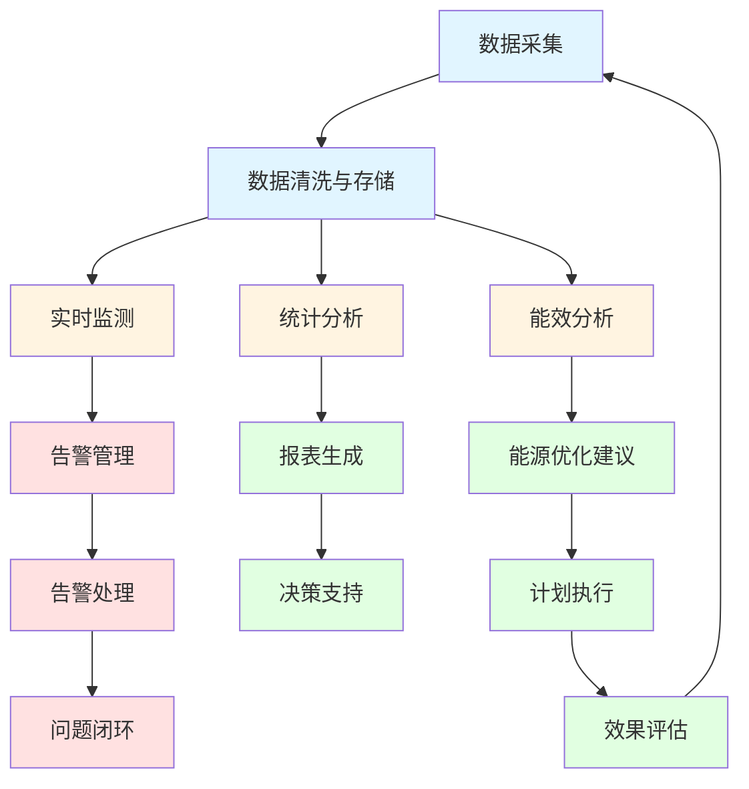

**整体业务流程说明：**

1. **数据采集**：系统通过数据采集网关从各类能源监测设备（电表、水表、流量计等）实时采集能源数据
2. **数据清洗与存储**：对采集的原始数据进行清洗、校验和存储，异常数据自动标记和处理
3. **实时监测**：基于清洗后的数据，系统提供实时监测功能，包括用能监测、设备状态监测、能源拓扑图等
4. **统计分析**：对历史数据进行多维度统计分析，包括能耗日历、分类能耗、分项能耗等
5. **能效分析**：进行深入的能效分析，包括设备负荷分析、变压器负载率分析、能流损失分析等
6. **告警管理**：实时监测数据异常，触发告警并通知相关人员处理
7. **报表生成**：自动生成各类能源管理报表，支持运行报表、统计报表、工艺能耗表等
8. **能源优化建议**：基于分析结果，系统提供能源优化建议和计划
9. **计划执行**：用户根据优化建议制定并执行能源管理计划
10. **效果评估**：对计划执行效果进行评估，形成闭环管理

## 5. 功能需求详细说明

### 5.1 首页概览

#### 5.1.1 需求描述
首页概览为用户提供系统整体运行状态的快速视图，集中展示关键能源指标（KPI）、实时能耗趋势、能源类型占比等核心信息，帮助用户快速了解系统整体运行情况。

**角色与权限**

| 角色 | 按钮权限 | 数据权限 |
|:----:|:--------|:--------|
| 调度员 | 查看 | 全部 |
| 能源专家 | 查看 | 全部 |
| 管理层 | 查看 | 全部 |
| 系统管理员 | 查看 | 全部 |

#### 5.1.2 原型
首页包含以下主要区域：
1. 页面头部：系统标题和用户信息
2. KPI卡片区域：展示6个关键指标卡片，横向单排排列
   - 今日总能耗
   - 今日能耗费用
   - 标煤当量
   - 碳排放
   - 未处理告警
   - 综合能效
3. 图表区域：两个图表横向排列
   - 24小时能耗趋势图（折线图）
   - 能源类型占比图（饼图）

#### 5.1.3 业务模型
| 名称 | 控件 | 查询 | 列表 | 新增 | 修改 | 必填 | 多值 | 字数限制 |
|:----:|:----:|:----:|:----:|:----:|:----:|:----:|:----:|:----:|
| 今日总能耗 | 数字框 | / | √ | 隐藏 | 隐藏 | / | / | 自动计算 |
| 今日能耗费用 | 数字框 | / | √ | 隐藏 | 隐藏 | / | / | 自动计算 |
| 标煤当量 | 数字框 | / | √ | 隐藏 | 隐藏 | / | / | 自动计算 |
| 碳排放 | 数字框 | / | √ | 隐藏 | 隐藏 | / | / | 自动计算 |
| 未处理告警 | 数字框 | / | √ | 隐藏 | 隐藏 | / | / | 自动统计 |
| 综合能效 | 百分比 | / | √ | 隐藏 | 隐藏 | / | / | 自动计算 |
| 24小时能耗趋势 | 图表 | / | √ | 隐藏 | 隐藏 | / | / | / |
| 能源类型占比 | 图表 | / | √ | 隐藏 | 隐藏 | / | / | / |

#### 5.1.4 业务规则
（1）KPI数据实时更新，更新频率为1分钟
（2）今日总能耗 = 当日所有能源类型消耗量之和
（3）今日能耗费用 = 各能源类型消耗量 × 对应单价之和
（4）标煤当量 = 各能源类型消耗量 × 对应标煤折算系数之和
（5）碳排放 = 各能源类型消耗量 × 对应碳排放因子之和
（6）未处理告警 = 状态为"未确认"的告警数量
（7）综合能效 = （实际能耗 / 基准能耗）× 100%，值越高表示能效越好
（8）24小时能耗趋势图显示最近24小时的数据，按小时聚合
（9）能源类型占比图显示当日各能源类型消耗量占比，按百分比显示

#### 5.1.5 数据处理逻辑说明
（1）**数据查询逻辑**：系统每分钟从时序数据库（TSDB）查询当日0点至当前时间的所有能源监测点数据，按能源类型分组聚合
（2）**数据聚合计算**：对采集的分钟级数据进行按小时聚合，计算每小时能耗总和，用于24小时趋势图展示
（3）**实时计算流程**：KPI指标采用流式计算方式，实时接收数据采集网关推送的数据，触发增量计算，避免全量扫描
（4）**数据缓存策略**：KPI卡片数据缓存1分钟，图表数据缓存5分钟，减少数据库查询压力
（5）**异常数据处理**：当监测点数据缺失时，使用最近有效值或线性插值方法填充，确保数据连续性
（6）**数据同步机制**：采用消息队列（如Kafka）实现数据的异步处理，保证高并发场景下的数据一致性

#### 5.1.6 数据限制要求
（1）**数据量限制**：单个KPI查询最多支持1000个监测点，超出范围需分页查询
（2）**时间范围限制**：历史趋势图查询时间范围不超过7天，超出范围需提示用户缩小查询范围
（3）**数据精度要求**：能耗数据精度保留2位小数，费用数据精度保留2位小数，百分比数据精度保留1位小数
（4）**并发访问限制**：单用户最多同时打开3个首页实例，超出限制提示用户关闭其他窗口
（5）**数据更新频率限制**：页面数据自动刷新间隔最短30秒，避免频繁刷新造成系统负载过高
（6）**缓存失效策略**：数据缓存过期时间为1分钟，过期后自动从数据库重新加载

#### 5.1.7 数据来源说明
（1）**能源监测数据**：来源于数据采集网关，通过Modbus、OPC等工业协议从电表、水表、流量计等计量设备实时采集
（2）**能源价格数据**：来源于配置管理模块的能源成本配置，包括分时电价、能源单价等信息
（3）**标煤折算系数**：来源于配置管理模块的能源网络配置中的标煤折算系数配置
（4）**碳排放因子**：来源于配置管理模块的能源网络配置中的碳排放因子配置，符合国家碳排放核算标准
（5）**告警数据**：来源于告警管理模块，实时查询状态为"未确认"的告警记录数量
（6）**基准能耗数据**：来源于能源管理模块的历史能耗基准值或设定的能耗目标值

### 5.2 在线监测模块

#### 5.2.0 数据流程图

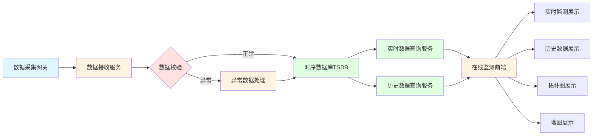

**数据流程说明：**
1. 数据采集网关从各类监测设备采集能源数据
2. 数据接收服务接收采集数据并进行初步校验
3. 正常数据直接存储到时序数据库，异常数据经过处理后存储
4. 实时数据查询服务提供实时数据查询接口
5. 历史数据查询服务提供历史数据查询和聚合接口
6. 在线监测前端调用查询服务获取数据并展示

#### 5.2.0.1 业务流程图

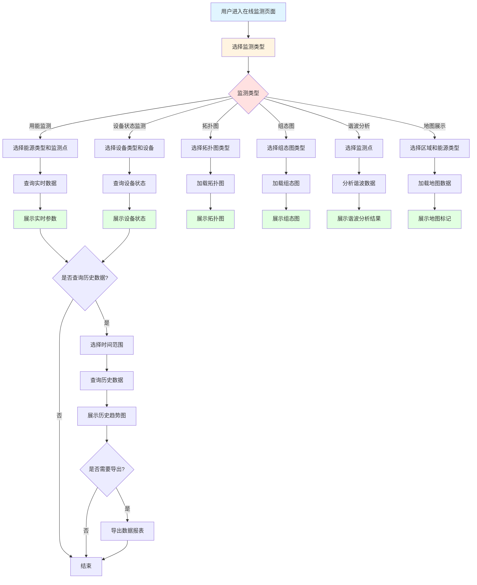

**业务流程说明：**
1. 用户进入在线监测页面，选择不同的监测功能
2. 根据选择的监测类型，用户配置相应的筛选条件
3. 系统根据条件查询相应的数据并展示
4. 用户可选择查询历史数据，查看趋势变化
5. 用户可选择导出数据报表，进行进一步分析

#### 5.2.1 用能监测

##### 5.2.1.1 需求描述
用能监测功能用于实时监测各类能源（电、水、蒸汽、压缩空气、氮气、其他能源）的相关参数，包括电流、电压、功率、流量、压力、温度等，支持实时数据展示和历史数据查询，帮助用户及时掌握能源使用情况。

**角色与权限**

| 角色 | 按钮权限 | 数据权限 |
|:----:|:--------|:--------|
| 调度员 | 查看、导出 | 全部 |
| 能源专家 | 查看、导出 | 全部 |
| 系统管理员 | 查看、导出 | 全部 |

##### 5.2.1.2 原型
页面包含以下主要区域：
1. 筛选区域：能源类型选择、监测点选择、时间范围选择
2. 实时数据展示区域：以表格形式展示当前监测点的实时参数值
3. 历史趋势图：以曲线图形式展示选定时间范围内的历史数据趋势
4. 数据导出功能：支持导出Excel格式的数据报表

##### 5.2.1.3 业务模型

| 名称 | 控件 | 查询 | 列表 | 新增 | 修改 | 必填 | 多值 | 字数限制 |
|:----:|:----:|:----:|:----:|:----:|:----:|:----:|:----:|:---------|
| 能源类型 | 下拉框 | √ | √ | 隐藏 | 隐藏 | / | / |  |
| 监测点 | 搜索选择框 | √ | √ | 隐藏 | 隐藏 | / | / |  |
| 时间范围 | 日期时间框 | √ | / | 隐藏 | 隐藏 | √ | / |  |
| 实时参数值 | 数字框 | / | √ | 隐藏 | 隐藏 | / | / | 自动采集 |
| 历史数据 | 图表 | / | √ | 隐藏 | 隐藏 | / | / | / |
| 数据导出 | 按钮 | / | / | 隐藏 | 隐藏 | / | / | / |

##### 5.2.1.4 业务规则
（1）实时数据更新频率为1分钟
（2）历史数据查询时间范围不超过1年
（3）数据曲线图支持缩放、平移、数据点查看
（4）导出数据包含：监测点名称、能源类型、参数名称、时间、数值、单位
（5）当监测点数据异常或离线时，在列表中标记显示
（6）支持多监测点数据对比展示

##### 5.2.1.5 数据处理逻辑说明
（1）**实时数据查询**：系统从时序数据库按监测点编码和时间范围查询实时数据，支持多监测点并行查询
（2）**历史数据聚合**：历史数据查询时，根据时间范围自动选择聚合粒度：1天以内按分钟聚合，1周以内按小时聚合，1月以内按天聚合，超过1月按周聚合
（3）**数据清洗逻辑**：查询结果自动过滤异常值（超过阈值上限3倍或低于下限1/3的数据），标记为异常数据
（4）**趋势计算**：对聚合后的数据按时间序列排序，计算数据变化趋势，识别能耗峰值和谷值
（5）**数据对比分析**：多监测点对比时，统一时间粒度，对数据进行归一化处理，便于对比分析
（6）**导出数据处理**：导出时对大数据量进行分页处理，每次导出最多10万条记录，超出范围需分批导出

##### 5.2.1.6 数据限制要求
（1）**查询时间范围限制**：单次查询时间范围不超过1年，超过1年需分时间段查询
（2）**监测点数量限制**：单次查询最多支持20个监测点，超出范围需分批次查询
（3）**数据量限制**：单次查询返回数据量不超过10万条，超出范围自动分页或提示用户缩小查询范围
（4）**导出数据量限制**：单次导出最多10万条记录，超出范围需分批导出或提示用户缩小时间范围
（5）**数据精度要求**：实时数据精度保留3位小数，历史聚合数据精度保留2位小数
（6）**并发查询限制**：单用户最多同时执行5个查询任务，超出限制需等待其他任务完成

##### 5.2.1.7 数据来源说明
（1）**实时监测数据**：来源于数据采集网关，通过Modbus、OPC等工业协议从各类计量仪表实时采集的原始数据
（2）**历史监测数据**：来源于时序数据库（TSDB），存储的分钟级、小时级、日级聚合数据
（3）**监测点配置信息**：来源于配置管理模块的KPI模型配置，包括监测点名称、编码、所属设备等信息
（4）**能源类型信息**：来源于配置管理模块的能源网络配置，包括能源类型、计量单位等信息
（5）**监测点状态信息**：来源于在线监测模块的设备状态监测功能，包括在线状态、数据质量等信息

#### 5.2.2 设备状态监测
##### 5.2.2.1 需求描述
设备状态监测功能用于实时监测生产设备的运行状态，包括设备启停状态、运行参数、健康状态等，帮助用户及时发现设备异常，保障生产安全。

**角色与权限**

| 角色 | 按钮权限 | 数据权限 |
|:----:|:--------|:--------|
| 调度员 | 查看、详情 | 全部 |
| 运维工程师 | 查看、详情 | 全部 |
| 系统管理员 | 查看、详情 | 全部 |

##### 5.2.2.2 原型
页面包含以下主要区域：
1. 设备筛选区域：设备类型、设备名称、状态筛选
2. 设备状态列表：以卡片或列表形式展示设备状态信息
3. 设备详情弹窗：点击设备可查看详细运行参数和历史状态

##### 5.2.2.3 业务模型
| 名称 | 控件 | 查询 | 列表 | 新增 | 修改 | 必填 | 多值 | 字数限制 |
|:----:|:----:|:----:|:----:|:----:|:----:|:----:|:----:|:----:|
| 设备类型 | 下拉框 | √ | √ | 隐藏 | 隐藏 | / | / |  |
| 设备名称 | 搜索选择框 | √ | √ | 隐藏 | 隐藏 | / | / |  |
| 运行状态 | 下拉框 | √ | √ | 隐藏 | 隐藏 | / | / |  |
| 设备编码 | 文本框 | √ | √ | 隐藏 | 隐藏 | / | / |  |
| 当前功率 | 数字框 | / | √ | 隐藏 | 隐藏 | / | / | 自动采集 |
| 运行时长 | 时间框 | / | √ | 隐藏 | 隐藏 | / | / | 自动计算 |
| 健康指数 | 数字框 | / | √ | 隐藏 | 隐藏 | / | / | 自动计算 |
| 最后更新时间 | 时间框 | / | √ | 隐藏 | 隐藏 | / | / | 自动记录 |

##### 5.2.2.4 业务规则
（1）设备状态包括：运行中、待机、停机、故障
（2）运行状态实时更新，更新频率为1分钟
（3）健康指数范围0-100，低于60时触发预警
（4）设备离线超过5分钟，状态标记为"离线"
（5）支持按设备类型、状态进行筛选和排序
（6）设备详情包含：基本信息、实时参数、历史趋势、告警记录

##### 5.2.2.5 数据处理逻辑说明
（1）**设备状态判断逻辑**：系统根据设备的实时功率、电流等参数判断设备状态，功率大于额定功率的10%为运行中，功率为0且时间超过5分钟为停机
（2）**健康指数计算**：健康指数 = 100 - (故障次数 × 10) - (异常时长占比 × 50)，故障次数和异常时长从设备历史运行记录中统计
（3）**离线状态判断**：系统定时检查设备数据采集时间戳，超过5分钟未收到数据则标记为离线状态
（4）**运行时长统计**：运行时长 = 本次启动时间至当前时间的差值，停机时保存本次运行时长累计到总运行时长
（5）**数据聚合计算**：设备列表查询时，对设备状态数据进行实时聚合，按设备类型、状态分组统计设备数量
（6）**历史趋势分析**：查询设备历史状态时，按时间粒度聚合状态数据，计算各状态时长占比，生成状态趋势图

##### 5.2.2.6 数据限制要求
（1）**设备数量限制**：单次查询最多支持500个设备，超出范围需分页查询或添加筛选条件
（2）**历史数据查询限制**：设备历史状态查询时间范围不超过1年，超过1年需分时间段查询
（3）**数据更新频率限制**：设备状态数据实时更新频率为1分钟，页面刷新间隔最短30秒
（4）**离线判断时间限制**：设备离线判断阈值最少5分钟，避免短暂网络波动误判为离线
（5）**健康指数范围限制**：健康指数取值范围0-100，超出范围自动修正到边界值
（6）**并发查询限制**：单用户最多同时查询10个设备的详细状态，超出限制需等待

##### 5.2.2.7 数据来源说明
（1）**设备基本信息**：来源于配置管理模块的KPI模型配置，包括设备编码、名称、类型、额定功率等信息
（2）**设备实时运行参数**：来源于数据采集网关，通过Modbus、OPC等工业协议从设备PLC/DCS实时采集的电流、电压、功率等参数
（3）**设备运行状态**：系统根据实时运行参数自动计算判断，或来源于设备管理系统的状态接口
（4）**设备历史运行记录**：来源于时序数据库（TSDB），存储的设备历史运行参数和状态变化记录
（5）**设备故障信息**：来源于告警管理模块，统计设备相关的告警记录和故障处理记录
（6）**设备离线状态**：系统根据数据采集时间戳自动判断，数据采集网关定时上报设备在线状态

#### 5.2.3 能源拓扑图
##### 5.2.3.1 需求描述
能源拓扑图功能以图形化方式展示能源系统的网络拓扑结构，包括能源流向、关键节点、监测点位置等，帮助用户直观了解能源系统架构。

**角色与权限**

| 角色 | 按钮权限 | 数据权限 |
|:----:|:--------|:--------|
| 调度员 | 查看、详情 | 全部 |
| 能源专家 | 查看、详情 | 全部 |
| 系统管理员 | 查看、详情 | 全部 |

##### 5.2.3.2 原型
页面包含以下主要区域：
1. 拓扑图展示区域：以图形化方式展示能源网络拓扑
2. 图例说明：说明图中各符号和颜色的含义
3. 节点详情：点击拓扑图中的节点可查看详细信息

##### 5.2.3.3 业务模型
| 名称 | 控件 | 查询 | 列表 | 新增 | 修改 | 必填 | 多值 | 字数限制 |
|:----:|:----:|:----:|:----:|:----:|:----:|:----:|:----:|:----:|
| 拓扑图类型 | 下拉框 | √ | / | 隐藏 | 隐藏 | / | / |  |
| 节点信息 | 文本框 | / | √ | 隐藏 | 隐藏 | / | / |  |
| 连接关系 | 文本框 | / | √ | 隐藏 | 隐藏 | / | / |  |
| 实时数据 | 数字框 | / | √ | 隐藏 | 隐藏 | / | / | 自动采集 |
| 节点状态 | 下拉框 | / | √ | 隐藏 | 隐藏 | / | / | 自动判断 |

##### 5.2.3.4 业务规则
（1）拓扑图支持缩放、平移、全屏查看
（2）节点颜色表示状态：绿色（正常）、黄色（预警）、红色（异常）、灰色（离线）
（3）支持按能源类型切换不同的拓扑图（电力、水、蒸汽等）
（4）点击节点可查看：节点名称、类型、实时数据、历史趋势
（5）拓扑图数据实时更新，更新频率为1分钟
（6）支持拓扑图导出为图片格式

##### 5.2.3.5 数据处理逻辑说明
（1）**拓扑结构数据组织**：系统从配置管理模块加载能源网络的拓扑结构数据，包括节点信息和连接关系，构建拓扑图的数据模型
（2）**节点状态实时计算**：系统实时查询每个节点关联的监测点数据，根据数据值判断节点状态（正常、预警、异常、离线）
（3）**节点数据聚合**：一个节点关联多个监测点时，对监测点数据进行聚合计算（平均值、最大值等），作为节点的实时数据
（4）**拓扑图渲染优化**：大规模拓扑图采用分层渲染策略，先渲染关键节点，再渲染次要节点，保证渲染性能
（5）**节点数据缓存**：节点数据缓存1分钟，减少数据库查询频率，提高拓扑图刷新性能
（6）**拓扑图导出处理**：导出时对拓扑图进行矢量转换，保持图形清晰度，支持SVG、PNG等格式

##### 5.2.3.6 数据限制要求
（1）**节点数量限制**：单个拓扑图最多支持500个节点，超出范围需分层展示或分图展示
（2）**拓扑图加载限制**：拓扑图初始加载时间不超过5秒，超出时间需优化数据量或使用异步加载
（3）**数据更新频率限制**：节点数据更新频率为1分钟，页面刷新间隔最短30秒
（4）**拓扑图复杂度限制**：拓扑图节点连接线数量不超过1000条，超出范围需简化拓扑结构
（5）**导出图片尺寸限制**：拓扑图导出图片最大尺寸为5000×5000像素，超出范围自动缩放
（6）**并发访问限制**：单用户最多同时打开3个拓扑图，超出限制提示用户关闭其他窗口

##### 5.2.3.7 数据来源说明
（1）**拓扑结构配置**：来源于配置管理模块的能源网络配置，包括节点编码、名称、类型、位置等信息
（2）**节点连接关系**：来源于配置管理模块的拓扑关系配置，定义节点之间的连接关系和能源流向
（3）**节点实时数据**：来源于数据采集网关，通过Modbus、OPC等工业协议从监测点实时采集的数据
（4）**节点历史趋势**：来源于时序数据库（TSDB），存储的节点关联监测点的历史数据
（5）**节点状态信息**：系统根据实时数据和告警规则自动判断，或来源于告警管理模块的状态信息
（6）**拓扑图模板**：来源于配置管理模块的拓扑图模板配置，包括图形布局、样式等信息

#### 5.2.4 组态图
##### 5.2.4.1 需求描述
组态图功能通过SCADA组态画面可视化展示各种能源系统流向图，如电力一次系统图、水系统图、蒸汽系统图等，显示总表和分表的实时负荷和占比，帮助用户直观了解能源系统运行状态。

**角色与权限**

| 角色 | 按钮权限 | 数据权限 |
|:----:|:--------|:--------|
| 调度员 | 查看、详情 | 全部 |
| 能源专家 | 查看、详情 | 全部 |
| 系统管理员 | 查看、详情 | 全部 |

##### 5.2.4.2 原型
页面包含以下主要区域：
1. 组态图展示区域：以SCADA组态画面形式展示能源系统
2. 数据面板：显示关键监测点的实时数据
3. 控制面板：支持远程控制操作（需权限）

##### 5.2.4.3 业务模型
| 名称 | 控件 | 查询 | 列表 | 新增 | 修改 | 必填 | 多值 | 字数限制 |
|:----:|:----:|:----:|:----:|:----:|:----:|:----:|:----:|:----:|
| 组态图类型 | 下拉框 | √ | / | 隐藏 | 隐藏 | / | / |  |
| 监测点数据 | 数字框 | / | √ | 隐藏 | 隐藏 | / | / | 自动采集 |
| 负荷占比 | 百分比 | / | √ | 隐藏 | 隐藏 | / | / | 自动计算 |
| 设备状态 | 下拉框 | / | √ | 隐藏 | 隐藏 | / | / | 自动判断 |
| 控制指令 | 按钮 | / | / | 隐藏 | 正常 | / | / | 需权限 |

##### 5.2.4.4 业务规则
（1）组态图支持多种能源系统类型：电力、水、蒸汽、压缩空气等
（2）实时数据更新频率为1分钟
（3）负荷占比 = 分表负荷 / 总表负荷 × 100%
（4）支持点击设备查看详细信息和历史数据
（5）远程控制操作需要双重身份验证
（6）控制操作记录操作日志，包括操作人、时间、指令内容

##### 5.2.4.5 数据处理逻辑说明
（1）**组态图配置加载**：系统从配置管理模块加载组态图配置，包括图形元素、数据绑定关系、控制权限等信息
（2）**实时数据绑定**：组态图中的图形元素绑定监测点编码，系统实时查询监测点数据并更新到组态图显示
（3）**负荷占比计算**：系统实时计算总表负荷和分表负荷，分表负荷占比 = 分表负荷 / 总表负荷 × 100%
（4）**控制指令处理**：用户发起控制指令时，系统进行权限验证、联锁逻辑检查，通过后下发到数据采集网关，再转发到设备PLC/DCS
（5）**操作日志记录**：所有控制操作自动记录到操作日志表，包括操作人、时间、设备、指令内容、执行结果等信息
（6）**组态图刷新优化**：组态图采用增量更新策略，只更新变化的数据点，减少数据传输量和渲染开销

##### 5.2.4.6 数据限制要求
（1）**组态图复杂度限制**：单个组态图最多支持200个图形元素，超出范围需分页展示或简化图形
（2）**数据更新频率限制**：组态图数据更新频率为1分钟，页面刷新间隔最短30秒
（3）**控制指令频率限制**：单个设备每分钟最多执行5次控制指令，超出限制需等待或提示用户
（4）**操作权限验证**：控制操作必须经过权限验证和双重身份验证，验证失败拒绝执行
（5）**联锁逻辑检查**：控制指令执行前必须通过联锁逻辑检查，违反联锁规则拒绝执行
（6）**操作日志存储**：操作日志保存时间不少于1年，超过1年可归档到历史库

##### 5.2.4.7 数据来源说明
（1）**组态图配置**：来源于配置管理模块的组态图配置，包括图形模板、元素配置、数据绑定等信息
（2）**监测点实时数据**：来源于数据采集网关，通过Modbus、OPC等工业协议从监测点实时采集的数据
（3）**设备负荷数据**：来源于用能监测模块，计算的总表和分表负荷数据
（4）**控制指令执行结果**：来源于数据采集网关反馈的执行结果，包括成功、失败、超时等状态
（5）**操作权限信息**：来源于系统权限管理模块，定义用户的控制操作权限
（6）**联锁逻辑配置**：来源于配置管理模块的系统配置，定义设备之间的联锁关系和控制规则

#### 5.2.5 谐波分析
##### 5.2.5.1 需求描述
谐波分析功能用于监测和分析电力系统的谐波含量，包括谐波频谱图、谐波含量统计、谐波治理建议等，帮助用户识别电能质量问题并采取治理措施。

**角色与权限**

| 角色 | 按钮权限 | 数据权限 |
|:----:|:--------|:--------|
| 调度员 | 查看、导出 | 全部 |
| 能源专家 | 查看、导出 | 全部 |
| 系统管理员 | 查看、导出 | 全部 |

##### 5.2.5.2 原型
页面包含以下主要区域：
1. 监测点选择：选择需要进行谐波分析的监测点
2. 谐波频谱图：以柱状图形式展示各次谐波的含量
3. 谐波统计表：展示谐波总畸变率（THD）等关键指标
4. 治理建议：基于分析结果提供谐波治理建议

##### 5.2.5.3 业务模型
| 名称 | 控件 | 查询 | 列表 | 新增 | 修改 | 必填 | 多值 | 字数限制 |
|:----:|:----:|:----:|:----:|:----:|:----:|:----:|:----:|:----:|
| 监测点 | 搜索选择框 | √ | √ | 隐藏 | 隐藏 | √ | / |  |
| 谐波次数 | 数字框 | / | √ | 隐藏 | 隐藏 | / | / | 自动分析 |
| 谐波含量 | 百分比 | / | √ | 隐藏 | 隐藏 | / | / | 自动计算 |
| 总畸变率 | 百分比 | / | √ | 隐藏 | 隐藏 | / | / | 自动计算 |
| 治理建议 | 文本框 | / | √ | 隐藏 | 隐藏 | / | / | 自动生成 |

##### 5.2.5.4 业务规则
（1）谐波分析频率范围：2-50次谐波
（2）总畸变率（THD）超过5%时触发预警
（3）谐波频谱图实时更新，更新频率为1分钟
（4）支持历史谐波数据查询和对比分析
（5）治理建议基于谐波含量和标准限值自动生成
（6）支持导出谐波分析报告

##### 5.2.5.5 数据处理逻辑说明
（1）**谐波数据采集**：系统从电能质量监测装置采集谐波数据，包括各次谐波含量（2-50次）、基波频率等参数
（2）**谐波分析计算**：对采集的原始波形数据进行FFT（快速傅里叶变换）分析，提取各次谐波的幅值和相位信息
（3）**总畸变率计算**：THD = sqrt(Σ(Hn²)) / H1 × 100%，其中Hn为n次谐波含量，H1为基波含量
（4）**谐波频谱图生成**：根据各次谐波含量数据生成柱状图，X轴为谐波次数，Y轴为谐波含量百分比
（5）**治理建议生成**：系统根据谐波含量和国家标准限值（如GB/T 14549-1993）对比，超过限值的谐波自动生成治理建议
（6）**历史数据对比**：支持多个时间点的谐波数据对比分析，识别谐波变化趋势和治理效果

##### 5.2.5.6 数据限制要求
（1）**谐波次数限制**：谐波分析频率范围为2-50次，超出范围的数据不参与分析
（2）**监测点数量限制**：单次分析最多支持10个监测点，超出范围需分批分析
（3）**数据更新频率限制**：谐波数据更新频率为1分钟，频谱图刷新间隔最短30秒
（4）**历史数据查询限制**：历史谐波数据查询时间范围不超过3个月，超过3个月需分时间段查询
（5）**数据精度要求**：谐波含量精度保留2位小数，总畸变率精度保留2位小数
（6）**导出报告限制**：单次导出报告最多包含100个监测点的数据，超出范围需分批次导出

##### 5.2.5.7 数据来源说明
（1）**谐波原始数据**：来源于电能质量监测装置，通过Modbus、IEC 61850等协议从监测装置实时采集的波形数据
（2）**谐波分析结果**：系统对原始波形数据进行FFT分析后得到的各次谐波含量和总畸变率
（3）**谐波标准限值**：来源于配置管理模块的系统配置，配置各次谐波的国标限值和行业标准限值
（4）**历史谐波数据**：来源于时序数据库（TSDB），存储的谐波分析结果历史数据
（5）**治理建议模板**：来源于配置管理模块的告警配置，包括谐波治理的标准建议和最佳实践
（6）**监测点配置信息**：来源于配置管理模块的KPI模型配置，包括监测点编码、名称、位置等信息

#### 5.2.6 地图展示
##### 5.2.6.1 需求描述
地图展示功能以地理信息系统的形式展示监测点的地理位置分布，支持地图缩放、标记点查看、区域筛选等，帮助用户从地理维度了解能源监测点的分布情况。

**角色与权限**

| 角色 | 按钮权限 | 数据权限 |
|:----:|:--------|:--------|
| 调度员 | 查看、详情 | 全部 |
| 能源专家 | 查看、详情 | 全部 |
| 系统管理员 | 查看、详情 | 全部 |

##### 5.2.6.2 原型
页面包含以下主要区域：
1. 地图展示区域：以地图形式展示监测点位置
2. 监测点标记：在地图上标记各监测点位置
3. 信息窗口：点击标记点显示监测点基本信息
4. 筛选面板：支持按区域、能源类型筛选

##### 5.2.6.3 业务模型
| 名称 | 控件 | 查询 | 列表 | 新增 | 修改 | 必填 | 多值 | 字数限制 |
|:----:|:----:|:----:|:----:|:----:|:----:|:----:|:----:|:----:|
| 地理位置 | 坐标 | / | √ | 隐藏 | 隐藏 | / | / |  |
| 监测点名称 | 文本框 | √ | √ | 隐藏 | 隐藏 | / | / |  |
| 区域 | 下拉框 | √ | √ | 隐藏 | 隐藏 | / | / |  |
| 能源类型 | 下拉框 | √ | √ | 隐藏 | 隐藏 | / | / |  |
| 实时数据 | 数字框 | / | √ | 隐藏 | 隐藏 | / | / | 自动采集 |
| 状态 | 下拉框 | / | √ | 隐藏 | 隐藏 | / | / | 自动判断 |

##### 5.2.6.4 业务规则
（1）地图支持缩放、平移、全屏查看
（2）监测点标记颜色表示状态：绿色（正常）、黄色（预警）、红色（异常）、灰色（离线）
（3）点击标记点可查看监测点详细信息
（4）支持按区域、能源类型筛选显示监测点
（5）地图数据实时更新，更新频率为1分钟
（6）支持地图导出为图片格式

##### 5.2.6.5 数据处理逻辑说明
（1）**地理位置数据加载**：系统从配置管理模块加载监测点的地理位置信息（经纬度坐标），在地图上标记监测点位置
（2）**监测点状态判断**：系统实时查询监测点的数据状态，根据数据值和告警规则判断监测点状态（正常、预警、异常、离线）
（3）**地图标记渲染**：根据监测点状态和能源类型，在地图上用不同颜色和图标标记监测点，支持聚合显示
（4）**筛选显示逻辑**：用户选择区域或能源类型时，系统筛选符合条件的监测点，只显示符合条件的标记点
（5）**地图缩放聚合**：地图缩放级别较小时，对相近的监测点进行聚合显示，显示监测点数量，点击聚合点展开显示
（6）**实时数据更新**：地图上的监测点标记实时更新状态和数据，采用增量更新策略，只更新变化的监测点

##### 5.2.6.6 数据限制要求
（1）**监测点数量限制**：单次地图展示最多支持1000个监测点，超出范围需分区域展示或使用聚合显示
（2）**地图缩放级别限制**：地图缩放级别范围为3-18级，超出范围自动修正到边界值
（3）**数据更新频率限制**：地图数据更新频率为1分钟，页面刷新间隔最短30秒
（4）**筛选条件限制**：筛选条件最多支持5个，包括区域、能源类型、状态等条件的组合
（5）**导出图片尺寸限制**：地图导出图片最大尺寸为8000×8000像素，超出范围自动缩放
（6）**并发访问限制**：单用户最多同时打开2个地图页面，超出限制提示用户关闭其他窗口

##### 5.2.6.7 数据来源说明
（1）**监测点地理位置**：来源于配置管理模块的KPI模型配置，包括监测点的经纬度坐标、区域等信息
（2）**监测点实时数据**：来源于数据采集网关，通过Modbus、OPC等工业协议从监测点实时采集的数据
（3）**监测点状态信息**：系统根据实时数据和告警规则自动判断，或来源于告警管理模块的状态信息
（4）**区域配置信息**：来源于配置管理模块的组织架构配置，包括区域名称、边界范围等信息
（5）**能源类型信息**：来源于配置管理模块的能源网络配置，包括能源类型、颜色标识等信息
（6）**地图底图数据**：来源于第三方地图服务（如高德地图、百度地图），或使用OpenStreetMap等开源地图数据

### 5.3 能源统计模块

#### 5.3.0 数据流程图

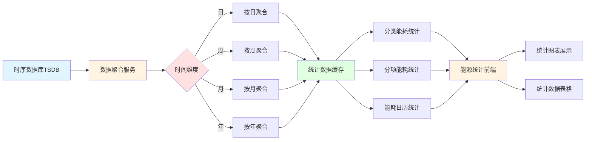

**数据流程说明：**
1. 从时序数据库读取原始能耗数据
2. 数据聚合服务根据时间维度（日、周、月、年）进行数据聚合
3. 聚合后的统计数据存储到缓存中，提高查询性能
4. 根据统计类型（分类、分项、日历）进行相应的统计计算
5. 统计结果通过前端展示给用户

#### 5.3.0.1 业务流程图

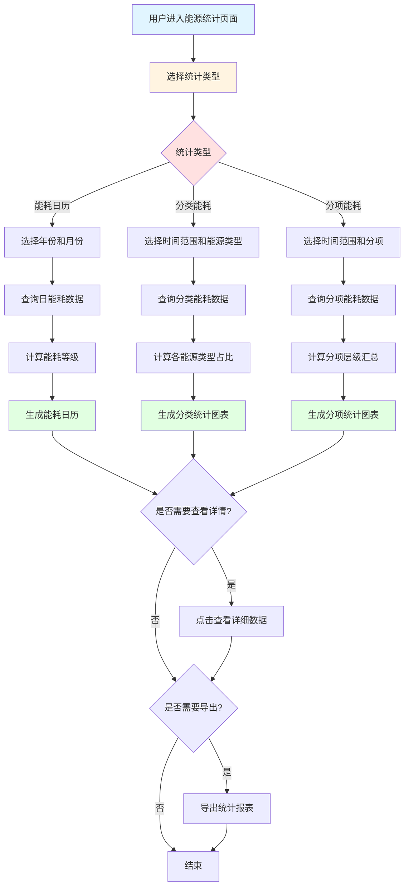

**业务流程说明：**
1. 用户选择统计类型（能耗日历、分类能耗、分项能耗）
2. 根据统计类型配置相应的查询条件
3. 系统查询数据并进行统计计算
4. 生成相应的统计图表和表格展示
5. 用户可查看详细数据或导出统计报表

#### 5.3.1 能耗日历
##### 5.3.1.1 需求描述
能耗日历功能以日历视图的形式展示每日的能源消耗情况，通过颜色深浅直观反映能耗高低，支持按月份、年份切换查看，帮助用户快速识别能耗异常日期和能耗趋势。

**角色与权限**

| 角色 | 按钮权限 | 数据权限 |
|:----:|:--------|:--------|
| 调度员 | 查看、详情 | 全部 |
| 能源专家 | 查看、详情 | 全部 |
| 管理层 | 查看、详情 | 全部 |
| 系统管理员 | 查看、详情 | 全部 |

##### 5.3.1.2 原型
页面包含以下主要区域：
1. 日历控制区域：年份选择、月份切换、今天按钮
2. 筛选区域：能源类型、站点、显示方式筛选
3. 图例说明：低能耗、中能耗、高能耗、无数据的颜色标识
4. 日历网格：以日历形式展示每日能耗，颜色深浅表示能耗高低
5. 日期详情面板：点击日期显示当日详细能耗数据

##### 5.3.1.3 业务模型
| 名称 | 控件 | 查询 | 列表 | 新增 | 修改 | 必填 | 多值 | 字数限制 |
|:----:|:----:|:----:|:----:|:----:|:----:|:----:|:----:|:----:|
| 年份 | 下拉框 | √ | / | 隐藏 | 隐藏 | / | / |  |
| 月份 | 下拉框 | √ | / | 隐藏 | 隐藏 | / | / |  |
| 能源类型 | 下拉框 | √ | √ | 隐藏 | 隐藏 | / | / |  |
| 站点 | 下拉框 | √ | √ | 隐藏 | 隐藏 | / | / |  |
| 显示方式 | 下拉框 | √ | / | 隐藏 | 隐藏 | / | / |  |
| 日期 | 日期框 | / | √ | 隐藏 | 隐藏 | / | / |  |
| 日能耗 | 数字框 | / | √ | 隐藏 | 隐藏 | / | / | 自动计算 |
| 能耗等级 | 下拉框 | / | √ | 隐藏 | 隐藏 | / | / | 自动判断 |

##### 5.3.1.4 业务规则
（1）日历视图按月份展示，支持切换年份和月份
（2）每日能耗颜色分级：低能耗（绿色）、中能耗（黄色）、高能耗（红色）、无数据（灰色）
（3）能耗等级划分标准：低能耗（<平均值-标准差）、中能耗（平均值±标准差）、高能耗（>平均值+标准差）
（4）点击日期可查看当日详细能耗数据，包括各能源类型消耗量
（5）支持按能源类型、站点筛选显示
（6）显示方式支持：总能耗、详细能耗（按能源类型分别显示）
（7）日历数据实时更新，更新频率为1小时

##### 5.3.1.5 数据处理逻辑说明
（1）**日能耗数据查询**：系统从时序数据库按日期、能源类型、站点查询每日能耗数据，按小时聚合后求和得到日能耗
（2）**能耗等级计算**：系统计算选定时间范围内的日能耗平均值和标准差，根据日能耗值与平均值的差值判断能耗等级
（3）**颜色分级渲染**：根据能耗等级在地图上渲染不同颜色，低能耗为绿色，中能耗为黄色，高能耗为红色，无数据为灰色
（4）**日历数据聚合**：按月查询日能耗数据时，对数据进行聚合计算，生成月度能耗统计，用于日历视图展示
（5）**筛选显示逻辑**：用户选择能源类型或站点时，系统筛选符合条件的日能耗数据，重新计算能耗等级和颜色分级
（6）**数据缓存策略**：日历数据缓存1小时，减少数据库查询压力，提高页面加载速度

##### 5.3.1.6 数据限制要求
（1）**查询时间范围限制**：日历视图查询时间范围不超过2年，超过2年需分时间段查询
（2）**数据量限制**：单次查询最多返回365天的数据（1年），超出范围需分页查询或提示用户缩小查询范围
（3）**筛选条件限制**：筛选条件最多支持5个，包括能源类型、站点、显示方式等条件的组合
（4）**数据更新频率限制**：日历数据更新频率为1小时，页面刷新间隔最短10分钟
（5）**能耗等级计算限制**：能耗等级计算需要至少7天的数据，数据不足时使用默认分级标准
（6）**并发访问限制**：单用户最多同时查询3个不同站点的日历数据，超出限制需等待

##### 5.3.1.7 数据来源说明
（1）**日能耗数据**：来源于时序数据库（TSDB），存储的按小时聚合的能耗数据，系统按日期聚合得到日能耗
（2）**能源类型信息**：来源于配置管理模块的能源网络配置，包括能源类型、计量单位等信息
（3）**站点配置信息**：来源于配置管理模块的组织架构配置，包括站点名称、编码、层级关系等信息
（4）**能耗等级标准**：系统根据历史数据自动计算，或来源于配置管理模块的能耗等级标准配置
（5）**监测点数据**：来源于数据采集网关，通过Modbus、OPC等工业协议从监测点实时采集的能耗数据
（6）**统计数据**：来源于能源统计模块的统计分析结果，包括日、周、月、年等维度的统计数据

#### 5.3.2 分类能耗
##### 5.3.2.1 需求描述
分类能耗功能按照能源类型（电、水、蒸汽、压缩空气、氮气、其他）对能源消耗进行分类统计和分析，支持多维度查询和对比分析，帮助用户了解各类能源的使用情况。

**角色与权限**

| 角色 | 按钮权限 | 数据权限 |
|:----:|:--------|:--------|
| 调度员 | 查看、导出 | 全部 |
| 能源专家 | 查看、导出 | 全部 |
| 管理层 | 查看、导出 | 全部 |
| 系统管理员 | 查看、导出 | 全部 |

##### 5.3.2.2 原型
页面包含以下主要区域：
1. 筛选区域：时间范围、能源类型、组织架构筛选
2. 统计概览：总能耗、总费用、标煤当量、碳排放等关键指标
3. 分类统计图表：饼图展示各能源类型占比，柱状图展示对比分析
4. 详细数据表格：展示各能源类型的详细消耗数据
5. 数据导出功能：支持导出Excel格式报表

##### 5.3.2.3 业务模型
| 名称 | 控件 | 查询 | 列表 | 新增 | 修改 | 必填 | 多值 | 字数限制 |
|:----:|:----:|:----:|:----:|:----:|:----:|:----:|:----:|:----:|
| 时间范围 | 日期时间框 | √ | / | 隐藏 | 隐藏 | √ | / |  |
| 能源类型 | 下拉框 | √ | √ | 隐藏 | 隐藏 | / | √ |  |
| 组织架构 | 搜索选择框 | √ | √ | 隐藏 | 隐藏 | / | / |  |
| 总能耗 | 数字框 | / | √ | 隐藏 | 隐藏 | / | / | 自动计算 |
| 总费用 | 数字框 | / | √ | 隐藏 | 隐藏 | / | / | 自动计算 |
| 标煤当量 | 数字框 | / | √ | 隐藏 | 隐藏 | / | / | 自动计算 |
| 碳排放 | 数字框 | / | √ | 隐藏 | 隐藏 | / | / | 自动计算 |
| 能源类型名称 | 文本框 | / | √ | 隐藏 | 隐藏 | / | / |  |
| 消耗量 | 数字框 | / | √ | 隐藏 | 隐藏 | / | / | 自动计算 |
| 占比 | 百分比 | / | √ | 隐藏 | 隐藏 | / | / | 自动计算 |

##### 5.3.2.4 业务规则
（1）支持按日、周、月、年等时间维度进行统计
（2）支持多能源类型同时查询和对比
（3）占比计算 = 单个能源类型消耗量 / 总消耗量 × 100%
（4）支持同环比分析，对比不同时间段的能耗变化
（5）数据表格支持排序、筛选、分页
（6）导出数据包含：时间、能源类型、消耗量、费用、标煤当量、碳排放等字段

##### 5.3.2.5 数据处理逻辑说明
（1）**分类能耗查询**：系统从时序数据库按时间范围、能源类型、组织架构查询能耗数据，按能源类型分组聚合
（2）**多维度聚合计算**：根据选择的时间维度自动选择聚合粒度：日维度按小时聚合，周/月维度按天聚合，年维度按月聚合
（3）**占比计算**：对每个能源类型的消耗量求和，计算各能源类型占总消耗量的百分比，生成占比数据
（4）**费用计算**：各能源类型消耗量 × 对应能源单价（分时电价需按时间段计算），汇总得到总费用
（5）**标煤当量计算**：各能源类型消耗量 × 对应标煤折算系数，汇总得到标煤当量
（6）**碳排放计算**：各能源类型消耗量 × 对应碳排放因子，汇总得到碳排放量
（7）**同环比分析**：系统计算同期和环比的数据，对比不同时间段的能耗变化，计算变化率和变化量

##### 5.3.2.6 数据限制要求
（1）**查询时间范围限制**：单次查询时间范围不超过5年，超过5年需分时间段查询
（2）**能源类型数量限制**：单次查询最多支持10种能源类型，超出范围需分批次查询
（3）**数据量限制**：单次查询返回数据量不超过50万条，超出范围自动分页或提示用户缩小查询范围
（4）**导出数据量限制**：单次导出最多50万条记录，超出范围需分批导出或提示用户缩小时间范围
（5）**数据精度要求**：消耗量精度保留2位小数，费用精度保留2位小数，占比精度保留1位小数
（6）**并发查询限制**：单用户最多同时执行3个查询任务，超出限制需等待其他任务完成

##### 5.3.2.7 数据来源说明
（1）**能耗原始数据**：来源于时序数据库（TSDB），存储的按时间聚合的能耗数据，包括分钟级、小时级、日级等不同粒度
（2）**能源类型配置**：来源于配置管理模块的能源网络配置，包括能源类型、计量单位、标煤折算系数、碳排放因子等信息
（3）**能源价格数据**：来源于配置管理模块的能源成本配置，包括能源单价、分时电价等信息
（4）**组织架构信息**：来源于配置管理模块的组织架构配置，包括厂区、车间、产线等层级关系
（5）**监测点数据**：来源于数据采集网关，通过Modbus、OPC等工业协议从监测点实时采集的能耗数据
（6）**统计数据**：来源于能源统计模块的预处理统计数据，包括按时间、能源类型、组织架构聚合的统计结果

#### 5.3.3 分项能耗
##### 5.3.3.1 需求描述
分项能耗功能按照能源用途或分项（如照明、空调、动力、生产等）对能源消耗进行分项统计和分析，支持多级分项树形结构，帮助用户深入了解能源消耗的详细构成。

**角色与权限**

| 角色 | 按钮权限 | 数据权限 |
|:----:|:--------|:--------|
| 调度员 | 查看、导出 | 全部 |
| 能源专家 | 查看、导出 | 全部 |
| 管理层 | 查看、导出 | 全部 |
| 系统管理员 | 查看、导出 | 全部 |

##### 5.3.3.2 原型
页面包含以下主要区域：
1. 筛选区域：时间范围、能源类型、分项选择
2. 分项树形结构：以树形结构展示分项层级关系
3. 统计图表：展示各分项的能耗占比和趋势
4. 详细数据表格：展示各分项的详细消耗数据
5. 数据导出功能：支持导出Excel格式报表

##### 5.3.3.3 业务模型
| 名称 | 控件 | 查询 | 列表 | 新增 | 修改 | 必填 | 多值 | 字数限制 |
|:----:|:----:|:----:|:----:|:----:|:----:|:----:|:----:|:----:|
| 时间范围 | 日期时间框 | √ | / | 隐藏 | 隐藏 | √ | / |  |
| 能源类型 | 下拉框 | √ | √ | 隐藏 | 隐藏 | / | / |  |
| 分项 | 树形选择框 | √ | √ | 隐藏 | 隐藏 | / | / |  |
| 分项名称 | 文本框 | / | √ | 隐藏 | 隐藏 | / | / |  |
| 分项层级 | 数字框 | / | √ | 隐藏 | 隐藏 | / | / |  |
| 消耗量 | 数字框 | / | √ | 隐藏 | 隐藏 | / | / | 自动计算 |
| 占比 | 百分比 | / | √ | 隐藏 | 隐藏 | / | / | 自动计算 |
| 子项数量 | 数字框 | / | √ | 隐藏 | 隐藏 | / | / | 自动统计 |

##### 5.3.3.4 业务规则
（1）分项结构支持多级树形结构，最多支持4级
（2）支持按分项展开和折叠查看
（3）父级分项消耗量 = 所有子级分项消耗量之和
（4）支持点击分项查看该分项下的详细监测点数据
（5）支持分项能耗趋势分析，查看历史变化
（6）数据表格支持按消耗量、占比排序

##### 5.3.3.5 数据处理逻辑说明
（1）**分项树结构加载**：系统从配置管理模块加载分项树形结构配置，包括分项层级、分项编码、父级关系等信息
（2）**分项能耗聚合**：系统按分项编码从时序数据库查询监测点能耗数据，对属于同一分项的监测点数据进行聚合求和
（3）**层级汇总计算**：从叶子节点开始，逐级向上汇总分项消耗量，父级分项消耗量 = 所有子级分项消耗量之和
（4）**占比计算**：每个分项的消耗量占总消耗量的百分比，占比 = 分项消耗量 / 总消耗量 × 100%
（5）**分项趋势分析**：按时间序列查询分项能耗数据，计算分项能耗的变化趋势，生成趋势图表
（6）**树形展开折叠**：支持按分项层级展开和折叠，折叠时只显示父级分项，展开时显示所有子级分项

##### 5.3.3.6 数据限制要求
（1）**分项层级限制**：分项结构最多支持4级，超出层级需简化分项结构或合并分项
（2）**分项数量限制**：单个分项下最多支持500个子项，超出范围需分页显示或优化分项结构
（3）**查询时间范围限制**：单次查询时间范围不超过3年，超过3年需分时间段查询
（4）**监测点数量限制**：单个分项下最多关联1000个监测点，超出范围需优化分项配置
（5）**数据精度要求**：消耗量精度保留2位小数，占比精度保留1位小数
（6）**并发查询限制**：单用户最多同时查询5个分项树的详细数据，超出限制需等待

##### 5.3.3.7 数据来源说明
（1）**分项配置信息**：来源于配置管理模块的分类分项配置，包括分项编码、名称、层级、父级关系等信息
（2）**监测点关联关系**：来源于配置管理模块的监测点与分项的关联配置，定义监测点所属的分项
（3）**分项能耗数据**：来源于时序数据库（TSDB），存储的按分项聚合的能耗数据
（4）**监测点原始数据**：来源于数据采集网关，通过Modbus、OPC等工业协议从监测点实时采集的能耗数据
（5）**能源类型信息**：来源于配置管理模块的能源网络配置，包括能源类型、计量单位等信息
（6）**分项层级关系**：来源于配置管理模块的分类分项树配置，定义分项之间的层级关系

### 5.4 能效分析模块

#### 5.4.0 数据流程图

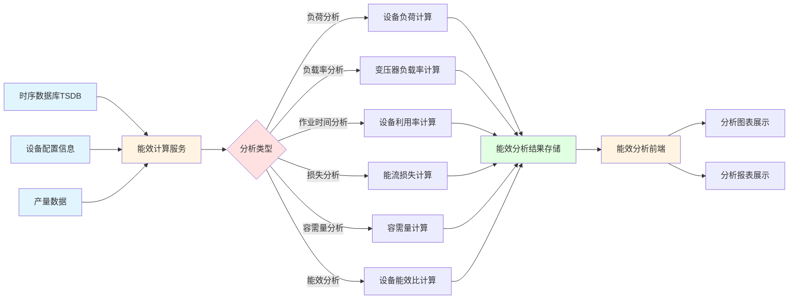

**数据流程说明：**
1. 从时序数据库读取设备能耗数据和运行数据
2. 从配置管理模块获取设备配置信息
3. 从能源管理模块获取产量数据
4. 能效计算服务根据不同的分析类型进行相应的计算
5. 计算结果存储到数据库，供前端查询展示

#### 5.4.0.1 业务流程图

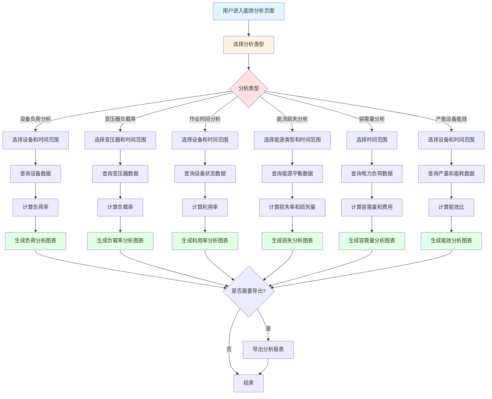

**业务流程说明：**
1. 用户选择能效分析类型
2. 根据分析类型配置相应的查询条件
3. 系统查询相关数据并进行能效计算
4. 生成相应的分析图表和报表
5. 用户可导出分析报表进行进一步分析

#### 5.4.1 设备负荷分析
##### 5.4.1.1 需求描述
设备负荷分析功能用于分析生产设备的负荷情况，包括设备负荷率、负荷分布、负荷趋势等，支持多设备对比分析，帮助用户识别设备运行效率和优化潜力。

**角色与权限**

| 角色 | 按钮权限 | 数据权限 |
|:----:|:--------|:--------|
| 调度员 | 查看、导出 | 全部 |
| 能源专家 | 查看、导出 | 全部 |
| 系统管理员 | 查看、导出 | 全部 |

##### 5.4.1.2 原型
页面包含以下主要区域：
1. 筛选区域：设备类型、设备名称、时间范围筛选
2. 设备列表：横向滚动展示设备卡片，支持左右箭头滑动
3. 负荷分析图表：展示设备负荷率趋势、负荷分布等
4. 设备详情：点击设备查看详细负荷分析数据

##### 5.4.1.3 业务模型
| 名称 | 控件 | 查询 | 列表 | 新增 | 修改 | 必填 | 多值 | 字数限制 |
|:----:|:----:|:----:|:----:|:----:|:----:|:----:|:----:|:----:|
| 设备类型 | 下拉框 | √ | √ | 隐藏 | 隐藏 | / | / |  |
| 设备名称 | 搜索选择框 | √ | √ | 隐藏 | 隐藏 | / | / |  |
| 时间范围 | 日期时间框 | √ | / | 隐藏 | 隐藏 | √ | / |  |
| 设备编码 | 文本框 | / | √ | 隐藏 | 隐藏 | / | / |  |
| 额定功率 | 数字框 | / | √ | 隐藏 | 隐藏 | / | / |  |
| 当前功率 | 数字框 | / | √ | 隐藏 | 隐藏 | / | / | 自动采集 |
| 负荷率 | 百分比 | / | √ | 隐藏 | 隐藏 | / | / | 自动计算 |
| 运行状态 | 下拉框 | / | √ | 隐藏 | 隐藏 | / | / | 自动判断 |

##### 5.4.1.4 业务规则
（1）负荷率 = 当前功率 / 额定功率 × 100%
（2）设备卡片横向排列，支持左右滑动查看
（3）负荷率分级：低负荷（<50%）、正常负荷（50%-80%）、高负荷（80%-100%）、超负荷（>100%）
（4）超负荷设备标记为红色预警
（5）支持多设备负荷对比分析
（6）负荷趋势图显示最近30天的负荷变化

##### 5.4.1.5 数据处理逻辑说明
（1）**负荷率计算**：系统实时查询设备的当前功率和额定功率，计算负荷率 = 当前功率 / 额定功率 × 100%
（2）**负荷分级判断**：根据负荷率值自动判断负荷等级，低于50%为低负荷，50%-80%为正常负荷，80%-100%为高负荷，超过100%为超负荷
（3）**负荷趋势计算**：从时序数据库查询设备的历史功率数据，按时间序列计算负荷率，生成负荷趋势曲线
（4）**设备筛选聚合**：根据设备类型、设备名称等筛选条件，对设备数据进行聚合查询和分组统计
（5）**负荷对比分析**：选择多个设备时，系统统一时间范围和时间粒度，对设备负荷率进行对比分析
（6）**预警触发判断**：实时监测设备负荷率，超负荷设备自动触发预警，在列表中标记显示

##### 5.4.1.6 数据限制要求
（1）**设备数量限制**：单次查询最多支持100个设备，超出范围需分页查询或添加筛选条件
（2）**查询时间范围限制**：负荷趋势查询时间范围不超过90天，超过90天需分时间段查询
（3）**数据精度要求**：当前功率精度保留2位小数，负荷率精度保留1位小数
（4）**数据更新频率限制**：设备负荷数据更新频率为1分钟，页面刷新间隔最短30秒
（5）**趋势数据点限制**：负荷趋势图最多显示1000个数据点，超出范围自动降采样
（6）**并发查询限制**：单用户最多同时查询10个设备的详细负荷数据，超出限制需等待

##### 5.4.1.7 数据来源说明
（1）**设备基本信息**：来源于配置管理模块的KPI模型配置，包括设备编码、名称、类型、额定功率等信息
（2）**设备实时功率**：来源于数据采集网关，通过Modbus、OPC等工业协议从设备PLC/DCS实时采集的功率数据
（3）**设备历史功率**：来源于时序数据库（TSDB），存储的设备历史功率数据，包括分钟级、小时级等不同粒度
（4）**设备运行状态**：来源于在线监测模块的设备状态监测功能，包括设备运行状态、健康指数等信息
（5）**预警配置信息**：来源于告警管理模块的告警设置，包括负荷率预警阈值、预警级别等信息
（6）**设备类型配置**：来源于配置管理模块的设备配置，包括设备类型、额定功率、运行参数等信息

#### 5.4.2 变压器负载率分析
##### 5.4.2.1 需求描述
变压器负载率分析功能专门用于分析变压器的负载情况，包括负载率、负载分布、负载趋势等，帮助用户优化变压器运行，避免过载和欠载，提高供电效率。

**角色与权限**

| 角色 | 按钮权限 | 数据权限 |
|:----:|:--------|:--------|
| 调度员 | 查看、导出 | 全部 |
| 能源专家 | 查看、导出 | 全部 |
| 系统管理员 | 查看、导出 | 全部 |

##### 5.4.2.2 原型
页面包含以下主要区域：
1. 筛选区域：变压器名称、时间范围筛选
2. 变压器列表：展示所有变压器的基本信息
3. 负载率分析图表：展示变压器负载率趋势、负载分布
4. 变压器详情：点击变压器查看详细负载分析数据

##### 5.4.2.3 业务模型
| 名称 | 控件 | 查询 | 列表 | 新增 | 修改 | 必填 | 多值 | 字数限制 |
|:----:|:----:|:----:|:----:|:----:|:----:|:----:|:----:|:----:|
| 变压器名称 | 搜索选择框 | √ | √ | 隐藏 | 隐藏 | / | / |  |
| 时间范围 | 日期时间框 | √ | / | 隐藏 | 隐藏 | √ | / |  |
| 变压器编码 | 文本框 | / | √ | 隐藏 | 隐藏 | / | / |  |
| 额定容量 | 数字框 | / | √ | 隐藏 | 隐藏 | / | / |  |
| 当前负载 | 数字框 | / | √ | 隐藏 | 隐藏 | / | / | 自动采集 |
| 负载率 | 百分比 | / | √ | 隐藏 | 隐藏 | / | / | 自动计算 |
| 运行状态 | 下拉框 | / | √ | 隐藏 | 隐藏 | / | / | 自动判断 |
| 温度 | 数字框 | / | √ | 隐藏 | 隐藏 | / | / | 自动采集 |

##### 5.4.2.4 业务规则
（1）负载率 = 当前负载 / 额定容量 × 100%
（2）负载率分级：欠载（<30%）、正常（30%-80%）、高负载（80%-100%）、过载（>100%）
（3）过载变压器标记为红色预警
（4）支持变压器负载率趋势分析，查看历史变化
（5）支持多变压器负载对比分析
（6）变压器温度超过设定值时触发预警

##### 5.4.2.5 数据处理逻辑说明
（1）**负载率计算**：系统实时查询变压器的当前负载和额定容量，计算负载率 = 当前负载 / 额定容量 × 100%
（2）**负载分级判断**：根据负载率值自动判断负载等级，低于30%为欠载，30%-80%为正常，80%-100%为高负载，超过100%为过载
（3）**负载趋势计算**：从时序数据库查询变压器的历史负载数据，按时间序列计算负载率，生成负载趋势曲线
（4）**温度监测判断**：实时监测变压器温度，当温度超过设定阈值时自动触发预警，记录预警信息
（5）**负载对比分析**：选择多个变压器时，系统统一时间范围和时间粒度，对变压器负载率进行对比分析
（6）**数据聚合处理**：根据查询时间范围自动选择数据聚合粒度，按小时、按天聚合负载数据

##### 5.4.2.6 数据限制要求
（1）**变压器数量限制**：单次查询最多支持50个变压器，超出范围需分页查询或添加筛选条件
（2）**查询时间范围限制**：负载趋势查询时间范围不超过1年，超过1年需分时间段查询
（3）**数据精度要求**：当前负载精度保留2位小数，负载率精度保留1位小数，温度精度保留1位小数
（4）**数据更新频率限制**：变压器负载数据更新频率为1分钟，页面刷新间隔最短30秒
（5）**温度阈值限制**：温度阈值设置范围0-150℃，超出范围需校验合理性
（6）**并发查询限制**：单用户最多同时查询10个变压器的详细负载数据，超出限制需等待

##### 5.4.2.7 数据来源说明
（1）**变压器基本信息**：来源于配置管理模块的KPI模型配置，包括变压器编码、名称、额定容量等信息
（2）**变压器实时负载**：来源于数据采集网关，通过Modbus、OPC等工业协议从变压器监测装置实时采集的负载数据
（3）**变压器历史负载**：来源于时序数据库（TSDB），存储的变压器历史负载数据，包括分钟级、小时级等不同粒度
（4）**变压器温度数据**：来源于数据采集网关，通过温度传感器实时采集的变压器温度数据
（5）**预警配置信息**：来源于告警管理模块的告警设置，包括负载率预警阈值、温度预警阈值等信息
（6）**变压器配置信息**：来源于配置管理模块的设备配置，包括变压器类型、额定容量、运行参数等信息

#### 5.4.3 生产设备作业时间分析
##### 5.4.3.1 需求描述
生产设备作业时间分析功能用于统计和分析生产设备的作业时间，包括运行时间、待机时间、停机时间等，帮助用户了解设备利用率，优化生产计划。

**角色与权限**

| 角色 | 按钮权限 | 数据权限 |
|:----:|:--------|:--------|
| 调度员 | 查看、导出 | 全部 |
| 能源专家 | 查看、导出 | 全部 |
| 系统管理员 | 查看、导出 | 全部 |

##### 5.4.3.2 原型
页面包含以下主要区域：
1. 筛选区域：设备类型、设备名称、时间范围筛选
2. 作业时间统计表：展示各设备的作业时间统计
3. 作业时间分析图表：展示设备利用率、作业时间分布等
4. 设备详情：点击设备查看详细作业时间分析

##### 5.4.3.3 业务模型
| 名称 | 控件 | 查询 | 列表 | 新增 | 修改 | 必填 | 多值 | 字数限制 |
|:----:|:----:|:----:|:----:|:----:|:----:|:----:|:----:|:----:|
| 设备类型 | 下拉框 | √ | √ | 隐藏 | 隐藏 | / | / |  |
| 设备名称 | 搜索选择框 | √ | √ | 隐藏 | 隐藏 | / | / |  |
| 时间范围 | 日期时间框 | √ | / | 隐藏 | 隐藏 | √ | / |  |
| 设备编码 | 文本框 | / | √ | 隐藏 | 隐藏 | / | / |  |
| 运行时间 | 时间框 | / | √ | 隐藏 | 隐藏 | / | / | 自动计算 |
| 待机时间 | 时间框 | / | √ | 隐藏 | 隐藏 | / | / | 自动计算 |
| 停机时间 | 时间框 | / | √ | 隐藏 | 隐藏 | / | / | 自动计算 |
| 利用率 | 百分比 | / | √ | 隐藏 | 隐藏 | / | / | 自动计算 |

##### 5.4.3.4 业务规则
（1）利用率 = 运行时间 / 总时间 × 100%
（2）总时间 = 运行时间 + 待机时间 + 停机时间
（3）支持按日、周、月、年统计作业时间
（4）支持设备利用率排名和对比分析
（5）利用率低于设定阈值时触发预警
（6）支持导出作业时间统计报表

##### 5.4.3.5 数据处理逻辑说明
（1）**作业时间统计**：系统从时序数据库查询设备的状态变化记录，按时间段统计设备的运行时间、待机时间、停机时间
（2）**利用率计算**：利用率 = 运行时间 / 总时间 × 100%，总时间 = 运行时间 + 待机时间 + 停机时间
（3）**时间维度聚合**：根据选择的时间维度（日、周、月、年）对作业时间数据进行聚合统计，生成对应时间维度的利用率
（4）**利用率排名**：对设备的利用率进行排序，生成设备利用率排名，支持升序和降序排列
（5）**趋势分析**：按时间序列查询设备的利用率数据，计算利用率的变化趋势，生成趋势图表
（6）**预警判断**：实时监测设备利用率，当利用率低于设定阈值时自动触发预警，记录预警信息

##### 5.4.3.6 数据限制要求
（1）**设备数量限制**：单次查询最多支持200个设备，超出范围需分页查询或添加筛选条件
（2）**查询时间范围限制**：作业时间查询时间范围不超过2年，超过2年需分时间段查询
（3）**数据精度要求**：作业时间精度保留分钟，利用率精度保留1位小数
（4）**统计维度限制**：单次统计最多支持一个时间维度，不能同时统计多个时间维度
（5）**并发查询限制**：单用户最多同时执行3个查询任务，超出限制需等待其他任务完成
（6）**导出数据量限制**：单次导出最多10万条记录，超出范围需分批导出或提示用户缩小时间范围

##### 5.4.3.7 数据来源说明
（1）**设备基本信息**：来源于配置管理模块的KPI模型配置，包括设备编码、名称、类型等信息
（2）**设备状态记录**：来源于在线监测模块的设备状态监测功能，记录设备状态变化的时间点
（3）**设备历史状态**：来源于时序数据库（TSDB），存储的设备历史状态数据，包括状态变化记录
（4）**设备运行参数**：来源于数据采集网关，通过Modbus、OPC等工业协议从设备PLC/DCS采集的运行参数
（5）**预警配置信息**：来源于告警管理模块的告警设置，包括利用率预警阈值、预警级别等信息
（6）**时间统计配置**：来源于配置管理模块的系统配置，包括时间统计规则、统计周期等信息

#### 5.4.4 能流损失分析
##### 5.4.4.1 需求描述
能流损失分析功能用于分析能源在传输和使用过程中的损失情况，识别能源浪费点，计算损失量和损失金额，帮助用户采取节能措施，减少能源浪费。

**角色与权限**

| 角色 | 按钮权限 | 数据权限 |
|:----:|:--------|:--------|
| 调度员 | 查看、导出 | 全部 |
| 能源专家 | 查看、导出 | 全部 |
| 系统管理员 | 查看、导出 | 全部 |

##### 5.4.4.2 原型
页面包含以下主要区域：
1. 筛选区域：能源类型、时间范围、区域筛选
2. 损失分析概览：总损失量、损失金额等关键指标
3. 损失分析图表：展示损失分布、损失趋势等
4. 损失明细表：展示各损失点的详细数据

##### 5.4.4.3 业务模型
| 名称 | 控件 | 查询 | 列表 | 新增 | 修改 | 必填 | 多值 | 字数限制 |
|:----:|:----:|:----:|:----:|:----:|:----:|:----:|:----:|:----:|
| 能源类型 | 下拉框 | √ | √ | 隐藏 | 隐藏 | / | / |  |
| 时间范围 | 日期时间框 | √ | / | 隐藏 | 隐藏 | √ | / |  |
| 区域 | 下拉框 | √ | √ | 隐藏 | 隐藏 | / | / |  |
| 损失类型 | 下拉框 | / | √ | 隐藏 | 隐藏 | / | / |  |
| 损失量 | 数字框 | / | √ | 隐藏 | 隐藏 | / | / | 自动计算 |
| 损失金额 | 数字框 | / | √ | 隐藏 | 隐藏 | / | / | 自动计算 |
| 损失率 | 百分比 | / | √ | 隐藏 | 隐藏 | / | / | 自动计算 |
| 损失原因 | 文本框 | / | √ | 隐藏 | 隐藏 | / | / | 自动分析 |

##### 5.4.4.4 业务规则
（1）损失量 = 输入量 - 输出量 - 有效利用量
（2）损失率 = 损失量 / 输入量 × 100%
（3）损失金额 = 损失量 × 能源单价
（4）损失类型包括：传输损失、转换损失、泄漏损失、无效加工损失等
（5）损失率超过设定阈值时触发预警
（6）支持损失趋势分析和损失原因分析

##### 5.4.4.5 数据处理逻辑说明
（1）**损失量计算**：系统从时序数据库查询能源的输入量、输出量、有效利用量数据，计算损失量 = 输入量 - 输出量 - 有效利用量
（2）**损失率计算**：损失率 = 损失量 / 输入量 × 100%，当输入量为0时，损失率设为0或标记为异常
（3）**损失金额计算**：损失金额 = 损失量 × 能源单价，能源单价来源于配置管理模块的能源成本配置
（4）**损失类型分类**：根据损失发生的位置和原因，系统自动或手动分类损失类型（传输损失、转换损失、泄漏损失、无效加工损失等）
（5）**损失趋势分析**：按时间序列查询损失数据，计算损失量、损失率的变化趋势，生成趋势图表
（6）**损失原因分析**：结合设备运行状态、工艺参数等因素，分析损失产生的原因，生成分析报告

##### 5.4.4.6 数据限制要求
（1）**查询时间范围限制**：损失分析查询时间范围不超过1年，超过1年需分时间段查询
（2）**数据精度要求**：损失量精度保留2位小数，损失率精度保留1位小数，损失金额精度保留2位小数
（3）**损失类型限制**：损失类型最多支持10种，超出范围需合并分类或优化损失类型定义
（4）**数据更新频率限制**：损失数据更新频率为1小时，页面刷新间隔最短10分钟
（5）**预警阈值限制**：损失率预警阈值设置范围0-100%，超出范围需校验合理性
（6）**并发查询限制**：单用户最多同时执行2个损失分析查询任务，超出限制需等待

##### 5.4.4.7 数据来源说明
（1）**能源输入输出数据**：来源于数据采集网关，通过Modbus、OPC等工业协议从监测点实时采集的能源输入输出数据
（2）**有效利用量数据**：来源于能源管理模块的产品单耗管理，根据产量和单耗计算的有效利用量
（3）**能源单价数据**：来源于配置管理模块的能源成本配置，包括能源单价、分时电价等信息
（4）**损失类型配置**：来源于配置管理模块的系统配置，包括损失类型定义、分类规则等信息
（5）**设备运行状态**：来源于在线监测模块的设备状态监测功能，包括设备运行状态、故障信息等
（6）**历史损失数据**：来源于时序数据库（TSDB），存储的历史损失数据，包括损失量、损失率、损失类型等

#### 5.4.5 容需量分析
##### 5.4.5.1 需求描述
容需量分析功能用于分析电力系统的容量需求和需量管理，包括基本容量、最大需量、需量预测等，支持费用分析、模型管理、需量申报等功能，帮助用户优化电力成本。

**角色与权限**

| 角色 | 按钮权限 | 数据权限 |
|:----:|:--------|:--------|
| 调度员 | 查看、导出、申报 | 全部 |
| 能源专家 | 查看、导出 | 全部 |
| 系统管理员 | 查看、导出、配置 | 全部 |

##### 5.4.5.2 原型
页面包含以下主要区域：
1. Tab导航：费用分析、模型管理、需量申报
2. 费用分析Tab：展示容量费用、需量费用、总费用等
3. 模型管理Tab：管理需量预测模型和参数配置
4. 需量申报Tab：进行需量申报和审批流程

##### 5.4.5.3 业务模型
| 名称 | 控件 | 查询 | 列表 | 新增 | 修改 | 必填 | 多值 | 字数限制 |
|:----:|:----:|:----:|:----:|:----:|:----:|:----:|:----:|:----:|
| 时间范围 | 日期时间框 | √ | / | 隐藏 | 隐藏 | √ | / |  |
| 基本容量 | 数字框 | / | √ | 隐藏 | 隐藏 | / | / |  |
| 最大需量 | 数字框 | / | √ | 隐藏 | 隐藏 | / | / | 自动计算 |
| 预测需量 | 数字框 | / | √ | 隐藏 | 隐藏 | / | / | 自动预测 |
| 容量费用 | 数字框 | / | √ | 隐藏 | 隐藏 | / | / | 自动计算 |
| 需量费用 | 数字框 | / | √ | 隐藏 | 隐藏 | / | / | 自动计算 |
| 总费用 | 数字框 | / | √ | 隐藏 | 隐藏 | / | / | 自动计算 |
| 申报状态 | 下拉框 | / | √ | 隐藏 | 正常 | / | / |  |

##### 5.4.5.4 业务规则
（1）容量费用 = 基本容量 × 容量单价
（2）需量费用 = 最大需量 × 需量单价
（3）总费用 = 容量费用 + 需量费用
（4）需量预测基于历史数据和负荷预测模型
（5）需量申报需要审批流程，支持多级审批
（6）申报状态包括：草稿、待审批、已审批、已生效

##### 5.4.5.5 数据处理逻辑说明
（1）**最大需量计算**：系统从时序数据库查询电力负荷数据，按月度统计最大需量，取月度内15分钟或30分钟平均负荷的最大值
（2）**容量费用计算**：容量费用 = 基本容量 × 容量单价，基本容量和容量单价来源于配置管理模块的电价配置
（3）**需量费用计算**：需量费用 = 最大需量 × 需量单价，需量单价来源于配置管理模块的电价配置
（4）**总费用计算**：总费用 = 容量费用 + 需量费用，汇总得到电力总费用
（5）**需量预测**：基于历史负荷数据，采用时间序列分析或机器学习模型（如LSTM）预测未来需量，生成预测曲线
（6）**申报流程处理**：需量申报经过草稿、提交、审批、生效等状态流转，支持多级审批流程，记录审批意见和审批时间

##### 5.4.5.6 数据限制要求
（1）**查询时间范围限制**：容需量分析查询时间范围不超过3年，超过3年需分时间段查询
（2）**数据精度要求**：基本容量精度保留2位小数，最大需量精度保留2位小数，费用精度保留2位小数
（3）**预测模型限制**：需量预测模型训练数据需要至少3个月的历史数据，数据不足时使用简单趋势预测
（4）**申报数据限制**：单次需量申报最多支持12个月，超出范围需分批次申报
（5）**审批流程限制**：审批流程最多支持5级审批，超出级别需优化审批流程
（6）**并发查询限制**：单用户最多同时执行2个容需量分析查询任务，超出限制需等待

##### 5.4.5.7 数据来源说明
（1）**电力负荷数据**：来源于数据采集网关，通过Modbus、OPC等工业协议从电表实时采集的电力负荷数据
（2）**基本容量配置**：来源于配置管理模块的电价配置，包括基本容量、容量单价等信息
（3）**电价配置信息**：来源于配置管理模块的能源成本配置，包括容量单价、需量单价、分时电价等信息
（4）**历史负荷数据**：来源于时序数据库（TSDB），存储的历史电力负荷数据，包括分钟级、15分钟级等不同粒度
（5）**需量预测模型**：来源于能效分析模块的预测模型配置，包括模型参数、预测算法等信息
（6）**申报审批记录**：来源于能源管理模块的需量申报管理，包括申报数据、审批状态、审批意见等

#### 5.4.6 产能设备能效
##### 5.4.6.1 需求描述
产能设备能效功能用于分析生产设备的能效情况，包括设备能效比、能效趋势、能效排名等，支持多设备对比分析，帮助用户识别高效设备和低效设备，优化设备运行。

**角色与权限**

| 角色 | 按钮权限 | 数据权限 |
|:----:|:--------|:--------|
| 调度员 | 查看、导出 | 全部 |
| 能源专家 | 查看、导出 | 全部 |
| 系统管理员 | 查看、导出 | 全部 |

##### 5.4.6.2 原型
页面包含以下主要区域：
1. 筛选区域：设备类型、设备名称、时间范围筛选
2. 能效概览：平均能效、能效排名等关键指标
3. 能效分析图表：展示设备能效趋势、能效分布等
4. 设备能效列表：展示各设备的能效数据和排名

##### 5.4.6.3 业务模型
| 名称 | 控件 | 查询 | 列表 | 新增 | 修改 | 必填 | 多值 | 字数限制 |
|:----:|:----:|:----:|:----:|:----:|:----:|:----:|:----:|:----:|
| 设备类型 | 下拉框 | √ | √ | 隐藏 | 隐藏 | / | / |  |
| 设备名称 | 搜索选择框 | √ | √ | 隐藏 | 隐藏 | / | / |  |
| 时间范围 | 日期时间框 | √ | / | 隐藏 | 隐藏 | √ | / |  |
| 设备编码 | 文本框 | / | √ | 隐藏 | 隐藏 | / | / |  |
| 产量 | 数字框 | / | √ | 隐藏 | 隐藏 | / | / | 自动采集 |
| 能耗 | 数字框 | / | √ | 隐藏 | 隐藏 | / | / | 自动采集 |
| 能效比 | 数字框 | / | √ | 隐藏 | 隐藏 | / | / | 自动计算 |
| 能效排名 | 数字框 | / | √ | 隐藏 | 隐藏 | / | / | 自动计算 |
| 运行状态 | 下拉框 | / | √ | 隐藏 | 隐藏 | / | / | 自动判断 |

##### 5.4.6.4 业务规则
（1）能效比 = 产量 / 能耗
（2）能效比越高表示设备能效越好
（3）支持按能效比进行设备排名
（4）能效比低于设定阈值时触发预警
（5）支持设备能效趋势分析，查看历史变化
（6）支持多设备能效对比分析

##### 5.4.6.5 数据处理逻辑说明
（1）**产量数据获取**：系统从能源管理模块的产量数据管理功能获取设备产量数据，包括日产量、月产量等
（2）**能耗数据获取**：系统从时序数据库查询设备能耗数据，按时间维度聚合得到对应时间段的能耗总量
（3）**能效比计算**：能效比 = 产量 / 能耗，当产量或能耗为0时，能效比设为0或标记为异常数据
（4）**设备排名计算**：对所有设备的能效比进行排序，生成设备能效排名，支持按能效比升序或降序排列
（5）**能效趋势分析**：按时间序列查询设备的能效比数据，计算能效比的变化趋势，生成趋势图表
（6）**能效对比分析**：选择多个设备时，系统统一时间范围，对设备能效比进行对比分析，识别高效设备和低效设备

##### 5.4.6.6 数据限制要求
（1）**设备数量限制**：单次查询最多支持100个设备，超出范围需分页查询或添加筛选条件
（2）**查询时间范围限制**：能效分析查询时间范围不超过2年，超过2年需分时间段查询
（3）**数据精度要求**：产量精度保留2位小数，能耗精度保留2位小数，能效比精度保留3位小数
（4）**数据更新频率限制**：能效数据更新频率为1小时，页面刷新间隔最短10分钟
（5）**能效阈值限制**：能效比预警阈值设置范围大于0，低于0需校验数据合理性
（6）**并发查询限制**：单用户最多同时执行3个能效分析查询任务，超出限制需等待

##### 5.4.6.7 数据来源说明
（1）**设备产量数据**：来源于能源管理模块的产量数据管理功能，包括产品名称、产量、单位、时间等信息
（2）**设备能耗数据**：来源于时序数据库（TSDB），存储的设备历史能耗数据，包括分钟级、小时级等不同粒度
（3）**设备基本信息**：来源于配置管理模块的KPI模型配置，包括设备编码、名称、类型等信息
（4）**产品信息**：来源于配置管理模块的产品配置，包括产品编码、名称、单位等信息
（5）**预警配置信息**：来源于告警管理模块的告警设置，包括能效比预警阈值、预警级别等信息
（6）**能效标准配置**：来源于配置管理模块的系统配置，包括能效比标准值、能效等级划分等信息

### 5.5 能源管理模块

#### 5.5.0 数据流程图

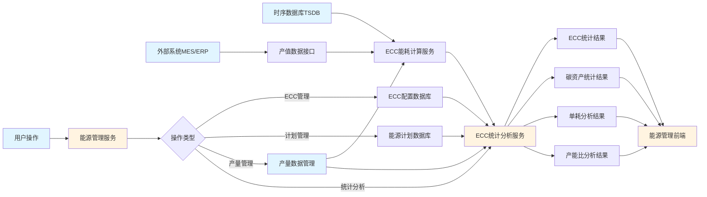

**数据流程说明：**
1. 用户通过前端进行ECC管理、计划管理、产量管理等操作
2. ECC能耗计算服务从时序数据库读取能耗数据
3. 从产量数据管理模块获取产量数据
4. 从外部系统（MES/ERP）获取产值数据
5. ECC统计分析服务进行各类统计分析计算
6. 统计结果通过前端展示给用户

#### 5.5.0.1 业务流程图

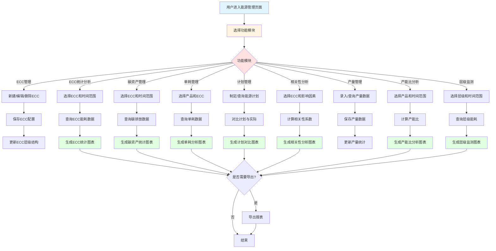

**业务流程说明：**
1. 用户选择能源管理功能模块
2. 根据功能模块进行相应的操作（新建、查询、分析等）
3. 系统处理用户操作并查询相关数据
4. 进行相应的计算和分析
5. 生成分析结果并展示给用户
6. 用户可选择导出报表

#### 5.5.1 新建ECC
##### 5.5.1.1 需求描述
新建ECC功能用于创建和管理能源消耗中心（ECC）的层级结构，支持工厂、车间、产线、工序、设备等多层级ECC的创建、编辑、删除和层级关系维护，帮助用户建立完整的能源管理组织架构。

**角色与权限**

| 角色 | 按钮权限 | 数据权限 |
|:----:|:--------|:--------|
| 调度员 | 查看、新增、编辑、删除 | 全部 |
| 能源专家 | 查看、新增、编辑、删除 | 全部 |
| 系统管理员 | 查看、新增、编辑、删除 | 全部 |

##### 5.5.1.2 原型
页面包含以下主要区域：
1. 操作栏：新建ECC、全部展开、全部折叠、导出配置按钮
2. 搜索栏：搜索ECC名称或编码
3. ECC层级结构树：以树形结构展示ECC层级关系
4. ECC节点操作：编辑、添加子节点、删除按钮

##### 5.5.1.3 业务模型
| 名称 | 控件 | 查询 | 列表 | 新增 | 修改 | 必填 | 多值 | 字数限制 |
|:----:|:----:|:----:|:----:|:----:|:----:|:----:|:----:|:----:|
| ECC编码 | 文本框 | √ | √ | 正常 | 正常 | √ | / | 20 |
| ECC名称 | 文本框 | √ | √ | 正常 | 正常 | √ | / | 50 |
| ECC层级 | 下拉框 | / | √ | 正常 | 只读 | √ | / |  |
| 父级ECC | 搜索选择框 | / | √ | 正常 | 只读 | / | / |  |
| 关联ECC | 搜索选择框 | / | √ | 正常 | 正常 | / | / |  |
| 负责人 | 人员选择框 | / | √ | 正常 | 正常 | / | / |  |
| 联系电话 | 文本框 | / | √ | 正常 | 正常 | / | / | 20 |
| 描述信息 | 多行文本 | / | √ | 正常 | 正常 | / | / | 500 |
| 创建人 | 人员选择框 | / | √ | 隐藏 | 隐藏 | √ | / |  |
| 创建时间 | 时间框 | / | √ | 隐藏 | 隐藏 | √ | / |  |
| 更新人 | 人员选择框 | / | / | 隐藏 | 隐藏 | / | / |  |
| 更新时间 | 时间框 | / | / | 隐藏 | 隐藏 | / | / |  |

##### 5.5.1.4 业务规则
（1）ECC编码在系统内唯一，不可重复
（2）ECC层级包括：公司工厂级、车间级、产线级、工序级、设备级、班组级
（3）子级ECC必须关联父级ECC，形成层级关系
（4）删除ECC时，如果存在子级ECC，需要先删除所有子级ECC
（5）支持ECC节点的展开和折叠操作
（6）支持ECC配置的导入和导出功能
（7）ECC层级结构支持拖拽调整（如需要）

##### 5.5.1.5 数据处理逻辑说明
（1）**ECC编码唯一性校验**：新建或编辑ECC时，系统检查ECC编码在系统内是否已存在，已存在则拒绝保存并提示用户
（2）**层级关系维护**：系统维护ECC的层级关系树，子级ECC必须关联父级ECC，形成树形结构，支持层级下钻和上钻
（3）**级联删除检查**：删除ECC时，系统检查是否存在子级ECC，存在则拒绝删除并提示用户先删除所有子级ECC
（4）**ECC数据关联**：删除ECC时，系统检查是否有关联的能耗数据、告警数据等，存在则提示用户或阻止删除
（5）**导入导出处理**：ECC配置导入时，系统验证数据格式和层级关系的正确性，导入后自动构建层级关系树；导出时按层级关系组织数据
（6）**树形结构渲染**：ECC层级结构树采用懒加载方式，初始只加载根节点，展开节点时再加载子节点，提高加载性能

##### 5.5.1.6 数据限制要求
（1）**ECC编码长度限制**：ECC编码最大长度20个字符，超出长度拒绝保存
（2）**ECC名称长度限制**：ECC名称最大长度50个字符，超出长度拒绝保存
（3）**层级深度限制**：ECC层级最多支持6级（公司工厂级、车间级、产线级、工序级、设备级、班组级），超出层级需优化结构
（4）**子节点数量限制**：单个ECC下最多支持1000个子节点，超出范围需分页显示或优化层级结构
（5）**导入数据量限制**：单次导入最多1000条ECC配置，超出范围需分批导入
（6）**并发编辑限制**：同一ECC同时只允许一个用户编辑，其他用户编辑时提示冲突

##### 5.5.1.7 数据来源说明
（1）**ECC配置数据**：来源于用户手动录入或导入，存储在关系型数据库的ECC配置表中
（2）**ECC层级关系**：来源于ECC配置表的父级ECC字段，系统根据父级关系构建层级关系树
（3）**组织架构配置**：来源于配置管理模块的组织架构配置，包括厂区、车间、产线等层级关系
（4）**人员信息**：来源于系统的用户管理模块或外部系统（如OA、HR系统），包括负责人、创建人等信息
（5）**关联数据检查**：来源于能源管理模块、告警管理模块等，检查ECC是否有关联的能耗数据、告警数据等
（6）**ECC模板数据**：来源于配置管理模块的ECC模板配置，提供标准的ECC层级结构和字段配置

#### 5.5.2 ECC能源统计分析
##### 5.5.2.1 需求描述
ECC能源统计分析功能用于对各个ECC的能源消耗进行统计分析，包括能耗量、费用、标煤当量、碳排放等指标，支持多维度查询和对比分析，帮助用户了解各ECC的能源使用情况。

**角色与权限**

| 角色 | 按钮权限 | 数据权限 |
|:----:|:--------|:--------|
| 调度员 | 查看、导出 | 全部 |
| 能源专家 | 查看、导出 | 全部 |
| 管理层 | 查看、导出 | 全部 |
| 系统管理员 | 查看、导出 | 全部 |

##### 5.5.2.2 原型
页面包含以下主要区域：
1. 筛选区域：ECC选择、能源类型、时间范围筛选
2. 统计概览：总能耗、总费用、标煤当量、碳排放等关键指标
3. 统计分析图表：展示各ECC的能耗对比、趋势分析等
4. 详细数据表格：展示各ECC的详细能耗数据

##### 5.5.2.3 业务模型
| 名称 | 控件 | 查询 | 列表 | 新增 | 修改 | 必填 | 多值 | 字数限制 |
|:----:|:----:|:----:|:----:|:----:|:----:|:----:|:----:|:----:|
| ECC | 搜索选择框 | √ | √ | 隐藏 | 隐藏 | / | / |  |
| 能源类型 | 下拉框 | √ | √ | 隐藏 | 隐藏 | / | / |  |
| 时间范围 | 日期时间框 | √ | / | 隐藏 | 隐藏 | √ | / |  |
| ECC编码 | 文本框 | / | √ | 隐藏 | 隐藏 | / | / |  |
| ECC名称 | 文本框 | / | √ | 隐藏 | 隐藏 | / | / |  |
| 能耗量 | 数字框 | / | √ | 隐藏 | 隐藏 | / | / | 自动计算 |
| 费用 | 数字框 | / | √ | 隐藏 | 隐藏 | / | / | 自动计算 |
| 标煤当量 | 数字框 | / | √ | 隐藏 | 隐藏 | / | / | 自动计算 |
| 碳排放 | 数字框 | / | √ | 隐藏 | 隐藏 | / | / | 自动计算 |
| 占比 | 百分比 | / | √ | 隐藏 | 隐藏 | / | / | 自动计算 |

##### 5.5.2.4 业务规则
（1）支持按ECC层级进行统计，支持层级下钻
（2）支持多ECC对比分析
（3）占比计算 = 单个ECC能耗量 / 总能耗量 × 100%
（4）支持同环比分析，对比不同时间段的能耗变化
（5）支持按能耗量、费用等指标排序
（6）支持导出ECC能源统计报表

##### 5.5.2.5 数据处理逻辑说明
（1）**ECC能耗数据查询**：系统从时序数据库按ECC编码、时间范围查询能耗数据，按ECC层级进行分组聚合
（2）**层级汇总计算**：从设备级开始，逐级向上汇总ECC能耗量，父级ECC能耗量 = 所有子级ECC能耗量之和
（3）**占比计算**：每个ECC的能耗量占总能耗量的百分比，占比 = 单个ECC能耗量 / 总能耗量 × 100%
（4）**费用计算**：各ECC能耗量 × 对应能源单价，汇总得到ECC总费用
（5）**同环比分析**：系统计算同期和环比的数据，对比不同时间段的能耗变化，计算变化率和变化量
（6）**层级下钻**：用户点击ECC节点时，系统查询该ECC下的子级ECC数据，展示子级ECC的能耗贡献

##### 5.5.2.6 数据限制要求
（1）**ECC数量限制**：单次查询最多支持100个ECC，超出范围需分页查询或添加筛选条件
（2）**查询时间范围限制**：ECC能耗统计查询时间范围不超过5年，超过5年需分时间段查询
（3）**数据精度要求**：能耗量精度保留2位小数，费用精度保留2位小数，占比精度保留1位小数
（4）**层级深度限制**：ECC层级下钻最多支持6级，超出层级需分页显示
（5）**导出数据量限制**：单次导出最多50万条记录，超出范围需分批导出或提示用户缩小时间范围
（6）**并发查询限制**：单用户最多同时执行3个ECC统计查询任务，超出限制需等待

##### 5.5.2.7 数据来源说明
（1）**ECC配置信息**：来源于能源管理模块的新建ECC功能，包括ECC编码、名称、层级、父级关系等信息
（2）**ECC能耗数据**：来源于时序数据库（TSDB），存储的按ECC聚合的能耗数据，包括分钟级、小时级、日级等不同粒度
（3）**能源价格数据**：来源于配置管理模块的能源成本配置，包括能源单价、分时电价等信息
（4）**监测点关联关系**：来源于配置管理模块的监测点与ECC的关联配置，定义监测点所属的ECC
（5）**组织架构信息**：来源于配置管理模块的组织架构配置，包括厂区、车间、产线等层级关系
（6）**统计数据**：来源于能源统计模块的预处理统计数据，包括按时间、ECC、能源类型聚合的统计结果

#### 5.5.3 ECC碳资产统计分析
##### 5.5.3.1 需求描述
ECC碳资产统计分析功能用于对各个ECC的碳排放和碳资产进行统计分析，包括碳排放量、碳资产价值、碳减排量等指标，支持碳资产管理和碳交易分析，帮助用户实现碳达峰、碳中和目标。

**角色与权限**

| 角色 | 按钮权限 | 数据权限 |
|:----:|:--------|:--------|
| 调度员 | 查看、导出 | 全部 |
| 能源专家 | 查看、导出 | 全部 |
| 管理层 | 查看、导出 | 全部 |
| 系统管理员 | 查看、导出 | 全部 |

##### 5.5.3.2 原型
页面包含以下主要区域：
1. 筛选区域：ECC选择、时间范围筛选
2. 碳资产概览：总碳排放、碳资产价值、碳减排量等关键指标
3. 碳排放分析图表：展示各ECC的碳排放对比、趋势分析等
4. 详细数据表格：展示各ECC的详细碳排放和碳资产数据

##### 5.5.3.3 业务模型
| 名称 | 控件 | 查询 | 列表 | 新增 | 修改 | 必填 | 多值 | 字数限制 |
|:----:|:----:|:----:|:----:|:----:|:----:|:----:|:----:|:----:|
| ECC | 搜索选择框 | √ | √ | 隐藏 | 隐藏 | / | / |  |
| 时间范围 | 日期时间框 | √ | / | 隐藏 | 隐藏 | √ | / |  |
| ECC编码 | 文本框 | / | √ | 隐藏 | 隐藏 | / | / |  |
| ECC名称 | 文本框 | / | √ | 隐藏 | 隐藏 | / | / |  |
| 碳排放量 | 数字框 | / | √ | 隐藏 | 隐藏 | / | / | 自动计算 |
| 碳资产价值 | 数字框 | / | √ | 隐藏 | 隐藏 | / | / | 自动计算 |
| 碳减排量 | 数字框 | / | √ | 隐藏 | 隐藏 | / | / | 自动计算 |
| 碳强度 | 数字框 | / | √ | 隐藏 | 隐藏 | / | / | 自动计算 |
| 占比 | 百分比 | / | √ | 隐藏 | 隐藏 | / | / | 自动计算 |

##### 5.5.3.4 业务规则
（1）碳排放量 = 各能源类型消耗量 × 对应碳排放因子之和
（2）碳资产价值 = 碳减排量 × 碳交易价格
（3）碳强度 = 碳排放量 / 产值（或产量）
（4）支持按ECC层级进行统计，支持层级下钻
（5）支持多ECC碳排放对比分析
（6）支持碳排放趋势分析和预测
（7）支持导出碳资产统计报表

##### 5.5.3.5 数据处理逻辑说明
（1）**碳排放量计算**：系统从时序数据库查询ECC的能源消耗数据，各能源类型消耗量 × 对应碳排放因子，汇总得到ECC碳排放量
（2）**碳减排量计算**：碳减排量 = 基准碳排放量 - 实际碳排放量，基准碳排放量来源于历史数据或设定的减排目标
（3）**碳资产价值计算**：碳资产价值 = 碳减排量 × 碳交易价格，碳交易价格来源于配置管理模块的碳交易价格配置
（4）**碳强度计算**：碳强度 = 碳排放量 / 产值（或产量），产值来源于外部系统（如MES、ERP）或用户手动录入
（5）**层级汇总计算**：从设备级开始，逐级向上汇总ECC碳排放量，父级ECC碳排放量 = 所有子级ECC碳排放量之和
（6）**碳排放趋势分析**：按时间序列查询碳排放数据，计算碳排放量的变化趋势，生成趋势图表和预测曲线

##### 5.5.3.6 数据限制要求
（1）**ECC数量限制**：单次查询最多支持100个ECC，超出范围需分页查询或添加筛选条件
（2）**查询时间范围限制**：碳排放统计查询时间范围不超过5年，超过5年需分时间段查询
（3）**数据精度要求**：碳排放量精度保留2位小数，碳资产价值精度保留2位小数，碳强度精度保留3位小数
（4）**碳排放因子限制**：碳排放因子必须大于0，小于0或等于0需校验合理性
（5）**碳交易价格限制**：碳交易价格必须大于0，价格变化需记录历史价格
（6）**并发查询限制**：单用户最多同时执行3个碳排放统计查询任务，超出限制需等待

##### 5.5.3.7 数据来源说明
（1）**ECC配置信息**：来源于能源管理模块的新建ECC功能，包括ECC编码、名称、层级等信息
（2）**ECC能耗数据**：来源于时序数据库（TSDB），存储的按ECC聚合的能耗数据
（3）**碳排放因子**：来源于配置管理模块的能源网络配置，包括各能源类型的碳排放因子，符合国家碳排放核算标准
（4）**产值数据**：来源于外部系统（如MES、ERP）的产品产值数据，或来源于能源管理模块的产量数据管理功能
（5）**碳交易价格**：来源于配置管理模块的系统配置，包括碳交易价格、价格生效日期等信息
（6）**基准碳排放量**：来源于历史碳排放数据或设定的减排目标，包括基准年碳排放量、减排目标等

#### 5.5.4 能源性能管理
##### 5.5.4.1 需求描述
能源性能管理功能用于分析和评估能源系统的性能表现，包括能耗趋势回归分析、残差分析、节能效果趋势分析、离散度分布分析等，帮助用户识别能源性能问题和优化机会。

**角色与权限**

| 角色 | 按钮权限 | 数据权限 |
|:----:|:--------|:--------|
| 调度员 | 查看、导出 | 全部 |
| 能源专家 | 查看、导出 | 全部 |
| 系统管理员 | 查看、导出 | 全部 |

##### 5.5.4.2 原型
页面包含以下主要区域：
1. 筛选区域：ECC选择、时间范围筛选
2. 性能分析图表区域：
   - 能耗趋势回归分析图
   - 残差图
   - 节能效果趋势图
   - 离散度分布图
3. 性能指标表格：展示各ECC的性能指标数据

##### 5.5.4.3 业务模型
| 名称 | 控件 | 查询 | 列表 | 新增 | 修改 | 必填 | 多值 | 字数限制 |
|:----:|:----:|:----:|:----:|:----:|:----:|:----:|:----:|:----:|
| ECC | 搜索选择框 | √ | √ | 隐藏 | 隐藏 | / | / |  |
| 时间范围 | 日期时间框 | √ | / | 隐藏 | 隐藏 | √ | / |  |
| ECC编码 | 文本框 | / | √ | 隐藏 | 隐藏 | / | / |  |
| ECC名称 | 文本框 | / | √ | 隐藏 | 隐藏 | / | / |  |
| 实际能耗 | 数字框 | / | √ | 隐藏 | 隐藏 | / | / | 自动采集 |
| 预测能耗 | 数字框 | / | √ | 隐藏 | 隐藏 | / | / | 自动计算 |
| 残差 | 数字框 | / | √ | 隐藏 | 隐藏 | / | / | 自动计算 |
| 节能效果 | 数字框 | / | √ | 隐藏 | 隐藏 | / | / | 自动计算 |
| 离散度 | 数字框 | / | √ | 隐藏 | 隐藏 | / | / | 自动计算 |

##### 5.5.4.4 业务规则
（1）能耗趋势回归分析基于历史数据建立回归模型
（2）残差 = 实际能耗 - 预测能耗
（3）节能效果 = 基准能耗 - 实际能耗
（4）离散度反映能耗数据的波动程度
（5）支持性能指标的对比分析和趋势分析
（6）性能指标异常时触发预警
（7）支持导出能源性能分析报告

##### 5.5.4.5 数据处理逻辑说明
（1）**回归分析模型构建**：系统从时序数据库查询ECC的历史能耗数据，采用线性回归或多项式回归建立能耗趋势回归模型
（2）**预测能耗计算**：基于回归模型预测未来能耗，预测能耗 = 回归模型（时间、影响因素等），预测结果用于对比分析
（3）**残差计算**：残差 = 实际能耗 - 预测能耗，残差值反映实际能耗与预测能耗的偏差，用于评估模型精度
（4）**节能效果计算**：节能效果 = 基准能耗 - 实际能耗，基准能耗来源于历史平均值或设定的能耗目标值
（5）**离散度计算**：离散度 = 标准差 / 平均值，反映能耗数据的波动程度，离散度越大表示波动越大
（6）**性能指标对比**：系统对比不同ECC的性能指标，识别性能优异的ECC和性能较差的ECC，生成对比报告

##### 5.5.4.6 数据限制要求
（1）**查询时间范围限制**：能源性能分析查询时间范围不超过2年，超过2年需分时间段查询
（2）**历史数据量限制**：回归分析模型训练数据需要至少3个月的历史数据，数据不足时使用简单趋势预测
（3）**数据精度要求**：实际能耗精度保留2位小数，预测能耗精度保留2位小数，残差精度保留2位小数
（4）**预测周期限制**：能耗预测周期不超过90天，超过90天需重新训练模型
（5）**ECC数量限制**：单次分析最多支持20个ECC，超出范围需分批次分析
（6）**并发查询限制**：单用户最多同时执行2个性能分析查询任务，超出限制需等待

##### 5.5.4.7 数据来源说明
（1）**ECC配置信息**：来源于能源管理模块的新建ECC功能，包括ECC编码、名称、层级等信息
（2）**ECC历史能耗数据**：来源于时序数据库（TSDB），存储的ECC历史能耗数据，包括分钟级、小时级、日级等不同粒度
（3）**基准能耗数据**：来源于能源管理模块的历史能耗基准值或设定的能耗目标值，包括基准年能耗、节能目标等
（4）**回归分析模型**：系统根据历史数据自动训练回归模型，包括线性回归、多项式回归等算法
（5）**影响因素数据**：来源于外部系统（如MES、ERP）或用户手动录入，包括产量、温湿度、设备利用率等影响因素
（6）**性能指标标准**：来源于配置管理模块的系统配置，包括性能指标标准值、异常判断阈值等信息

#### 5.5.5 产品单耗管理
##### 5.5.5.1 需求描述
产品单耗管理功能用于管理和分析产品的单位产量能耗，包括单耗监测、单耗对标、单耗排名等功能，支持单耗指标的设定、监控和优化，帮助用户降低产品能耗成本。

**角色与权限**

| 角色 | 按钮权限 | 数据权限 |
|:----:|:--------|:--------|
| 调度员 | 查看、新增、编辑、删除 | 全部 |
| 能源专家 | 查看、新增、编辑、删除 | 全部 |
| 系统管理员 | 查看、新增、编辑、删除 | 全部 |

##### 5.5.5.2 原型
页面包含以下主要区域：
1. 筛选区域：产品名称、ECC、时间范围筛选
2. 单耗指标列表：展示已设定的单耗指标
3. 单耗分析图表：
   - 单耗监测趋势图
   - 单耗对标趋势图
   - 单耗排名分布图
4. 单耗指标管理：新增、编辑、删除单耗指标

##### 5.5.5.3 业务模型
| 名称 | 控件 | 查询 | 列表 | 新增 | 修改 | 必填 | 多值 | 字数限制 |
|:----:|:----:|:----:|:----:|:----:|:----:|:----:|:----:|:----:|
| 产品名称 | 搜索选择框 | √ | √ | 正常 | 正常 | √ | / |  |
| ECC | 搜索选择框 | √ | √ | 正常 | 正常 | √ | / |  |
| 单耗指标 | 数字框 | / | √ | 正常 | 正常 | √ | / |  |
| 标准单耗 | 数字框 | / | √ | 正常 | 正常 | / | / |  |
| 最优单耗 | 数字框 | / | √ | 正常 | 正常 | / | / |  |
| 实际单耗 | 数字框 | / | √ | 隐藏 | 隐藏 | / | / | 自动计算 |
| 单耗状态 | 下拉框 | / | √ | 隐藏 | 隐藏 | / | / | 自动判断 |
| 启用状态 | 下拉框 | / | √ | 正常 | 正常 | √ | / |  |
| 创建人 | 人员选择框 | / | √ | 隐藏 | 隐藏 | √ | / |  |
| 创建时间 | 时间框 | / | √ | 隐藏 | 隐藏 | √ | / |  |

##### 5.5.5.4 业务规则
（1）实际单耗 = 能耗量 / 产量
（2）单耗状态：达标（实际单耗 ≤ 标准单耗）、超标（实际单耗 > 标准单耗）
（3）支持单耗指标的设定和修改
（4）支持单耗趋势监测和对标分析
（5）单耗超标时触发预警
（6）支持单耗排名和对比分析
（7）支持导出单耗管理报表

##### 5.5.5.5 数据处理逻辑说明
（1）**产量数据获取**：系统从能源管理模块的产量数据管理功能获取产品产量数据，按时间、产品、ECC匹配产量数据
（2）**能耗数据获取**：系统从时序数据库查询ECC能耗数据，按时间、ECC匹配能耗数据，计算与产量对应的能耗量
（3）**实际单耗计算**：实际单耗 = 能耗量 / 产量，当产量为0时，单耗设为0或标记为异常数据
（4）**单耗状态判断**：系统对比实际单耗与标准单耗，实际单耗 ≤ 标准单耗为达标，实际单耗 > 标准单耗为超标
（5）**单耗趋势分析**：按时间序列查询单耗数据，计算单耗的变化趋势，生成趋势图表和对标分析图表
（6）**单耗排名计算**：对所有产品的单耗进行排序，生成产品单耗排名，支持按单耗升序或降序排列

##### 5.5.5.6 数据限制要求
（1）**产品数量限制**：单次查询最多支持100个产品，超出范围需分页查询或添加筛选条件
（2）**查询时间范围限制**：单耗管理查询时间范围不超过3年，超过3年需分时间段查询
（3）**数据精度要求**：产量精度保留2位小数，能耗量精度保留2位小数，单耗精度保留3位小数
（4）**单耗指标限制**：单耗指标必须大于0，小于0或等于0需校验合理性
（5）**数据更新频率限制**：单耗数据更新频率为1小时，页面刷新间隔最短10分钟
（6）**并发查询限制**：单用户最多同时执行3个单耗分析查询任务，超出限制需等待

##### 5.5.5.7 数据来源说明
（1）**产品产量数据**：来源于能源管理模块的产量数据管理功能，包括产品名称、产量、单位、时间等信息
（2）**ECC能耗数据**：来源于时序数据库（TSDB），存储的ECC历史能耗数据，包括分钟级、小时级、日级等不同粒度
（3）**产品配置信息**：来源于配置管理模块的产品配置，包括产品编码、名称、单位等信息
（4）**ECC配置信息**：来源于能源管理模块的新建ECC功能，包括ECC编码、名称、层级等信息
（5）**单耗指标配置**：来源于产品单耗管理功能，包括标准单耗、最优单耗、单耗指标等信息
（6）**预警配置信息**：来源于告警管理模块的告警设置，包括单耗预警阈值、预警级别等信息

#### 5.5.6 能源计划实绩管理
##### 5.5.6.1 需求描述
能源计划实绩管理功能用于制定和管理能源消耗计划，对比计划与实际消耗的差异，分析计划执行情况，支持计划调整和优化，帮助用户实现能源消耗的精细化管理。

**角色与权限**

| 角色 | 按钮权限 | 数据权限 |
|:----:|:--------|:--------|
| 调度员 | 查看、新增、编辑、删除 | 全部 |
| 能源专家 | 查看、新增、编辑、删除 | 全部 |
| 系统管理员 | 查看、新增、编辑、删除 | 全部 |

##### 5.5.6.2 原型
页面包含以下主要区域：
1. 筛选区域：ECC、能源类型、时间范围筛选
2. 计划实绩对比图表：展示计划与实际消耗的对比
3. 计划实绩数据表格：展示各ECC的计划和实际消耗数据
4. 计划管理：新增、编辑、删除能源计划

##### 5.5.6.3 业务模型
| 名称 | 控件 | 查询 | 列表 | 新增 | 修改 | 必填 | 多值 | 字数限制 |
|:----:|:----:|:----:|:----:|:----:|:----:|:----:|:----:|:----:|
| ECC | 搜索选择框 | √ | √ | 正常 | 正常 | √ | / |  |
| 能源类型 | 下拉框 | √ | √ | 正常 | 正常 | √ | / |  |
| 时间范围 | 日期时间框 | √ | / | 正常 | 正常 | √ | / |  |
| 计划消耗量 | 数字框 | / | √ | 正常 | 正常 | √ | / |  |
| 实际消耗量 | 数字框 | / | √ | 隐藏 | 隐藏 | / | / | 自动计算 |
| 差异量 | 数字框 | / | √ | 隐藏 | 隐藏 | / | / | 自动计算 |
| 差异率 | 百分比 | / | √ | 隐藏 | 隐藏 | / | / | 自动计算 |
| 执行状态 | 下拉框 | / | √ | 隐藏 | 隐藏 | / | / | 自动判断 |
| 计划状态 | 下拉框 | / | √ | 正常 | 正常 | √ | / |  |
| 创建人 | 人员选择框 | / | √ | 隐藏 | 隐藏 | √ | / |  |
| 创建时间 | 时间框 | / | √ | 隐藏 | 隐藏 | √ | / |  |

##### 5.5.6.4 业务规则
（1）差异量 = 实际消耗量 - 计划消耗量
（2）差异率 = 差异量 / 计划消耗量 × 100%
（3）执行状态：达标（差异率在允许范围内）、超标（差异率超过允许范围）
（4）计划状态：草稿、已发布、已执行、已归档
（5）支持计划与实际消耗的对比分析
（6）差异率超过设定阈值时触发预警
（7）支持计划调整和优化建议

##### 5.5.6.5 数据处理逻辑说明
（1）**能源计划数据管理**：系统从能源计划实绩管理功能获取能源计划数据，包括计划消耗量、计划时间、计划状态等信息
（2）**实际消耗量查询**：系统从时序数据库查询ECC的实际能耗数据，按时间、ECC匹配实际消耗量，计算与计划对应的实际消耗量
（3）**差异量计算**：差异量 = 实际消耗量 - 计划消耗量，差异量为正表示超计划，差异量为负表示低于计划
（4）**差异率计算**：差异率 = 差异量 / 计划消耗量 × 100%，当计划消耗量为0时，差异率设为0或标记为异常数据
（5）**执行状态判断**：系统对比差异率与允许范围，差异率在允许范围内为达标，差异率超过允许范围为超标
（6）**计划对比分析**：按时间序列对比计划消耗量和实际消耗量，生成对比图表，分析计划执行情况

##### 5.5.6.6 数据限制要求
（1）**计划数量限制**：单次查询最多支持100个能源计划，超出范围需分页查询或添加筛选条件
（2）**查询时间范围限制**：计划实绩管理查询时间范围不超过2年，超过2年需分时间段查询
（3）**数据精度要求**：计划消耗量精度保留2位小数，实际消耗量精度保留2位小数，差异率精度保留1位小数
（4）**计划时间限制**：能源计划时间范围不超过12个月，超过12个月需分批次制定计划
（5）**差异率允许范围限制**：差异率允许范围设置范围±50%，超出范围需校验合理性
（6）**并发查询限制**：单用户最多同时执行3个计划实绩分析查询任务，超出限制需等待

##### 5.5.6.7 数据来源说明
（1）**能源计划数据**：来源于能源管理模块的能源计划实绩管理功能，包括计划消耗量、计划时间、计划状态等信息
（2）**ECC实际能耗数据**：来源于时序数据库（TSDB），存储的ECC历史能耗数据，包括分钟级、小时级、日级等不同粒度
（3）**ECC配置信息**：来源于能源管理模块的新建ECC功能，包括ECC编码、名称、层级等信息
（4）**能源类型信息**：来源于配置管理模块的能源网络配置，包括能源类型、计量单位等信息
（5）**差异率允许范围**：来源于配置管理模块的系统配置，包括差异率允许范围、差异率预警阈值等信息
（6）**计划审批记录**：来源于能源管理模块的计划审批流程，包括审批状态、审批意见、审批时间等信息

#### 5.5.7 能源相关性分析
##### 5.5.7.1 需求描述
能源相关性分析功能用于分析能耗数据与影响能耗的其他因素（如产量、温湿度、设备利用率、运行时间等）之间的相关性，通过相关性分析识别影响能耗的关键因素，为能源优化提供依据。

**角色与权限**

| 角色 | 按钮权限 | 数据权限 |
|:----:|:--------|:--------|
| 调度员 | 查看、导出 | 全部 |
| 能源专家 | 查看、导出 | 全部 |
| 系统管理员 | 查看、导出 | 全部 |

##### 5.5.7.2 原型
页面包含以下主要区域：
1. 筛选区域：ECC、时间范围、影响因素选择
2. 相关性分析图表：
   - 散点图：展示能耗与影响因素的关系
   - 时间序列对比图：展示能耗与影响因素的时间序列对比
   - 相关性矩阵：展示各因素之间的相关性系数
3. 相关性分析结果表格：展示相关性系数和显著性

##### 5.5.7.3 业务模型
| 名称 | 控件 | 查询 | 列表 | 新增 | 修改 | 必填 | 多值 | 字数限制 |
|:----:|:----:|:----:|:----:|:----:|:----:|:----:|:----:|:----:|
| ECC | 搜索选择框 | √ | √ | 隐藏 | 隐藏 | / | / |  |
| 时间范围 | 日期时间框 | √ | / | 隐藏 | 隐藏 | √ | / |  |
| 影响因素 | 多选框 | √ | √ | 隐藏 | 隐藏 | / | √ |  |
| 能耗值 | 数字框 | / | √ | 隐藏 | 隐藏 | / | / | 自动采集 |
| 产量 | 数字框 | / | √ | 隐藏 | 隐藏 | / | / | 自动采集 |
| 温度 | 数字框 | / | √ | 隐藏 | 隐藏 | / | / | 自动采集 |
| 湿度 | 数字框 | / | √ | 隐藏 | 隐藏 | / | / | 自动采集 |
| 设备利用率 | 百分比 | / | √ | 隐藏 | 隐藏 | / | / | 自动计算 |
| 运行时间 | 时间框 | / | √ | 隐藏 | 隐藏 | / | / | 自动计算 |
| 相关性系数 | 数字框 | / | √ | 隐藏 | 隐藏 | / | / | 自动计算 |

##### 5.5.7.4 业务规则
（1）相关性系数范围：-1到1，绝对值越大表示相关性越强
（2）相关性系数 > 0.7 表示强正相关，< -0.7 表示强负相关
（3）支持多因素相关性分析
（4）相关性矩阵展示各因素之间的相关性
（5）支持相关性趋势分析和预测
（6）相关性分析结果支持导出

##### 5.5.7.5 数据处理逻辑说明
（1）**能耗数据查询**：系统从时序数据库查询ECC的能耗数据，按时间序列获取能耗值，作为相关性分析的目标变量
（2）**影响因素数据获取**：系统从外部系统（如MES、ERP）或用户手动录入获取影响因素数据，包括产量、温湿度、设备利用率、运行时间等
（3）**相关性系数计算**：采用皮尔逊相关系数计算方法，相关性系数 = cov(X,Y) / (std(X) × std(Y))，范围-1到1
（4）**相关性矩阵生成**：对多个因素进行两两相关性分析，生成相关性矩阵，展示各因素之间的相关性系数
（5）**散点图生成**：根据能耗值和影响因素值生成散点图，直观展示能耗与影响因素的关系
（6）**时间序列对比**：按时间序列对比能耗和影响因素的变化趋势，识别关键影响因素

##### 5.5.7.6 数据限制要求
（1）**查询时间范围限制**：相关性分析查询时间范围不超过1年，超过1年需分时间段查询
（2）**影响因素数量限制**：单次分析最多支持10个影响因素，超出范围需分批次分析
（3）**数据量限制**：相关性分析需要至少30个数据点，数据不足时提示用户扩大时间范围
（4）**数据精度要求**：能耗值精度保留2位小数，影响因素值精度保留2位小数，相关性系数精度保留3位小数
（5）**ECC数量限制**：单次分析最多支持5个ECC，超出范围需分批次分析
（6）**并发查询限制**：单用户最多同时执行2个相关性分析查询任务，超出限制需等待

##### 5.5.7.7 数据来源说明
（1）**ECC能耗数据**：来源于时序数据库（TSDB），存储的ECC历史能耗数据，包括分钟级、小时级、日级等不同粒度
（2）**产量数据**：来源于能源管理模块的产量数据管理功能，包括产品名称、产量、单位、时间等信息
（3）**温湿度数据**：来源于数据采集网关，通过Modbus、OPC等工业协议从环境监测设备实时采集的温湿度数据
（4）**设备利用率数据**：来源于能效分析模块的设备作业时间分析功能，包括设备利用率、运行时间等信息
（5）**运行时间数据**：来源于在线监测模块的设备状态监测功能，包括设备运行时间、停机时间等信息
（6）**相关性分析模型**：系统采用统计分析方法（如皮尔逊相关系数）计算相关性，包括相关性系数、显著性检验等

#### 5.5.8 产量数据管理
##### 5.5.8.1 需求描述
产量数据管理功能用于管理生产产量数据，支持多种产品、多班组的产量数据录入、编辑、查询和统计，为产品单耗、产能比等分析提供基础数据。

**角色与权限**

| 角色 | 按钮权限 | 数据权限 |
|:----:|:--------|:--------|
| 计划员 | 查看、新增、编辑、删除 | 全部 |
| 调度员 | 查看、新增、编辑、删除 | 全部 |
| 系统管理员 | 查看、新增、编辑、删除 | 全部 |

##### 5.5.8.2 原型
页面包含以下主要区域：
1. 筛选区域：产品名称、班组、ECC、时间范围筛选
2. 产量数据列表：展示产量数据记录
3. 数据管理操作：新增、编辑、删除、批量导入
4. 分页控件：支持数据分页显示

##### 5.5.8.3 业务模型
| 名称 | 控件 | 查询 | 列表 | 新增 | 修改 | 必填 | 多值 | 字数限制 |
|:----:|:----:|:----:|:----:|:----:|:----:|:----:|:----:|:----:|
| 日期 | 日期框 | √ | √ | 正常 | 正常 | √ | / |  |
| 产品名称 | 搜索选择框 | √ | √ | 正常 | 正常 | √ | / |  |
| 班组 | 下拉框 | √ | √ | 正常 | 正常 | √ | / |  |
| ECC | 搜索选择框 | √ | √ | 正常 | 正常 | √ | / |  |
| 产量 | 数字框 | √ | √ | 正常 | 正常 | √ | / |  |
| 单位 | 下拉框 | √ | √ | 正常 | 正常 | √ | / |  |
| 录入人 | 人员选择框 | / | √ | 隐藏 | 隐藏 | √ | / |  |
| 录入时间 | 时间框 | / | √ | 隐藏 | 隐藏 | √ | / |  |
| 备注 | 多行文本 | / | √ | 正常 | 正常 | / | / | 500 |

##### 5.5.8.4 业务规则
（1）支持多种产品同时录入产量数据
（2）支持多班组（白班、中班、夜班等）产量数据录入
（3）同一日期、同一产品、同一班组、同一ECC的产量数据不能重复
（4）产量数据支持批量导入，支持Excel模板导入
（5）产量数据支持编辑和删除，删除需要权限验证
（6）支持产量数据统计和汇总
（7）产量数据用于计算产品单耗和产能比

##### 5.5.8.5 数据处理逻辑说明
（1）**产量数据录入**：用户手动录入或批量导入产量数据，系统校验数据格式、完整性、唯一性等，校验通过后保存到关系型数据库
（2）**唯一性校验**：系统检查同一日期、同一产品、同一班组、同一ECC的产量数据是否已存在，已存在则拒绝保存并提示用户
（3）**数据格式校验**：系统校验产量数据格式，包括日期格式、数值格式、单位格式等，格式不正确则拒绝保存
（4）**批量导入处理**：支持Excel模板导入，系统解析Excel文件，校验数据格式和完整性，导入后自动校验数据唯一性
（5）**数据统计汇总**：系统按时间、产品、班组、ECC等维度统计产量数据，生成产量统计报表
（6）**数据关联计算**：产量数据用于计算产品单耗和产能比，系统实时关联能耗数据，计算单耗和产能比

##### 5.5.8.6 数据限制要求
（1）**产量数据量限制**：单次录入最多支持100条产量数据，超出范围需分批录入或使用批量导入
（2）**批量导入限制**：单次批量导入最多支持1000条产量数据，超出范围需分批导入
（3）**数据精度要求**：产量精度保留2位小数，超出精度自动四舍五入
（4）**数据查询限制**：产量数据查询时间范围不超过5年，超过5年需分时间段查询
（5）**删除权限限制**：产量数据删除需要管理员权限，普通用户只能编辑不能删除
（6）**并发录入限制**：同一时间同一产品的产量数据只允许一个用户录入，其他用户录入时提示冲突

##### 5.5.8.7 数据来源说明
（1）**产量录入数据**：来源于用户手动录入或批量导入，存储在关系型数据库的产量数据表中
（2）**产品配置信息**：来源于配置管理模块的产品配置，包括产品编码、名称、单位等信息
（3）**ECC配置信息**：来源于能源管理模块的新建ECC功能，包括ECC编码、名称、层级等信息
（4）**班组配置信息**：来源于配置管理模块的系统配置，包括班组编码、名称、班次等信息
（5）**外部系统数据**：来源于外部系统（如MES、ERP）的产量数据接口，通过数据对接获取产量数据
（6）**产量统计结果**：系统对产量数据进行统计汇总，生成按时间、产品、班组、ECC等维度的统计数据

#### 5.5.9 产能比分析
##### 5.5.9.1 需求描述
产能比分析功能用于分析产品的单位产量能耗和万元产值能耗，支持多能源单元的产量能耗和万元产值能耗对比分析，帮助用户识别高效产品和低效产品，优化生产结构。

**角色与权限**

| 角色 | 按钮权限 | 数据权限 |
|:----:|:--------|:--------|
| 调度员 | 查看、导出 | 全部 |
| 能源专家 | 查看、导出 | 全部 |
| 管理层 | 查看、导出 | 全部 |
| 系统管理员 | 查看、导出 | 全部 |

##### 5.5.9.2 原型
页面包含以下主要区域：
1. 筛选区域：产品名称、ECC、时间范围筛选
2. 产能比概览：单位产量能耗、万元产值能耗等关键指标
3. 产能比分析图表：展示各产品的产能比对比、趋势分析等
4. 详细数据表格：展示各产品的详细产能比数据

##### 5.5.9.3 业务模型
| 名称 | 控件 | 查询 | 列表 | 新增 | 修改 | 必填 | 多值 | 字数限制 |
|:----:|:----:|:----:|:----:|:----:|:----:|:----:|:----:|:----:|
| 产品名称 | 搜索选择框 | √ | √ | 隐藏 | 隐藏 | / | / |  |
| ECC | 搜索选择框 | √ | √ | 隐藏 | 隐藏 | / | / |  |
| 时间范围 | 日期时间框 | √ | / | 隐藏 | 隐藏 | √ | / |  |
| 产品编码 | 文本框 | / | √ | 隐藏 | 隐藏 | / | / |  |
| 产量 | 数字框 | / | √ | 隐藏 | 隐藏 | / | / | 自动采集 |
| 能耗量 | 数字框 | / | √ | 隐藏 | 隐藏 | / | / | 自动计算 |
| 产值 | 数字框 | / | √ | 隐藏 | 隐藏 | / | / | 自动采集 |
| 单位产量能耗 | 数字框 | / | √ | 隐藏 | 隐藏 | / | / | 自动计算 |
| 万元产值能耗 | 数字框 | / | √ | 隐藏 | 隐藏 | / | / | 自动计算 |
| 产能比排名 | 数字框 | / | √ | 隐藏 | 隐藏 | / | / | 自动计算 |

##### 5.5.9.4 业务规则
（1）单位产量能耗 = 能耗量 / 产量
（2）万元产值能耗 = 能耗量 / 产值 × 10000
（3）支持多产品产能比对比分析
（4）支持产能比趋势分析和排名
（5）产能比异常时触发预警
（6）支持按单位产量能耗、万元产值能耗排序
（7）支持导出产能比分析报表

##### 5.5.9.5 数据处理逻辑说明
（1）**产量数据获取**：系统从能源管理模块的产量数据管理功能获取产品产量数据，按时间、产品、ECC匹配产量数据
（2）**产值数据获取**：系统从外部系统（如MES、ERP）或用户手动录入获取产品产值数据，按时间、产品、ECC匹配产值数据
（3）**能耗数据获取**：系统从时序数据库查询ECC能耗数据，按时间、ECC匹配能耗数据，计算与产量对应的能耗量
（4）**单位产量能耗计算**：单位产量能耗 = 能耗量 / 产量，当产量为0时，单位产量能耗设为0或标记为异常数据
（5）**万元产值能耗计算**：万元产值能耗 = 能耗量 / 产值 × 10000，当产值为0时，万元产值能耗设为0或标记为异常数据
（6）**产能比排名计算**：对所有产品的单位产量能耗和万元产值能耗进行排序，生成产品产能比排名

##### 5.5.9.6 数据限制要求
（1）**产品数量限制**：单次查询最多支持100个产品，超出范围需分页查询或添加筛选条件
（2）**查询时间范围限制**：产能比分析查询时间范围不超过3年，超过3年需分时间段查询
（3）**数据精度要求**：产量精度保留2位小数，产值精度保留2位小数，单位产量能耗精度保留3位小数，万元产值能耗精度保留2位小数
（4）**产值数据限制**：产值数据必须大于0，小于0或等于0需校验合理性
（5）**数据更新频率限制**：产能比数据更新频率为1小时，页面刷新间隔最短10分钟
（6）**并发查询限制**：单用户最多同时执行3个产能比分析查询任务，超出限制需等待

##### 5.5.9.7 数据来源说明
（1）**产品产量数据**：来源于能源管理模块的产量数据管理功能，包括产品名称、产量、单位、时间等信息
（2）**产品产值数据**：来源于外部系统（如MES、ERP）的产品产值数据接口，或来源于用户手动录入的产值数据
（3）**ECC能耗数据**：来源于时序数据库（TSDB），存储的ECC历史能耗数据，包括分钟级、小时级、日级等不同粒度
（4）**产品配置信息**：来源于配置管理模块的产品配置，包括产品编码、名称、单位等信息
（5）**ECC配置信息**：来源于能源管理模块的新建ECC功能，包括ECC编码、名称、层级等信息
（6）**预警配置信息**：来源于告警管理模块的告警设置，包括产能比预警阈值、预警级别等信息

#### 5.5.10 层级能耗监测
##### 5.5.10.1 需求描述
层级能耗监测功能按照工厂、车间、产线、工序、设备等层级结构进行能源消耗监测和分析，支持层级下钻、多维度筛选、KPI展示、趋势分析等功能，帮助用户从不同层级了解能源消耗情况。

**角色与权限**

| 角色 | 按钮权限 | 数据权限 |
|:----:|:--------|:--------|
| 调度员 | 查看、导出 | 全部 |
| 能源专家 | 查看、导出 | 全部 |
| 管理层 | 查看、导出 | 全部 |
| 系统管理员 | 查看、导出 | 全部 |

##### 5.5.10.2 原型
页面包含以下主要区域：
1. 筛选区域：层级选择、能源类型、时间范围、区域筛选
2. KPI卡片区域：总能耗、总费用、标煤当量、碳排放等关键指标
3. 能耗趋势图：展示选定层级的能耗趋势
4. 层级贡献列表：展示子层级的能耗贡献
5. 设备明细表：展示设备级别的详细能耗数据

##### 5.5.10.3 业务模型
| 名称 | 控件 | 查询 | 列表 | 新增 | 修改 | 必填 | 多值 | 字数限制 |
|:----:|:----:|:----:|:----:|:----:|:----:|:----:|:----:|:----:|
| 层级类型 | 下拉框 | √ | / | 隐藏 | 隐藏 | / | / |  |
| 层级名称 | 搜索选择框 | √ | √ | 隐藏 | 隐藏 | / | / |  |
| 能源类型 | 下拉框 | √ | √ | 隐藏 | 隐藏 | / | / |  |
| 时间范围 | 日期时间框 | √ | / | 隐藏 | 隐藏 | √ | / |  |
| 区域 | 下拉框 | √ | √ | 隐藏 | 隐藏 | / | / |  |
| 设备类型 | 多选框 | √ | √ | 隐藏 | 隐藏 | / | √ |  |
| 层级编码 | 文本框 | / | √ | 隐藏 | 隐藏 | / | / |  |
| 能耗量 | 数字框 | / | √ | 隐藏 | 隐藏 | / | / | 自动计算 |
| 费用 | 数字框 | / | √ | 隐藏 | 隐藏 | / | / | 自动计算 |
| 标煤当量 | 数字框 | / | √ | 隐藏 | 隐藏 | / | / | 自动计算 |
| 碳排放 | 数字框 | / | √ | 隐藏 | 隐藏 | / | / | 自动计算 |
| 贡献率 | 百分比 | / | √ | 隐藏 | 隐藏 | / | / | 自动计算 |

##### 5.5.10.4 业务规则
（1）支持按工厂、车间、产线、工序、设备等层级进行监测
（2）支持层级下钻，从上级层级查看下级层级数据
（3）父级层级能耗 = 所有子级层级能耗之和
（4）贡献率 = 子级层级能耗 / 父级层级能耗 × 100%
（5）支持按区域（办公区、生产区）筛选
（6）支持按设备类型（照明、空调、动力、特殊、水泵、主机）筛选
（7）支持能耗趋势分析和对比分析
（8）支持导出层级能耗监测报表

##### 5.5.10.5 数据处理逻辑说明
（1）**层级结构加载**：系统从配置管理模块加载组织架构的层级结构，包括工厂、车间、产线、工序、设备等层级关系
（2）**层级能耗查询**：系统从时序数据库按层级编码、时间范围查询能耗数据，按层级进行分组聚合
（3）**层级汇总计算**：从设备级开始，逐级向上汇总层级能耗量，父级层级能耗量 = 所有子级层级能耗量之和
（4）**贡献率计算**：贡献率 = 子级层级能耗 / 父级层级能耗 × 100%，反映子级层级对父级层级能耗的贡献程度
（5）**层级下钻处理**：用户点击层级节点时，系统查询该层级下的子级层级数据，展示子级层级的能耗贡献
（6）**筛选显示逻辑**：用户选择区域或设备类型时，系统筛选符合条件的层级数据，只显示符合条件的层级

##### 5.5.10.6 数据限制要求
（1）**层级数量限制**：单次查询最多支持100个层级，超出范围需分页查询或添加筛选条件
（2）**查询时间范围限制**：层级能耗监测查询时间范围不超过5年，超过5年需分时间段查询
（3）**层级深度限制**：层级下钻最多支持6级（工厂、车间、产线、工序、设备、班组），超出层级需分页显示
（4）**数据精度要求**：能耗量精度保留2位小数，费用精度保留2位小数，贡献率精度保留1位小数
（5）**筛选条件限制**：筛选条件最多支持5个，包括区域、设备类型、能源类型等条件的组合
（6）**并发查询限制**：单用户最多同时执行3个层级能耗监测查询任务，超出限制需等待

##### 5.5.10.7 数据来源说明
（1）**组织架构配置**：来源于配置管理模块的KPI模型配置，包括工厂、车间、产线、工序、设备等层级关系
（2）**层级能耗数据**：来源于时序数据库（TSDB），存储的按层级聚合的能耗数据，包括分钟级、小时级、日级等不同粒度
（3）**监测点关联关系**：来源于配置管理模块的监测点与层级的关联配置，定义监测点所属的层级
（4）**区域配置信息**：来源于配置管理模块的系统配置，包括区域名称、区域编码等信息
（5）**设备类型配置**：来源于配置管理模块的设备配置，包括设备类型、设备编码等信息
（6）**能源类型信息**：来源于配置管理模块的能源网络配置，包括能源类型、计量单位等信息

### 5.6 告警管理模块

#### 5.6.0 数据流程图

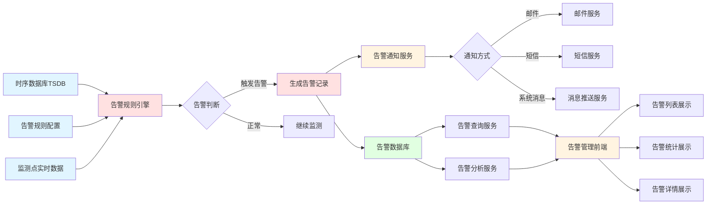

**数据流程说明：**
1. 告警规则引擎实时监测时序数据库中的监测点数据
2. 根据告警规则配置判断是否触发告警
3. 触发告警时生成告警记录并存储到告警数据库
4. 通过告警通知服务发送通知（邮件、短信、系统消息）
5. 告警查询和分析服务提供告警数据的查询和分析功能

#### 5.6.0.1 业务流程图

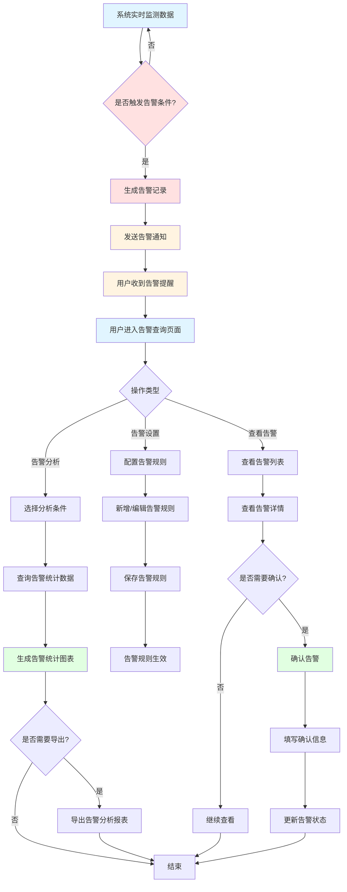

**业务流程说明：**
1. 系统实时监测数据，判断是否触发告警条件
2. 触发告警时生成告警记录并发送通知
3. 用户查看告警列表和详情
4. 用户确认告警并填写处理信息
5. 用户可配置告警规则，设置告警阈值和通知方式
6. 用户可进行告警统计分析，查看告警趋势和分布

#### 5.6.1 告警查询
##### 5.6.1.1 需求描述
告警查询功能用于查询和展示系统中的告警信息，包括未确认和已确认的告警，支持按时间、厂站、设备、级别等条件进行筛选查询，支持告警详情查看和确认操作，帮助用户及时处理告警事件。

**角色与权限**

| 角色 | 按钮权限 | 数据权限 |
|:----:|:--------|:--------|
| 调度员 | 查看、确认、详情 | 全部 |
| 运维工程师 | 查看、确认、详情 | 全部 |
| 系统管理员 | 查看、确认、详情 | 全部 |

##### 5.6.1.2 原型
页面包含以下主要区域：
1. 筛选区域：时间范围、厂站、设备、级别、确认状态筛选
2. 统计概览：未确认告警数、已确认告警数、告警总数等
3. 告警列表：展示告警信息列表，支持分页
4. 告警详情弹窗：点击告警查看详细信息
5. 自动告警弹窗：新告警自动弹出提醒

##### 5.6.1.3 业务模型
| 名称 | 控件 | 查询 | 列表 | 新增 | 修改 | 必填 | 多值 | 字数限制 |
|:----:|:----:|:----:|:----:|:----:|:----:|:----:|:----:|:----:|
| 告警点名称 | 文本框 | √ | √ | 隐藏 | 隐藏 | / | / |  |
| 告警内容 | 文本框 | √ | √ | 隐藏 | 隐藏 | / | / |  |
| 告警时间 | 日期时间框 | √ | √ | 隐藏 | 隐藏 | / | / |  |
| 厂站 | 下拉框 | √ | √ | 隐藏 | 隐藏 | / | / |  |
| 设备名称 | 搜索选择框 | √ | √ | 隐藏 | 隐藏 | / | / |  |
| 设备编码 | 文本框 | / | √ | 隐藏 | 隐藏 | / | / |  |
| 告警级别 | 下拉框 | √ | √ | 隐藏 | 隐藏 | / | / |  |
| 确认状态 | 下拉框 | √ | √ | 隐藏 | 正常 | / | / |  |
| 确认人 | 人员选择框 | / | √ | 隐藏 | 正常 | / | / |  |
| 确认时间 | 时间框 | / | √ | 隐藏 | 隐藏 | / | / |  |
| 告警值 | 数字框 | / | √ | 隐藏 | 隐藏 | / | / | 自动采集 |
| 阈值上限 | 数字框 | / | √ | 隐藏 | 隐藏 | / | / |  |
| 阈值下限 | 数字框 | / | √ | 隐藏 | 隐藏 | / | / |  |

##### 5.6.1.4 业务规则
（1）告警列表按时间倒序排列，最新告警显示在最前面
（2）告警级别包括：严重、警告、提示
（3）确认状态包括：未确认、已确认
（4）未确认告警自动弹出提醒窗口
（5）点击告警可查看详细信息，包括告警点、内容、时间、设备、级别等
（6）支持告警确认操作，确认后状态变更为"已确认"
（7）支持告警筛选和搜索功能
（8）告警列表支持分页显示，每页显示10条记录

##### 5.6.1.5 数据处理逻辑说明
（1）**告警数据查询**：系统从告警数据库查询告警记录，按时间倒序排列，支持按时间、厂站、设备、级别、确认状态等条件筛选
（2）**告警级别判断**：系统根据告警规则自动判断告警级别，严重告警立即通知，警告告警延时通知，提示告警记录即可
（3）**告警确认处理**：用户点击确认按钮时，系统更新告警记录的状态为"已确认"，记录确认人、确认时间等信息
（4）**未确认告警提醒**：系统定时检查未确认告警，对严重告警和警告告警自动弹出提醒窗口，提示用户处理
（5）**告警详情加载**：用户点击告警时，系统查询告警详细信息，包括告警点、内容、时间、设备、级别、告警值、阈值等信息
（6）**告警统计数据**：系统实时统计未确认告警数、已确认告警数、告警总数等统计数据，用于概览展示

##### 5.6.1.6 数据限制要求
（1）**告警数量限制**：单次查询最多返回1000条告警记录，超出范围自动分页或提示用户缩小查询范围
（2）**查询时间范围限制**：告警查询时间范围不超过1年，超过1年需分时间段查询
（3）**分页显示限制**：告警列表每页显示10条记录，支持翻页查看
（4）**未确认告警数量限制**：未确认告警数量超过100条时，提示用户及时处理，避免告警积压
（5）**告警详情数据量限制**：告警详情包含的数据量不超过500条记录，超出范围需优化数据结构
（6）**并发查询限制**：单用户最多同时执行3个告警查询任务，超出限制需等待

##### 5.6.1.7 数据来源说明
（1）**告警记录数据**：来源于告警管理模块的告警引擎，系统实时监测数据异常时自动生成的告警记录
（2）**告警规则配置**：来源于告警管理模块的告警设置，包括告警上下限值、告警级别、告警类型等信息
（3）**监测点数据**：来源于数据采集网关，通过Modbus、OPC等工业协议从监测点实时采集的数据
（4）**设备信息**：来源于配置管理模块的KPI模型配置，包括设备编码、名称、类型等信息
（5）**厂站信息**：来源于配置管理模块的组织架构配置，包括厂站编码、名称等信息
（6）**用户信息**：来源于系统的用户管理模块，包括确认人、创建人等信息

#### 5.6.2 告警设置
##### 5.6.2.1 需求描述
告警设置功能用于配置告警规则，包括告警上下限值、告警级别、告警类型、告警对象等参数，支持按能源类型、监测参数类型进行差异化配置，帮助用户建立完善的告警监测体系。

**角色与权限**

| 角色 | 按钮权限 | 数据权限 |
|:----:|:--------|:--------|
| 调度员 | 查看、新增、编辑、删除 | 全部 |
| 能源专家 | 查看、新增、编辑、删除 | 全部 |
| 系统管理员 | 查看、新增、编辑、删除 | 全部 |

##### 5.6.2.2 原型
页面采用Tab导航，包含以下Tab：
1. 电监测告警设置Tab：电流、电压、功率、电能等参数告警设置
2. 水监测告警设置Tab：流量、流速等参数告警设置
3. 蒸汽监测告警设置Tab：压力、温度、流量等参数告警设置
4. 压缩空气监测告警设置Tab：压力、流量等参数告警设置
5. 氮气监测告警设置Tab：压力、流量等参数告警设置
6. 其他能源监测告警设置Tab：相关参数告警设置

每个Tab包含：
- 告警规则列表：以卡片形式展示告警规则
- 新增/编辑告警规则弹窗：配置告警规则参数

##### 5.6.2.3 业务模型
| 名称 | 控件 | 查询 | 列表 | 新增 | 修改 | 必填 | 多值 | 字数限制 |
|:----:|:----:|:----:|:----:|:----:|:----:|:----:|:----:|:----:|
| 能源类型 | 下拉框 | √ | √ | 正常 | 只读 | √ | / |  |
| 监测参数 | 下拉框 | √ | √ | 正常 | 正常 | √ | / |  |
| 告警对象 | 搜索选择框 | √ | √ | 正常 | 正常 | √ | / |  |
| 上限值 | 数字框 | / | √ | 正常 | 正常 | / | / |  |
| 下限值 | 数字框 | / | √ | 正常 | 正常 | / | / |  |
| 告警级别 | 下拉框 | / | √ | 正常 | 正常 | √ | / |  |
| 告警类型 | 下拉框 | / | √ | 正常 | 正常 | √ | / |  |
| 启用状态 | 下拉框 | / | √ | 正常 | 正常 | √ | / |  |
| 创建人 | 人员选择框 | / | √ | 隐藏 | 隐藏 | √ | / |  |
| 创建时间 | 时间框 | / | √ | 隐藏 | 隐藏 | √ | / |  |
| 更新人 | 人员选择框 | / | / | 隐藏 | 隐藏 | / | / |  |
| 更新时间 | 时间框 | / | / | 隐藏 | 隐藏 | / | / |  |

##### 5.6.2.4 业务规则
（1）告警规则按能源类型分类管理
（2）不同能源类型对应不同的监测参数类型
（3）告警级别包括：严重、警告、提示
（4）告警类型包括：越上限、越下限、变化率超限、平值告警等
（5）上限值和下限值必须合理，上限值 > 下限值
（6）告警对象可以是具体的监测点、设备、ECC等
（7）支持告警规则的启用和禁用
（8）删除告警规则需要确认，避免误删

##### 5.6.2.5 数据处理逻辑说明
（1）**告警规则分类**：系统按能源类型对告警规则进行分类管理，不同能源类型对应不同的监测参数类型和告警规则
（2）**告警规则校验**：新建或编辑告警规则时，系统校验上限值和下限值的合理性，上限值必须大于下限值，否则拒绝保存
（3）**告警规则启用**：告警规则启用后，系统实时监测相关监测点的数据，当数据触发告警条件时自动生成告警记录
（4）**告警规则禁用**：告警规则禁用后，系统不再监测相关监测点的数据，已生成的告警记录不受影响
（5）**告警规则删除**：删除告警规则时，系统检查是否存在关联的告警记录，存在则提示用户或阻止删除
（6）**告警规则导入导出**：支持告警规则的导入和导出功能，导入时校验数据格式和完整性，导出时按能源类型组织数据

##### 5.6.2.6 数据限制要求
（1）**告警规则数量限制**：单个能源类型最多支持1000条告警规则，超出范围需优化规则配置
（2）**监测参数数量限制**：单个告警规则最多支持10个监测参数，超出范围需拆分规则
（3）**告警对象数量限制**：单个告警规则最多支持100个告警对象，超出范围需分批次配置
（4）**阈值设置限制**：上限值和下限值必须在合理范围内，超出范围需校验合理性
（5）**数据精度要求**：上限值精度保留2位小数，下限值精度保留2位小数
（6）**并发编辑限制**：同一告警规则同时只允许一个用户编辑，其他用户编辑时提示冲突

##### 5.6.2.7 数据来源说明
（1）**告警规则配置**：来源于用户手动配置或导入，存储在关系型数据库的告警规则配置表中
（2）**能源类型信息**：来源于配置管理模块的能源网络配置，包括能源类型、计量单位等信息
（3）**监测参数类型**：来源于配置管理模块的能源指标配置，包括监测参数类型、参数单位等信息
（4）**告警对象信息**：来源于配置管理模块的KPI模型配置，包括监测点、设备、ECC等告警对象信息
（5）**告警级别配置**：来源于配置管理模块的告警配置，包括告警级别定义、颜色标识等信息
（6）**告警规则模板**：来源于配置管理模块的系统配置，提供标准的告警规则模板，方便快速配置

#### 5.6.3 告警分析
##### 5.6.3.1 需求描述
告警分析功能用于对历史告警数据进行统计分析，包括告警次数统计、告警类型分布、设备告警排名等，支持多维度分析和图表展示，帮助用户识别告警规律和问题设备。

**角色与权限**

| 角色 | 按钮权限 | 数据权限 |
|:----:|:--------|:--------|
| 调度员 | 查看、导出 | 全部 |
| 能源专家 | 查看、导出 | 全部 |
| 系统管理员 | 查看、导出 | 全部 |

##### 5.6.3.2 原型
页面包含以下主要区域：
1. 筛选区域：时间范围、厂站、设备、级别筛选
2. 统计概览：告警总数、严重告警数、警告告警数、提示告警数
3. 统计分析图表：
   - 设备告警统计图（柱状图）
   - 告警类型分布图（饼图）
4. 统计表格：展示各设备的告警统计信息
5. 历史告警列表：展示历史告警记录，支持分页

##### 5.6.3.3 业务模型
| 名称 | 控件 | 查询 | 列表 | 新增 | 修改 | 必填 | 多值 | 字数限制 |
|:----:|:----:|:----:|:----:|:----:|:----:|:----:|:----:|:----:|
| 时间范围 | 日期时间框 | √ | / | 隐藏 | 隐藏 | √ | / |  |
| 厂站 | 下拉框 | √ | √ | 隐藏 | 隐藏 | / | / |  |
| 设备 | 搜索选择框 | √ | √ | 隐藏 | 隐藏 | / | / |  |
| 级别 | 下拉框 | √ | √ | 隐藏 | 隐藏 | / | / |  |
| 设备名称 | 文本框 | / | √ | 隐藏 | 隐藏 | / | / |  |
| 告警类型 | 文本框 | / | √ | 隐藏 | 隐藏 | / | / |  |
| 告警次数 | 数字框 | / | √ | 隐藏 | 隐藏 | / | / | 自动统计 |
| 严重告警数 | 数字框 | / | √ | 隐藏 | 隐藏 | / | / | 自动统计 |
| 警告告警数 | 数字框 | / | √ | 隐藏 | 隐藏 | / | / | 自动统计 |
| 提示告警数 | 数字框 | / | √ | 隐藏 | 隐藏 | / | / | 自动统计 |
| 最后告警时间 | 时间框 | / | √ | 隐藏 | 隐藏 | / | / | 自动记录 |

##### 5.6.3.4 业务规则
（1）支持按设备、告警类型、级别进行统计
（2）告警次数统计 = 该设备在时间范围内的告警总数
（3）支持告警次数排名，识别告警频发设备
（4）支持告警类型分布分析，了解告警类型构成
（5）支持告警趋势分析，查看告警变化趋势
（6）历史告警列表支持分页显示，每页显示10条记录
（7）支持导出告警分析报表

##### 5.6.3.5 数据处理逻辑说明
（1）**告警数据统计**：系统从告警数据库查询历史告警记录，按设备、告警类型、级别等维度进行分组统计
（2）**告警次数计算**：告警次数统计 = 该设备在时间范围内的告警总数，按设备、告警类型、级别分别统计
（3）**告警排名计算**：对所有设备的告警次数进行排序，生成设备告警排名，识别告警频发设备
（4）**告警类型分布**：按告警类型统计告警次数，计算各告警类型占总告警次数的百分比，生成告警类型分布图
（5）**告警趋势分析**：按时间序列统计告警次数，计算告警次数的变化趋势，生成趋势图表
（6）**统计图表生成**：系统生成设备告警统计图（柱状图）、告警类型分布图（饼图）等统计图表

##### 5.6.3.6 数据限制要求
（1）**查询时间范围限制**：告警分析查询时间范围不超过1年，超过1年需分时间段查询
（2）**设备数量限制**：单次统计最多支持500个设备，超出范围需分页查询或添加筛选条件
（3）**数据量限制**：单次查询返回数据量不超过10万条，超出范围自动分页或提示用户缩小查询范围
（4）**分页显示限制**：历史告警列表每页显示10条记录，支持翻页查看
（5）**数据精度要求**：告警次数精度保留整数，告警占比精度保留1位小数
（6）**并发查询限制**：单用户最多同时执行2个告警分析查询任务，超出限制需等待

##### 5.6.3.7 数据来源说明
（1）**历史告警记录**：来源于告警管理模块的告警数据库，存储的历史告警记录，包括告警时间、设备、级别、类型等信息
（2）**设备信息**：来源于配置管理模块的KPI模型配置，包括设备编码、名称、类型等信息
（3）**告警规则配置**：来源于告警管理模块的告警设置，包括告警类型、告警级别等信息
（4）**厂站信息**：来源于配置管理模块的组织架构配置，包括厂站编码、名称等信息
（5）**统计维度配置**：来源于配置管理模块的系统配置，包括统计维度、统计周期等信息
（6）**告警处理记录**：来源于告警管理模块的告警查询功能，包括告警确认、处理结果等信息

### 5.7 报表管理模块

#### 5.7.0 数据流程图

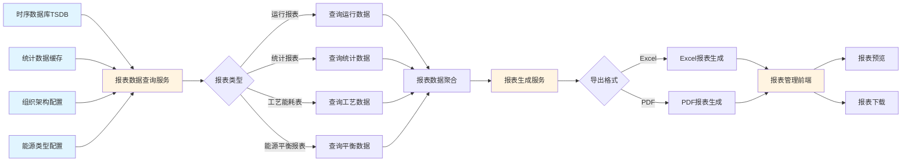

**数据流程说明：**
1. 报表数据查询服务从时序数据库和统计数据缓存查询数据
2. 根据报表类型查询相应的数据
3. 对查询的数据进行聚合和格式化处理
4. 报表生成服务根据导出格式生成报表（Excel、PDF）
5. 通过前端展示报表预览或提供下载

#### 5.7.0.1 业务流程图

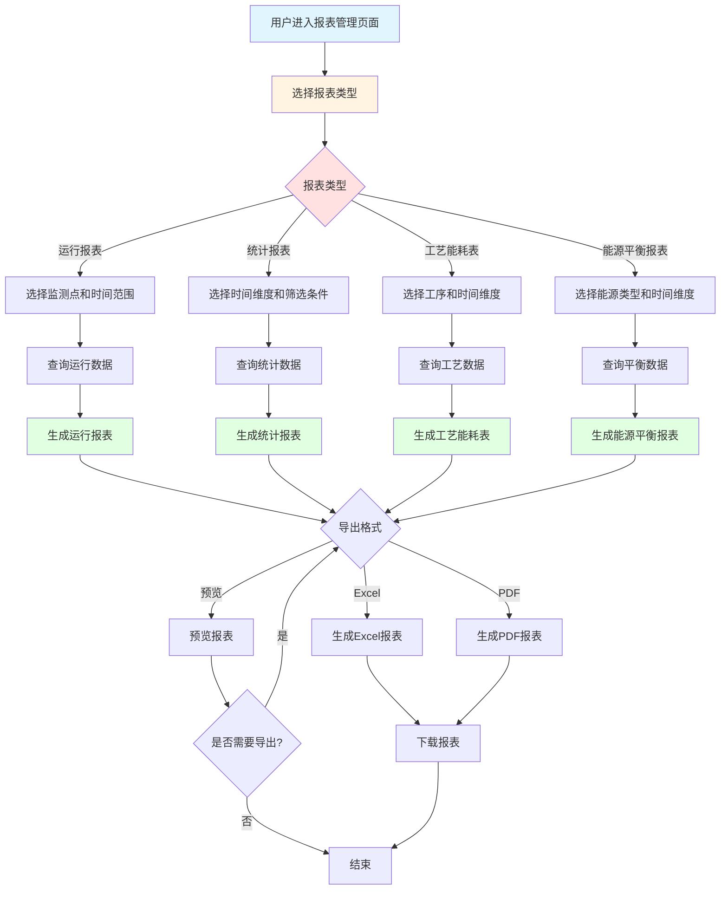

**业务流程说明：**
1. 用户选择报表类型
2. 根据报表类型配置相应的查询条件
3. 系统查询数据并生成报表
4. 用户选择导出格式（Excel、PDF）或预览报表
5. 用户下载报表文件

#### 5.7.1 运行报表
##### 5.7.1.1 需求描述
运行报表功能以报表形式展示各个监测点分钟级的运行参数，详细记录各个监测点的运行状态，包括参数值、状态、时间等信息，支持多维度筛选和导出，为工厂日常运维提供数据保障。

**角色与权限**

| 角色 | 按钮权限 | 数据权限 |
|:----:|:--------|:--------|
| 调度员 | 查看、导出 | 全部 |
| 运维工程师 | 查看、导出 | 全部 |
| 系统管理员 | 查看、导出 | 全部 |

##### 5.7.1.2 原型
页面包含以下主要区域：
1. 筛选区域：工厂、车间、产线、设备、监测点、时间范围、状态筛选
2. 操作栏：总记录数、导出Excel、导出PDF按钮
3. 运行报表表格：展示监测点的运行参数数据
4. 分页控件：支持数据分页显示

##### 5.7.1.3 业务模型
| 名称 | 控件 | 查询 | 列表 | 新增 | 修改 | 必填 | 多值 | 字数限制 |
|:----:|:----:|:----:|:----:|:----:|:----:|:----:|:----:|:----:|
| 工厂 | 下拉框 | √ | √ | 隐藏 | 隐藏 | / | / |  |
| 车间 | 下拉框 | √ | √ | 隐藏 | 隐藏 | / | / |  |
| 产线 | 下拉框 | √ | √ | 隐藏 | 隐藏 | / | / |  |
| 设备 | 搜索选择框 | √ | √ | 隐藏 | 隐藏 | / | / |  |
| 监测点 | 搜索选择框 | √ | √ | 隐藏 | 隐藏 | / | / |  |
| 时间范围 | 日期时间框 | √ | / | 隐藏 | 隐藏 | √ | / |  |
| 状态 | 下拉框 | √ | √ | 隐藏 | 隐藏 | / | / |  |
| 监测点名称 | 文本框 | / | √ | 隐藏 | 隐藏 | / | / |  |
| 参数名称 | 文本框 | / | √ | 隐藏 | 隐藏 | / | / |  |
| 参数值 | 数字框 | / | √ | 隐藏 | 隐藏 | / | / | 自动采集 |
| 单位 | 文本框 | / | √ | 隐藏 | 隐藏 | / | / |  |
| 状态 | 下拉框 | / | √ | 隐藏 | 隐藏 | / | / | 自动判断 |
| 记录时间 | 时间框 | / | √ | 隐藏 | 隐藏 | / | / | 自动记录 |

##### 5.7.1.4 业务规则
（1）运行报表数据按分钟级记录，数据精度为分钟
（2）支持按工厂、车间、产线、设备、监测点进行筛选
（3）支持按时间范围查询，时间范围不超过1个月
（4）状态包括：正常、异常、离线
（5）支持数据导出，导出格式包括Excel、PDF
（6）运行报表支持分页显示，每页显示10条记录
（7）导出数据包含所有筛选后的记录

##### 5.7.1.5 数据处理逻辑说明
（1）**运行数据查询**：系统从时序数据库按工厂、车间、产线、设备、监测点、时间范围查询运行数据，按分钟级聚合
（2）**数据筛选处理**：根据用户选择的筛选条件，系统筛选符合条件的运行数据，只返回符合条件的数据记录
（3）**状态判断**：系统根据监测点的数据值、采集时间等判断监测点状态（正常、异常、离线），标记到数据记录中
（4）**数据分页处理**：对查询结果进行分页处理，每页显示10条记录，支持翻页查看
（5）**数据导出处理**：导出时对大数据量进行分页处理，每次导出最多10万条记录，超出范围需分批导出
（6）**PDF格式转换**：导出PDF格式时，系统将数据转换为PDF格式，包括表格、图表等内容

##### 5.7.1.6 数据限制要求
（1）**查询时间范围限制**：运行报表查询时间范围不超过1个月，超过1个月需分时间段查询
（2）**数据量限制**：单次查询返回数据量不超过10万条，超出范围自动分页或提示用户缩小查询范围
（3）**分页显示限制**：运行报表每页显示10条记录，支持翻页查看
（4）**导出数据量限制**：单次导出最多10万条记录，超出范围需分批导出或提示用户缩小时间范围
（5）**监测点数量限制**：单次查询最多支持100个监测点，超出范围需分批次查询
（6）**并发查询限制**：单用户最多同时执行2个运行报表查询任务，超出限制需等待

##### 5.7.1.7 数据来源说明
（1）**运行监测数据**：来源于时序数据库（TSDB），存储的按分钟级记录的运行参数数据，包括参数值、时间、单位等信息
（2）**组织架构信息**：来源于配置管理模块的KPI模型配置，包括工厂、车间、产线、工序、设备等层级关系
（3）**监测点配置信息**：来源于配置管理模块的KPI模型配置，包括监测点编码、名称、参数名称、单位等信息
（4）**设备状态信息**：来源于在线监测模块的设备状态监测功能，包括设备运行状态、健康状态等信息
（5）**监测点状态判断**：系统根据数据采集时间戳、数据值范围等自动判断监测点状态（正常、异常、离线）
（6）**统计数据**：来源于能源统计模块的预处理统计数据，包括按时间、组织架构、监测点聚合的统计结果

#### 5.7.2 统计报表
##### 5.7.2.1 需求描述
统计报表功能支持按年、月、周、日、时或任意时间段以及订单、规格等业务维度定制生成能源统计报表，可以按组织架构（厂区、工艺、能耗设备）和能源类型选取展示，帮助用户生成个性化的能源统计报告。

**角色与权限**

| 角色 | 按钮权限 | 数据权限 |
|:----:|:--------|:--------|
| 调度员 | 查看、生成、导出 | 全部 |
| 能源专家 | 查看、生成、导出 | 全部 |
| 管理层 | 查看、导出 | 全部 |
| 系统管理员 | 查看、生成、导出 | 全部 |

##### 5.7.2.2 原型
页面包含以下主要区域：
1. 筛选区域：
   - 时间维度选择：年、月、周、日、时、自定义
   - 时间输入：根据选择的时间维度动态显示对应的输入框
   - 组织架构筛选：厂区、工艺、能耗设备
   - 能源类型筛选：电、水、蒸汽等
   - 业务维度筛选：订单、规格、产品名称
2. KPI卡片区域：总能耗、总费用、标煤当量、碳排放
3. 统计报表表格：展示详细的统计数据
4. 分页控件：支持数据分页显示

##### 5.7.2.3 业务模型
| 名称 | 控件 | 查询 | 列表 | 新增 | 修改 | 必填 | 多值 | 字数限制 |
|:----:|:----:|:----:|:----:|:----:|:----:|:----:|:----:|:----:|
| 时间维度 | 下拉框 | √ | / | 隐藏 | 隐藏 | √ | / |  |
| 开始时间 | 日期时间框 | √ | / | 隐藏 | 隐藏 | √ | / |  |
| 结束时间 | 日期时间框 | √ | / | 隐藏 | 隐藏 | √ | / |  |
| 厂区 | 下拉框 | √ | √ | 隐藏 | 隐藏 | / | / |  |
| 工艺 | 下拉框 | √ | √ | 隐藏 | 隐藏 | / | / |  |
| 能耗设备 | 搜索选择框 | √ | √ | 隐藏 | 隐藏 | / | / |  |
| 能源类型 | 下拉框 | √ | √ | 隐藏 | 隐藏 | / | / |  |
| 订单 | 搜索选择框 | √ | √ | 隐藏 | 隐藏 | / | / |  |
| 规格 | 文本框 | √ | √ | 隐藏 | 隐藏 | / | / |  |
| 产品名称 | 搜索选择框 | √ | √ | 隐藏 | 隐藏 | / | / |  |
| 时间标签 | 文本框 | / | √ | 隐藏 | 隐藏 | / | / | 自动生成 |
| 能耗量 | 数字框 | / | √ | 隐藏 | 隐藏 | / | / | 自动计算 |
| 费用 | 数字框 | / | √ | 隐藏 | 隐藏 | / | / | 自动计算 |
| 标煤当量 | 数字框 | / | √ | 隐藏 | 隐藏 | / | / | 自动计算 |
| 碳排放 | 数字框 | / | √ | 隐藏 | 隐藏 | / | / | 自动计算 |

##### 5.7.2.4 业务规则
（1）不同时间维度对应不同的时间输入方式：
   - 年：年份选择
   - 月：年月选择
   - 周：周选择（开始周、结束周）
   - 日：日期选择（开始日期、结束日期）
   - 时：日期时间选择（开始时间、结束时间）
   - 自定义：日期时间选择（开始时间、结束时间）
（2）统计数据根据选择的时间维度进行聚合计算
（3）支持多组织架构、多能源类型、多业务维度组合查询
（4）KPI数据实时计算，基于筛选条件
（5）统计报表支持分页显示，每页显示10条记录
（6）支持导出统计报表，导出格式包括Excel、PDF
（7）支持定时生成报表并邮件发送

##### 5.7.2.5 数据处理逻辑说明
（1）**时间维度处理**：根据用户选择的时间维度（年、月、周、日、时、自定义），系统动态显示对应的时间输入框，处理时间输入格式
（2）**数据聚合计算**：根据选择的时间维度自动选择数据聚合粒度：年维度按月聚合，月维度按天聚合，周维度按天聚合，日维度按小时聚合，时维度按分钟聚合
（3）**多维度筛选**：支持多组织架构、多能源类型、多业务维度组合查询，系统对数据进行多维筛选和聚合计算
（4）**KPI数据计算**：系统实时计算总能耗、总费用、标煤当量、碳排放等KPI指标，基于筛选条件进行统计计算
（5）**报表生成处理**：统计报表生成时，系统对数据进行格式化处理，包括数据排序、分页、图表生成等
（6）**定时报表生成**：系统支持定时生成报表并邮件发送，定时任务按设定的时间执行，生成报表并发送到指定邮箱

##### 5.7.2.6 数据限制要求
（1）**查询时间范围限制**：统计报表查询时间范围不超过5年，超过5年需分时间段查询
（2）**数据量限制**：单次查询返回数据量不超过50万条，超出范围自动分页或提示用户缩小查询范围
（3）**分页显示限制**：统计报表每页显示10条记录，支持翻页查看
（4）**筛选条件限制**：筛选条件最多支持10个，包括组织架构、能源类型、业务维度等条件的组合
（5）**导出数据量限制**：单次导出最多50万条记录，超出范围需分批导出或提示用户缩小时间范围
（6）**并发查询限制**：单用户最多同时执行2个统计报表查询任务，超出限制需等待

##### 5.7.2.7 数据来源说明
（1）**统计数据**：来源于时序数据库（TSDB），存储的按时间聚合的能耗数据，包括分钟级、小时级、日级等不同粒度
（2）**组织架构信息**：来源于配置管理模块的KPI模型配置，包括厂区、工艺、能耗设备等层级关系
（3）**能源类型信息**：来源于配置管理模块的能源网络配置，包括能源类型、计量单位等信息
（4）**业务维度数据**：来源于外部系统（如MES、ERP）的业务数据接口，包括订单、规格、产品名称等信息
（5）**KPI计算数据**：来源于能源统计模块的统计分析结果，包括总能耗、总费用、标煤当量、碳排放等统计数据
（6）**定时任务配置**：来源于配置管理模块的系统配置，包括定时任务时间、邮件接收人、报表模板等信息

#### 5.7.3 工艺能耗表
##### 5.7.3.1 需求描述
工艺能耗表功能对各能源类型各工序能源的消耗回收的实物量、折标煤量和单耗通过表格展现，包括工艺能耗的分析和能源加工转换报表，按日、月、年进行统计，帮助用户了解各工艺环节的能源消耗情况。

**角色与权限**

| 角色 | 按钮权限 | 数据权限 |
|:----:|:--------|:--------|
| 调度员 | 查看、导出 | 全部 |
| 能源专家 | 查看、导出 | 全部 |
| 系统管理员 | 查看、导出 | 全部 |

##### 5.7.3.2 原型
页面采用Tab导航，包含以下Tab：
1. 工艺能耗表Tab：展示各工序的能源消耗数据
2. 能源加工转换报表Tab：展示能源加工转换数据

每个Tab包含：
- 筛选区域：时间维度（日、月、年）、工序、能源类型、转换类型筛选
- KPI卡片：总消耗量、回收量、标煤当量、平均单耗
- 数据表格：展示详细的工艺能耗数据
- 分页控件：支持数据分页显示

##### 5.7.3.3 业务模型
| 名称 | 控件 | 查询 | 列表 | 新增 | 修改 | 必填 | 多值 | 字数限制 |
|:----:|:----:|:----:|:----:|:----:|:----:|:----:|:----:|:----:|
| 时间维度 | 下拉框 | √ | / | 隐藏 | 隐藏 | √ | / |  |
| 时间 | 日期框 | √ | / | 隐藏 | 隐藏 | √ | / |  |
| 工序 | 下拉框 | √ | √ | 隐藏 | 隐藏 | / | / |  |
| 能源类型 | 下拉框 | √ | √ | 隐藏 | 隐藏 | / | / |  |
| 转换类型 | 下拉框 | √ | √ | 隐藏 | 隐藏 | / | / |  |
| 工序名称 | 文本框 | / | √ | 隐藏 | 隐藏 | / | / |  |
| 能源名称 | 文本框 | / | √ | 隐藏 | 隐藏 | / | / |  |
| 消耗量 | 数字框 | / | √ | 隐藏 | 隐藏 | / | / | 自动计算 |
| 回收量 | 数字框 | / | √ | 隐藏 | 隐藏 | / | / | 自动计算 |
| 标煤当量 | 数字框 | / | √ | 隐藏 | 隐藏 | / | / | 自动计算 |
| 单耗 | 数字框 | / | √ | 隐藏 | 隐藏 | / | / | 自动计算 |
| 转换效率 | 百分比 | / | √ | 隐藏 | 隐藏 | / | / | 自动计算 |

##### 5.7.3.4 业务规则
（1）支持按日、月、年进行统计
（2）消耗量 = 输入量 - 回收量
（3）单耗 = 消耗量 / 产量
（4）转换效率 = 输出量 / 输入量 × 100%
（5）支持多工序、多能源类型组合查询
（6）工艺能耗表支持分页显示，每页显示10条记录
（7）支持导出工艺能耗表，导出格式包括Excel、PDF

##### 5.7.3.5 数据处理逻辑说明
（1）**工艺能耗数据查询**：系统从时序数据库按工序、能源类型、时间范围查询能耗数据，按时间维度进行聚合计算
（2）**消耗量计算**：消耗量 = 输入量 - 回收量，输入量和回收量来源于工艺环节的能源输入输出监测数据
（3）**单耗计算**：单耗 = 消耗量 / 产量，产量来源于能源管理模块的产量数据管理功能
（4）**转换效率计算**：转换效率 = 输出量 / 输入量 × 100%，反映能源转换的效率，效率越高表示转换损失越小
（5）**标煤当量计算**：消耗量和回收量按标煤折算系数转换为标煤当量，用于统一计量和比较
（6）**数据聚合处理**：根据选择的时间维度（日、月、年）自动选择数据聚合粒度，生成对应时间维度的统计数据

##### 5.7.3.6 数据限制要求
（1）**查询时间范围限制**：工艺能耗表查询时间范围不超过3年，超过3年需分时间段查询
（2）**工序数量限制**：单次查询最多支持100个工序，超出范围需分页查询或添加筛选条件
（3）**数据精度要求**：消耗量精度保留2位小数，回收量精度保留2位小数，单耗精度保留3位小数，转换效率精度保留1位小数
（4）**分页显示限制**：工艺能耗表每页显示10条记录，支持翻页查看
（5）**导出数据量限制**：单次导出最多10万条记录，超出范围需分批导出或提示用户缩小时间范围
（6）**并发查询限制**：单用户最多同时执行2个工艺能耗表查询任务，超出限制需等待

##### 5.7.3.7 数据来源说明
（1）**工艺能耗数据**：来源于时序数据库（TSDB），存储的按工序聚合的能耗数据，包括输入量、输出量、回收量等
（2）**工序配置信息**：来源于配置管理模块的KPI模型配置，包括工序编码、名称、类型等信息
（3）**能源类型信息**：来源于配置管理模块的能源网络配置，包括能源类型、计量单位、标煤折算系数等信息
（4）**产量数据**：来源于能源管理模块的产量数据管理功能，包括产品名称、产量、单位、时间等信息
（5）**转换类型配置**：来源于配置管理模块的系统配置，包括能源转换类型、转换关系等信息
（6）**统计数据**：来源于能源统计模块的预处理统计数据，包括按时间、工序、能源类型聚合的统计结果

#### 5.7.4 能源平衡报表
##### 5.7.4.1 需求描述
能源平衡报表功能展示工厂各类型能源输出及支出的平衡，消耗及有效利用能源及各项损失之间的数据平衡，实现企业能源平衡报表，按照月、年进行统计，帮助用户分析能源利用效率和发现能源浪费。

**角色与权限**

| 角色 | 按钮权限 | 数据权限 |
|:----:|:--------|:--------|
| 调度员 | 查看、导出 | 全部 |
| 能源专家 | 查看、导出 | 全部 |
| 管理层 | 查看、导出 | 全部 |
| 系统管理员 | 查看、导出 | 全部 |

##### 5.7.4.2 原型
页面包含以下主要区域：
1. 筛选区域：时间维度（月、年）、能源类型筛选
2. 统计概览：总输入量、总输出量、总有效利用量、总损失量、平衡差
3. 能源平衡表格：展示各能源类型的平衡数据
4. 平衡状态标识：平衡、不平衡的视觉标识
5. 分页控件：支持数据分页显示

##### 5.7.4.3 业务模型
| 名称 | 控件 | 查询 | 列表 | 新增 | 修改 | 必填 | 多值 | 字数限制 |
|:----:|:----:|:----:|:----:|:----:|:----:|:----:|:----:|:----:|
| 时间维度 | 下拉框 | √ | / | 隐藏 | 隐藏 | √ | / |  |
| 时间 | 日期框 | √ | / | 隐藏 | 隐藏 | √ | / |  |
| 能源类型 | 下拉框 | √ | √ | 隐藏 | 隐藏 | / | / |  |
| 能源名称 | 文本框 | / | √ | 隐藏 | 隐藏 | / | / |  |
| 输入量 | 数字框 | / | √ | 隐藏 | 隐藏 | / | / | 自动计算 |
| 输出量 | 数字框 | / | √ | 隐藏 | 隐藏 | / | / | 自动计算 |
| 有效利用量 | 数字框 | / | √ | 隐藏 | 隐藏 | / | / | 自动计算 |
| 损失量 | 数字框 | / | √ | 隐藏 | 隐藏 | / | / | 自动计算 |
| 平衡差 | 数字框 | / | √ | 隐藏 | 隐藏 | / | / | 自动计算 |
| 平衡状态 | 下拉框 | / | √ | 隐藏 | 隐藏 | / | / | 自动判断 |

##### 5.7.4.4 业务规则
（1）支持按月、年进行统计
（2）平衡差 = 输入量 - 输出量 - 有效利用量 - 损失量
（3）平衡状态：平衡（|平衡差| ≤ 输入量 × 5%）、不平衡（|平衡差| > 输入量 × 5%）
（4）不平衡的能源类型标记为红色预警
（5）支持多能源类型组合查询
（6）能源平衡报表支持分页显示，每页显示10条记录
（7）支持导出能源平衡报表，导出格式包括Excel、PDF

##### 5.7.4.5 数据处理逻辑说明
（1）**能源平衡数据查询**：系统从时序数据库按能源类型、时间范围查询能源平衡数据，按时间维度进行聚合计算
（2）**输入输出量统计**：系统统计能源的输入量、输出量，输入量来源于能源输入监测点，输出量来源于能源输出监测点
（3）**有效利用量计算**：有效利用量来源于能源管理模块的产品单耗管理，根据产量和单耗计算的有效利用量
（4）**损失量计算**：损失量来源于能效分析模块的能流损失分析，包括传输损失、转换损失、泄漏损失等
（5）**平衡差计算**：平衡差 = 输入量 - 输出量 - 有效利用量 - 损失量，平衡差反映能源平衡的偏差
（6）**平衡状态判断**：系统判断平衡状态，|平衡差| ≤ 输入量 × 5%为平衡，|平衡差| > 输入量 × 5%为不平衡

##### 5.7.4.6 数据限制要求
（1）**查询时间范围限制**：能源平衡报表查询时间范围不超过3年，超过3年需分时间段查询
（2）**能源类型数量限制**：单次查询最多支持10种能源类型，超出范围需分批次查询
（3）**数据精度要求**：输入量精度保留2位小数，输出量精度保留2位小数，平衡差精度保留2位小数
（4）**分页显示限制**：能源平衡报表每页显示10条记录，支持翻页查看
（5）**平衡差阈值限制**：平衡差判断阈值设置为输入量的5%，可根据实际情况调整
（6）**并发查询限制**：单用户最多同时执行2个能源平衡报表查询任务，超出限制需等待

##### 5.7.4.7 数据来源说明
（1）**能源输入输出数据**：来源于时序数据库（TSDB），存储的能源输入输出监测数据，包括输入量、输出量等
（2）**有效利用量数据**：来源于能源管理模块的产品单耗管理，根据产量和单耗计算的有效利用量
（3）**损失量数据**：来源于能效分析模块的能流损失分析，包括传输损失、转换损失、泄漏损失等
（4）**能源类型信息**：来源于配置管理模块的能源网络配置，包括能源类型、计量单位等信息
（5）**监测点数据**：来源于数据采集网关，通过Modbus、OPC等工业协议从监测点实时采集的能源数据
（6）**统计数据**：来源于能源统计模块的预处理统计数据，包括按时间、能源类型聚合的统计结果

### 5.8 配置管理模块

#### 5.8.0 数据流程图

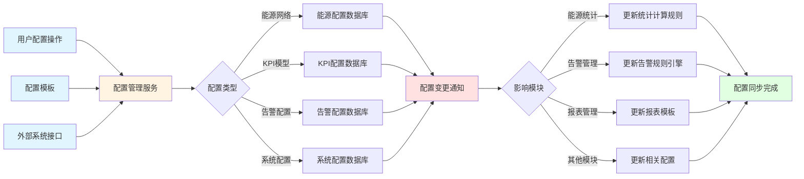

**数据流程说明：**
1. 用户通过前端进行配置操作（新增、编辑、删除）
2. 配置管理服务处理配置变更并保存到对应的配置数据库
3. 配置变更后发送通知到相关模块
4. 相关模块根据配置变更更新相应的计算规则和处理逻辑
5. 配置同步完成，新的配置生效

#### 5.8.0.1 业务流程图

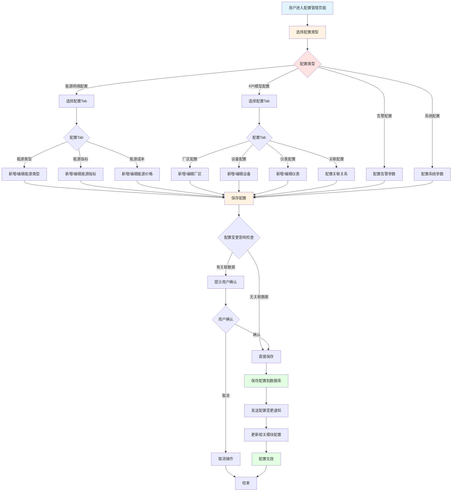

**业务流程说明：**
1. 用户选择配置类型和具体的配置项
2. 用户进行配置操作（新增、编辑、删除）
3. 系统检查配置变更的影响，如有关联数据则提示用户确认
4. 保存配置到数据库
5. 发送配置变更通知，更新相关模块的配置
6. 新的配置生效

#### 5.8.1 能源网络配置
##### 5.8.1.1 需求描述
能源网络配置功能用于配置能源管理的基础数据，包括能源类型、能源指标、能源成本等配置信息，为能源监测、统计、分析等功能提供基础数据支撑。

**角色与权限**

| 角色 | 按钮权限 | 数据权限 |
|:----:|:--------|:--------|
| 系统管理员 | 查看、新增、编辑、删除 | 全部 |
| 能源专家 | 查看 | 全部 |

##### 5.8.1.2 原型
页面采用Tab导航，包含以下Tab：
1. 能源类型配置Tab：配置能源类型信息
2. 能源指标配置Tab：配置能源监测指标
3. 能源成本配置Tab：配置能源价格信息

每个Tab包含：
- 数据列表：展示配置数据
- 操作按钮：新增、编辑、删除、搜索
- 配置弹窗：新增/编辑配置信息
- 分页控件：支持数据分页显示

##### 5.8.1.3 业务模型
| 名称 | 控件 | 查询 | 列表 | 新增 | 修改 | 必填 | 多值 | 字数限制 |
|:----:|:----:|:----:|:----:|:----:|:----:|:----:|:----:|:----:|
| 能源编码 | 文本框 | √ | √ | 正常 | 正常 | √ | / | 20 |
| 能源名称 | 文本框 | √ | √ | 正常 | 正常 | √ | / | 50 |
| 能源类型 | 下拉框 | / | √ | 正常 | 正常 | √ | / |  |
| 分类名称 | 文本框 | / | √ | 正常 | 正常 | / | / |  |
| 计量单位 | 文本框 | / | √ | 正常 | 正常 | √ | / |  |
| 标煤折算系数 | 数字框 | / | √ | 正常 | 正常 | / | / |  |
| 父能源 | 搜索选择框 | / | √ | 正常 | 正常 | / | / |  |
| 启用状态 | 下拉框 | / | √ | 正常 | 正常 | √ | / |  |
| 指标名称 | 文本框 | / | √ | 正常 | 正常 | √ | / | 50 |
| 指标类型 | 下拉框 | / | √ | 正常 | 正常 | √ | / |  |
| 价格 | 数字框 | / | √ | 正常 | 正常 | / | / |  |
| 生效日期 | 日期框 | / | √ | 正常 | 正常 | √ | / |  |
| 失效日期 | 日期框 | / | √ | 正常 | 正常 | / | / |  |
| 创建人 | 人员选择框 | / | √ | 隐藏 | 隐藏 | √ | / |  |
| 创建时间 | 时间框 | / | √ | 隐藏 | 隐藏 | √ | / |  |

##### 5.8.1.4 业务规则
（1）能源编码在系统内唯一，不可重复
（2）能源类型包括：电、水、蒸汽、压缩空气、氮气、其他
（3）标煤折算系数用于计算标煤当量
（4）支持能源类型的层级关系配置
（5）能源成本支持按时间段配置，支持价格调整
（6）配置数据支持导入和导出功能
（7）删除配置数据需要确认，避免误删
（8）配置数据修改后，相关统计数据自动更新

##### 5.8.1.5 数据处理逻辑说明
（1）**能源编码唯一性校验**：新建或编辑能源配置时，系统检查能源编码在系统内是否已存在，已存在则拒绝保存并提示用户
（2）**层级关系维护**：系统维护能源类型的层级关系，支持父能源和子能源的关联，形成层级结构
（3）**价格时间段配置**：能源成本支持按时间段配置，系统校验时间段的有效性，时间重叠时提示用户调整
（4）**配置数据关联检查**：删除配置数据时，系统检查是否有关联的能耗数据、告警规则等，存在则提示用户或阻止删除
（5）**配置数据同步更新**：配置数据修改后，系统自动更新相关的统计数据，包括标煤当量、碳排放等指标
（6）**导入导出处理**：导入时系统校验数据格式和完整性，导入后自动校验数据唯一性；导出时按能源类型组织数据

##### 5.8.1.6 数据限制要求
（1）**能源编码长度限制**：能源编码最大长度20个字符，超出长度拒绝保存
（2）**能源名称长度限制**：能源名称最大长度50个字符，超出长度拒绝保存
（3）**标煤折算系数限制**：标煤折算系数必须大于0，小于0或等于0需校验合理性
（4）**价格时间段限制**：能源成本时间段配置不超过10年，超过10年需分时间段配置
（5）**导入数据量限制**：单次导入最多1000条配置数据，超出范围需分批导入
（6）**并发编辑限制**：同一配置项同时只允许一个用户编辑，其他用户编辑时提示冲突

##### 5.8.1.7 数据来源说明
（1）**能源配置数据**：来源于用户手动配置或导入，存储在关系型数据库的能源配置表中
（2）**标煤折算系数标准**：来源于国家标准或行业标准，包括各能源类型的标煤折算系数，符合国家标准GB/T 2589
（3）**能源成本价格**：来源于市场价格或用户手动录入，包括能源单价、分时电价等信息
（4）**能源层级关系**：来源于配置管理模块的能源网络配置，包括父能源、子能源等层级关系
（5）**关联数据检查**：来源于能源管理模块、告警管理模块等，检查能源配置是否有关联的能耗数据、告警规则等
（6）**配置模板数据**：来源于配置管理模块的系统配置，提供标准的能源配置模板，方便快速配置

#### 5.8.2 KPI模型配置
##### 5.8.2.1 需求描述
KPI模型配置功能用于配置能源管理的关键绩效指标模型，包括厂区、车间、产线、工艺、工序、设备、计量仪表等基础档案的配置，以及它们之间的关联关系，为能源监测和分析提供组织架构和业务模型支撑。

**角色与权限**

| 角色 | 按钮权限 | 数据权限 |
|:----:|:--------|:--------|
| 系统管理员 | 查看、新增、编辑、删除 | 全部 |
| 能源专家 | 查看、新增、编辑 | 全部 |

##### 5.8.2.2 原型
页面采用Tab导航，包含以下Tab：
1. 厂区配置Tab：配置厂区信息
2. 车间配置Tab：配置车间信息
3. 产线配置Tab：配置产线信息
4. 工艺配置Tab：配置工艺信息
5. 工序配置Tab：配置工序信息
6. 设备配置Tab：配置设备信息
7. 计量仪表配置Tab：配置计量仪表信息
8. 工序设备分配配置Tab：配置工序与设备的分配关系
9. 设备仪表关联配置Tab：配置设备与仪表的关联关系

每个Tab包含：
- 数据列表：展示配置数据
- 操作按钮：新增、编辑、删除、搜索
- 配置弹窗：新增/编辑配置信息
- 分页控件：支持数据分页显示

##### 5.8.2.3 业务模型
| 名称 | 控件 | 查询 | 列表 | 新增 | 修改 | 必填 | 多值 | 字数限制 |
|:----:|:----:|:----:|:----:|:----:|:----:|:----:|:----:|:----:|
| 编码 | 文本框 | √ | √ | 正常 | 正常 | √ | / | 20 |
| 名称 | 文本框 | √ | √ | 正常 | 正常 | √ | / | 50 |
| 层级 | 下拉框 | / | √ | 正常 | 只读 | √ | / |  |
| 父级 | 搜索选择框 | / | √ | 正常 | 只读 | / | / |  |
| 关联ECC | 搜索选择框 | / | √ | 正常 | 正常 | / | / |  |
| 负责人 | 人员选择框 | / | √ | 正常 | 正常 | / | / |  |
| 联系电话 | 文本框 | / | √ | 正常 | 正常 | / | / | 20 |
| 设备类型 | 下拉框 | / | √ | 正常 | 正常 | / | / |  |
| 额定功率 | 数字框 | / | √ | 正常 | 正常 | / | / |  |
| 仪表类型 | 下拉框 | / | √ | 正常 | 正常 | / | / |  |
| 监测参数 | 下拉框 | / | √ | 正常 | 正常 | / | / |  |
| 单位 | 文本框 | / | √ | 正常 | 正常 | / | / |  |
| 启用状态 | 下拉框 | / | √ | 正常 | 正常 | √ | / |  |
| 创建人 | 人员选择框 | / | √ | 隐藏 | 隐藏 | √ | / |  |
| 创建时间 | 时间框 | / | √ | 隐藏 | 隐藏 | √ | / |  |

##### 5.8.2.4 业务规则
（1）编码在系统内唯一，不可重复
（2）层级关系：厂区 > 车间 > 产线 > 工艺 > 工序 > 设备
（3）子级必须关联父级，形成层级关系
（4）删除配置时，如果存在关联数据，需要先删除关联数据
（5）设备类型包括：照明、空调、动力、特殊、水泵、主机
（6）仪表类型包括：电表、水表、流量计、压力表、温度计、电流表、电压表等
（7）配置数据支持导入和导出功能
（8）配置数据修改后，相关统计数据自动更新

##### 5.8.2.5 数据处理逻辑说明
（1）**编码唯一性校验**：新建或编辑配置时，系统检查编码在系统内是否已存在，已存在则拒绝保存并提示用户
（2）**层级关系维护**：系统维护组织架构的层级关系，子级必须关联父级，形成树形结构，支持层级下钻和上钻
（3）**关联关系配置**：工序与设备的分配关系、设备与仪表的关联关系等，系统维护这些关联关系，支持多对多关系
（4）**级联删除检查**：删除配置时，系统检查是否存在关联数据（如能耗数据、告警记录等），存在则提示用户或阻止删除
（5）**配置数据同步更新**：配置数据修改后，系统自动更新相关的统计数据，包括组织架构、设备信息、仪表信息等
（6）**导入导出处理**：导入时系统校验数据格式和完整性，导入后自动校验数据唯一性和层级关系；导出时按层级关系组织数据

##### 5.8.2.6 数据限制要求
（1）**编码长度限制**：编码最大长度20个字符，超出长度拒绝保存
（2）**名称长度限制**：名称最大长度50个字符，超出长度拒绝保存
（3）**层级深度限制**：层级关系最多支持6级（厂区、车间、产线、工艺、工序、设备），超出层级需优化结构
（4）**关联数量限制**：单个设备最多关联50个仪表，超出范围需优化配置
（5）**导入数据量限制**：单次导入最多1000条配置数据，超出范围需分批导入
（6）**并发编辑限制**：同一配置项同时只允许一个用户编辑，其他用户编辑时提示冲突

##### 5.8.2.7 数据来源说明
（1）**配置数据**：来源于用户手动配置或导入，存储在关系型数据库的配置表中
（2）**组织架构信息**：来源于企业的组织架构系统或用户手动配置，包括厂区、车间、产线等层级关系
（3）**设备信息**：来源于设备管理系统或用户手动配置，包括设备编码、名称、类型、额定功率等信息
（4）**仪表信息**：来源于仪表管理系统或用户手动配置，包括仪表编码、名称、类型、监测参数等信息
（5）**关联关系数据**：来源于配置管理模块的关联配置，包括工序与设备的分配关系、设备与仪表的关联关系等
（6）**配置模板数据**：来源于配置管理模块的系统配置，提供标准的配置模板，方便快速配置

#### 5.8.3 告警配置
##### 5.8.3.1 需求描述
告警配置功能用于配置系统的告警相关参数，包括告警通知方式、告警处理流程、告警级别定义等，为告警管理功能提供配置支撑。

**角色与权限**

| 角色 | 按钮权限 | 数据权限 |
|:----:|:--------|:--------|
| 系统管理员 | 查看、新增、编辑、删除 | 全部 |

##### 5.8.3.2 原型
页面包含以下主要区域：
1. 告警通知配置：配置告警通知方式（邮件、短信、系统消息等）
2. 告警处理流程配置：配置告警处理流程和审批流程
3. 告警级别定义：配置告警级别的定义和颜色标识
4. 告警规则模板：提供告警规则模板，方便快速配置

##### 5.8.3.3 业务模型
| 名称 | 控件 | 查询 | 列表 | 新增 | 修改 | 必填 | 多值 | 字数限制 |
|:----:|:----:|:----:|:----:|:----:|:----:|:----:|:----:|:----:|
| 配置项名称 | 文本框 | √ | √ | 正常 | 正常 | √ | / | 50 |
| 配置项类型 | 下拉框 | / | √ | 正常 | 正常 | √ | / |  |
| 配置值 | 文本框 | / | √ | 正常 | 正常 | √ | / | 200 |
| 配置说明 | 多行文本 | / | √ | 正常 | 正常 | / | / | 500 |
| 启用状态 | 下拉框 | / | √ | 正常 | 正常 | √ | / |  |
| 创建人 | 人员选择框 | / | √ | 隐藏 | 隐藏 | √ | / |  |
| 创建时间 | 时间框 | / | √ | 隐藏 | 隐藏 | √ | / |  |

##### 5.8.3.4 业务规则
（1）告警通知方式支持多种方式组合配置
（2）告警处理流程支持自定义审批流程
（3）告警级别定义包括：严重、警告、提示
（4）告警级别颜色标识：严重（红色）、警告（橙色）、提示（蓝色）
（5）告警规则模板支持导入和导出
（6）配置修改后立即生效
（7）删除配置需要确认，避免误删

##### 5.8.3.5 数据处理逻辑说明
（1）**通知方式配置**：系统支持多种告警通知方式（邮件、短信、系统消息等），用户可选择多种方式组合配置
（2）**审批流程配置**：告警处理流程支持自定义审批流程，系统维护审批流程的节点、审批人、审批条件等信息
（3）**告警级别定义**：系统定义告警级别（严重、警告、提示），配置各级别的颜色标识、处理优先级等信息
（4）**配置生效处理**：配置修改后系统立即生效，新的告警按照新配置的规则进行处理，已生成的告警不受影响
（5）**规则模板管理**：系统提供告警规则模板，支持模板的导入和导出，方便快速配置告警规则
（6）**配置验证处理**：配置修改时系统验证配置的完整性和合理性，配置不完整或不合理则拒绝保存

##### 5.8.3.6 数据限制要求
（1）**通知方式数量限制**：单个告警规则最多支持5种通知方式，超出范围需优化配置
（2）**审批流程级别限制**：审批流程最多支持5级审批，超出级别需优化审批流程
（3）**告警级别数量限制**：告警级别最多支持10级，超出范围需合并级别或优化配置
（4）**配置项名称长度限制**：配置项名称最大长度50个字符，超出长度拒绝保存
（5）**配置值长度限制**：配置值最大长度200个字符，超出长度拒绝保存
（6）**并发编辑限制**：同一配置项同时只允许一个用户编辑，其他用户编辑时提示冲突

##### 5.8.3.7 数据来源说明
（1）**告警配置数据**：来源于用户手动配置或导入，存储在关系型数据库的告警配置表中
（2）**通知方式配置**：来源于系统的通知服务配置，包括邮件服务器、短信网关、消息推送等配置
（3）**审批流程模板**：来源于配置管理模块的系统配置，提供标准的审批流程模板，方便快速配置
（4）**告警级别标准**：来源于行业标准或企业标准，包括告警级别定义、颜色标识、处理优先级等
（5）**规则模板数据**：来源于配置管理模块的系统配置，提供标准的告警规则模板，方便快速配置
（6）**用户权限信息**：来源于系统的用户管理模块，包括审批人、通知接收人等用户信息

#### 5.8.4 系统配置
##### 5.8.4.1 需求描述
系统配置功能用于配置系统的全局参数，包括系统基本信息、数据采集参数、数据存储参数、系统安全参数等，为系统运行提供配置支撑。

**角色与权限**

| 角色 | 按钮权限 | 数据权限 |
|:----:|:--------|:--------|
| 系统管理员 | 查看、新增、编辑、删除 | 全部 |

##### 5.8.4.2 原型
页面包含以下主要区域：
1. 系统基本信息配置：系统名称、版本、公司信息等
2. 数据采集配置：采集频率、采集协议、网关配置等
3. 数据存储配置：存储周期、数据备份策略等
4. 系统安全配置：密码策略、登录策略、权限配置等

##### 5.8.4.3 业务模型
| 名称 | 控件 | 查询 | 列表 | 新增 | 修改 | 必填 | 多值 | 字数限制 |
|:----:|:----:|:----:|:----:|:----:|:----:|:----:|:----:|:----:|
| 配置项名称 | 文本框 | √ | √ | 正常 | 正常 | √ | / | 50 |
| 配置项类型 | 下拉框 | / | √ | 正常 | 正常 | √ | / |  |
| 配置值 | 文本框 | / | √ | 正常 | 正常 | √ | / | 200 |
| 配置说明 | 多行文本 | / | √ | 正常 | 正常 | / | / | 500 |
| 配置分组 | 下拉框 | / | √ | 正常 | 正常 | / | / |  |
| 启用状态 | 下拉框 | / | √ | 正常 | 正常 | √ | / |  |
| 创建人 | 人员选择框 | / | √ | 隐藏 | 隐藏 | √ | / |  |
| 创建时间 | 时间框 | / | √ | 隐藏 | 隐藏 | √ | / |  |

##### 5.8.4.4 业务规则
（1）系统配置按配置分组进行分类管理
（2）配置项类型包括：文本、数字、日期、布尔值、选项等
（3）关键配置项修改需要管理员权限
（4）配置修改后需要重启相关服务才能生效
（5）支持配置的导入和导出功能
（6）系统配置支持版本管理，记录配置修改历史
（7）删除配置需要确认，避免误删

##### 5.8.4.5 数据处理逻辑说明
（1）**配置分组管理**：系统配置按配置分组进行分类管理，包括系统基本信息、数据采集、数据存储、系统安全等分组
（2）**配置项类型处理**：根据配置项类型（文本、数字、日期、布尔值、选项等），系统进行相应的数据校验和格式转换
（3）**权限验证处理**：关键配置项修改时需要管理员权限，系统验证用户权限，权限不足则拒绝修改
（4）**配置生效处理**：配置修改后需要重启相关服务才能生效，系统记录配置修改历史，支持配置回滚
（5）**版本管理处理**：系统配置支持版本管理，记录配置修改历史，包括修改人、修改时间、修改内容等信息
（6）**配置导入导出**：支持配置的导入和导出功能，导入时校验数据格式和完整性，导出时按配置分组组织数据

##### 5.8.4.6 数据限制要求
（1）**配置项名称长度限制**：配置项名称最大长度50个字符，超出长度拒绝保存
（2）**配置值长度限制**：配置值最大长度200个字符，超出长度拒绝保存
（3）**配置说明长度限制**：配置说明最大长度500个字符，超出长度拒绝保存
（4）**配置分组数量限制**：配置分组最多支持20个，超出范围需合并分组或优化配置
（5）**版本历史限制**：配置版本历史保存时间不少于1年，超过1年可归档到历史库
（6）**并发编辑限制**：同一配置项同时只允许一个用户编辑，其他用户编辑时提示冲突

##### 5.8.4.7 数据来源说明
（1）**系统配置数据**：来源于用户手动配置或导入，存储在关系型数据库的系统配置表中
（2）**系统基本信息**：来源于系统的安装配置或用户手动配置，包括系统名称、版本、公司信息等
（3）**数据采集配置**：来源于数据采集系统的配置，包括采集频率、采集协议、网关配置等
（4）**数据存储配置**：来源于数据库系统的配置，包括存储周期、数据备份策略等
（5）**系统安全配置**：来源于系统的安全策略配置，包括密码策略、登录策略、权限配置等
（6）**配置模板数据**：来源于系统的默认配置模板，提供标准的系统配置模板，方便快速配置

## 附录：关键业务流程详细说明

### A.1 数据采集与处理流程

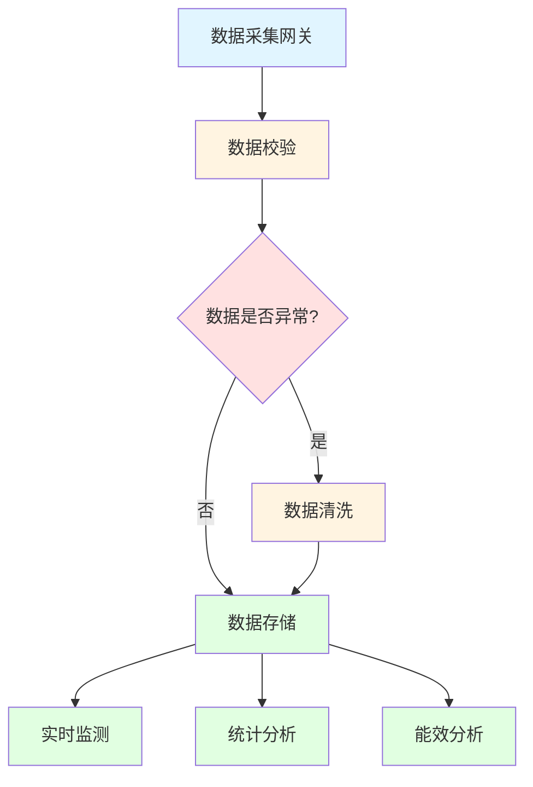

数据采集与处理流程说明：
1. 数据采集网关从各类能源监测设备（电表、水表、流量计等）实时采集能源数据
2. 系统对采集的原始数据进行校验，检查数据格式、范围、完整性等
3. 如果数据异常（跳变、缺失、超出范围等），进行数据清洗处理
4. 清洗后的数据存储到时序数据库（TSDB）和关系型数据库
5. 存储的数据用于实时监测、统计分析、能效分析等功能

### A.2 告警处理流程

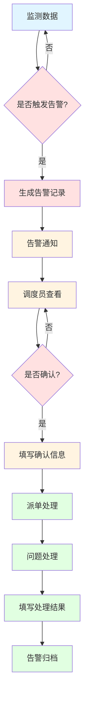

告警处理流程说明：
1. 系统实时监测能源数据，判断是否触发告警条件
2. 如果触发告警，系统自动生成告警记录
3. 系统通过邮件、短信、系统消息等方式通知相关人员
4. 调度员查看告警信息，决定是否确认
5. 确认告警后，填写确认信息和处理意见
6. 系统自动生成处理工单，派发给相关处理人员
7. 处理人员处理问题后，填写处理结果
8. 告警处理完成后，告警状态变更为"已归档"

### A.3 能源统计分析流程

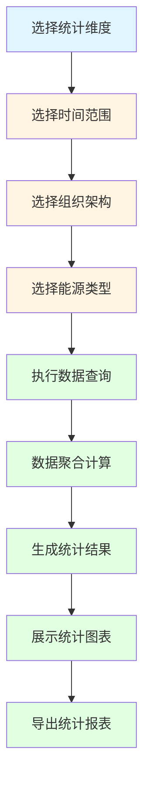

能源统计分析流程说明：
1. 用户选择统计维度（时间、组织、能源类型等）
2. 系统根据选择的维度查询相关数据
3. 对查询的数据进行聚合计算（求和、平均值、最大值、最小值等）
4. 生成统计结果，包括总能耗、总费用、标煤当量、碳排放等
5. 以图表形式展示统计结果（饼图、柱状图、折线图等）
6. 支持导出统计报表，格式包括Excel、PDF

### A.4 ECC层级管理流程

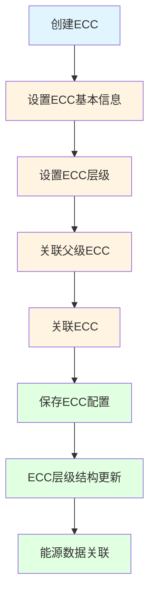

ECC层级管理流程说明：
1. 用户创建新的ECC，设置ECC基本信息（编码、名称、层级等）
2. 根据ECC层级选择父级ECC，建立层级关系
3. 关联ECC用于能源数据统计和分析
4. 保存ECC配置后，系统更新ECC层级结构
5. 能源监测数据自动关联到对应的ECC，用于统计分析

### A.5 产品单耗计算流程

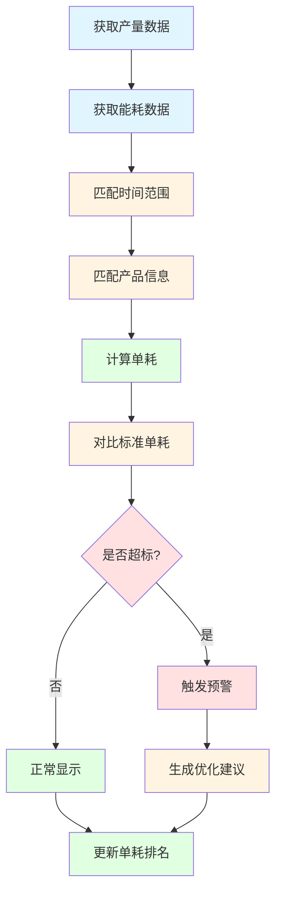

产品单耗计算流程说明：
1. 系统从产量数据管理模块获取产品产量数据
2. 系统从能源监测数据中获取对应的能耗数据
3. 根据时间范围、产品信息匹配产量和能耗数据
4. 计算产品单耗 = 能耗量 / 产量
5. 对比标准单耗，判断是否超标
6. 如果超标，触发预警并生成优化建议
7. 更新产品单耗排名，用于对比分析

